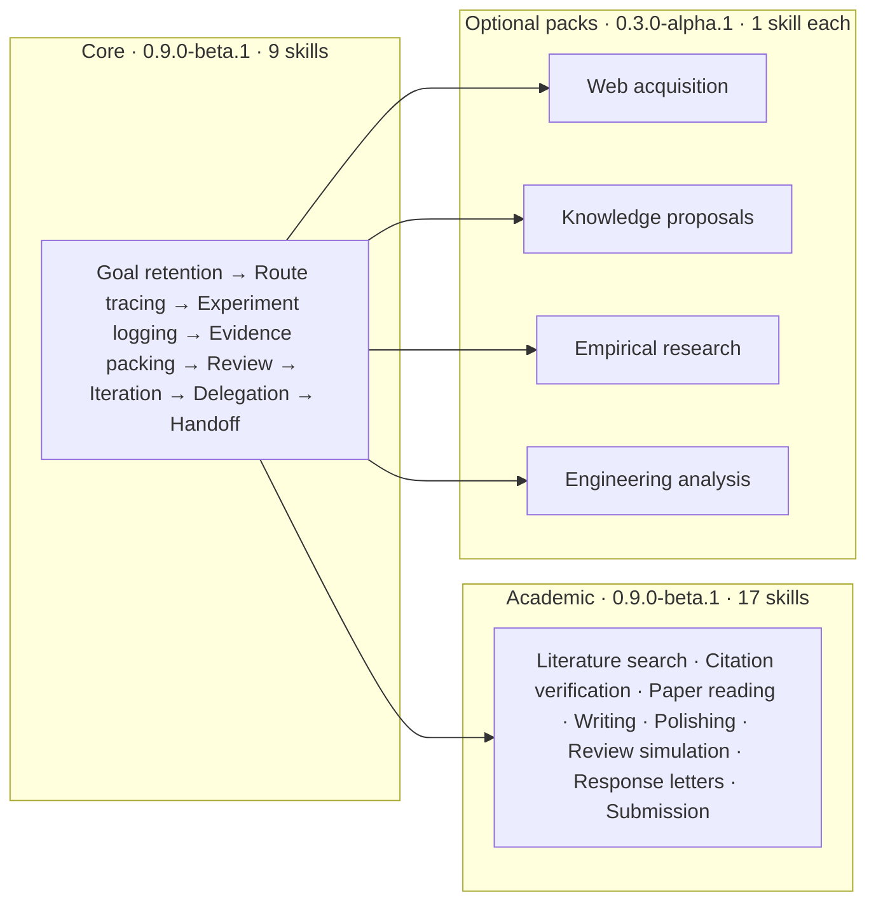
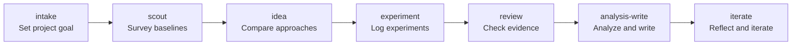

# DeepScientist Lite Codex Plugin — Research Command Kit

[中文说明](README.zh.md) · [User Guide](docs/user-guide.zh.md) · [Documentation](docs/README.md) · [Acknowledgments](ACKNOWLEDGMENTS.md)

Long research sessions overwhelm chat history. Switch to a new thread and you lose the reasoning behind last week's route choice. An experiment ran, but the commands, metrics, and logs are gone. A high score looks good, but nobody verified whether the test labels were accidentally seen.

DeepScientist Lite solves these handoff problems with a set of Codex skills and ordinary project files. It does not judge scientific conclusions. For frozen, authorized, and auditable gates, it can push forward continuously via a foreground controller, auto-resume, and generate progress receipts without starting a background daemon. Its job is to leave behind goals, routes, experiments, and review results so the next session or the next person can pick up where things stopped.

> **Official plugin:** DeepScientist Lite is the official Codex plugin for the DeepScientist workflow. "DeepScientist" identifies the upstream research workflow and platform. See [NOTICE](NOTICE) for project attribution and naming.

## Package Overview



| Package | Version | Skills | What it does |
| --- | --- | --- | --- |
| Core | `0.9.0-beta.1` | 9 | Domain-neutral worker protocol: goal retention, route tracing, experiments, evidence, reviews, iterations, delegation, handoffs |
| Academic | `0.9.0-beta.1` | 17 | Nature-grade paper workflow: literature search through submission |
| Web | `0.3.0-alpha.1` | 1 | Public web acquisition and provenance recording |
| Knowledge | `0.3.0-alpha.1` | 1 | Review-gated knowledge proposals |
| Empirical | `0.3.0-alpha.1` | 1 | Bounded empirical research specs and result handoff |
| Engineering | `0.3.0-alpha.1` | 1 | Bounded engineering numerical analysis and figure audit |

**Typical research workflow:**



`intake` sets goals and criteria → `scout` surveys baselines → `idea` compares approaches → `experiment` logs contracts and runs → `review` checks evidence → `analysis-write` summarizes findings → `iterate` reflects and advances.

## Quick Start

### 1. Install

Requires Codex and Python 3.10 or newer. Runtime scripts use only the Python standard library.

```bash
codex plugin marketplace add AlexenderSokolov/deepscientist-lite-codex-plugin
```

This command adds a plugin source. Open `/plugins`, select this marketplace, and install `deepscientist-lite` Core by default (9 skills). Install Academic, Web, Knowledge, Empirical, or Engineering separately when needed. After installing or upgrading, restart Codex Desktop and use a fresh task to verify actual versions and skill counts.

Each optional package requires running its built-in doctor on first use, pointing to the Core root. It stops if Core is missing or version-mismatched.

### 2. Start from a question

In a project folder, ask Codex:

```text
$ds-lite-intake start a lightweight research project from this question:
"Compare two text classification baselines under a fixed budget and decide which to continue.
Check the current directory first, do not overwrite existing files; establish project goal, acceptance criteria, current status, and next step."
```

Then continue with:

```text
$ds-lite inspect this research or engineering workspace, explain why the plugin applies, and route to one next action
$ds-lite-scout audit the baseline and benchmark route
$ds-lite-experiment record this experiment in the research map
$ds-lite-review review the Evidence Pack before analysis
$ds-lite-analysis-write summarize the findings and limitations
$ds-lite-iterate register one action, verify, reflect, report, update STATUS, and stop
$ds-lite-coordinate plan two independent tasks, wait for approval, then collect and verify results
```

For Chinese project titles on Windows, write longer text into a UTF-8 file and use `--title-file` when calling the state CLI directly.

## What Files Appear in Your Project

```
research/
  state/
    graph.json              ← Machine-authoritative state graph
  status/
    STATUS.md               ← Current node, next step, rollback points (human-readable)
  artifacts/                ← What each step did, with public justification
  evidence/<run-id>/        ← Experiment contracts, logs, metrics, file hashes
PROJECT.md                  ← Project goals and criteria (rarely changes)
RESEARCH_MAP.md             ← Research map (rendered from Graph, human-readable)
```

`graph.json` is the single source of truth. `STATUS.md` and `RESEARCH_MAP.md` are human projections. When they disagree, `graph.json` wins.

## What It Helps With

- **Switch threads without losing context:** Codex can recover goals, active nodes, and next steps from project files.
- **Failures have a home:** Failed experiments and rejected routes are not overwritten by successes.
- **Progress is visible:** Mission Board projects the Graph into a task board; internal artifacts are not treated as user interfaces.
- **Contracts before interpretation:** Metrics, thresholds, seeds, budgets, and failure conditions are written before a run starts.
- **High scores do not auto-pass:** File integrity, metric compliance, and conclusion validity are three separate checks.
- **Graph is inspectable and rebuildable:** Machine state lives in `graph.json`; human maps can be re-rendered.
- **Delegation boundaries are explicit:** Each subtask has independent inputs, modifiable paths, result paths, budgets, and stop conditions. The parent worker owns final verification and integration.

## What It Does Not Do

- It does not prove paper conclusions or guarantee elimination of hallucinations.
- Core does not start a daemon, run a Web/TUI, install local models, expose an MCP server, or connect chat channels. Academic MCP/API integrations and Web hosted backends require explicit workspace authorization and do not modify global configuration.
- The Web package is public-only and fail-closed: every `fetch`, `search`, `render`, or `benchmark` run must pass `--allowed-domain` values. Login, cookies, form submission, uploads, and automatic browser installation are not supported.
- It does not continue tasks after Codex closes.
- `$ds-lite-iterate` does not become an infinite loop; one call advances one round and stops at a checkpoint.
- `$ds-lite-coordinate` does not become a queue or background service; without explicit user or OpenScience approval, it generates a plan and stops.
- It does not replace human review, domain expertise, data governance, or research ethics.
- Review is a single check step and record; it does not imply a separate model or isolated execution environment.

## Troubleshooting

### Skills not found in a new thread
Restart Codex Desktop, then create a new thread. Old threads may still use the pre-upgrade plugin cache.

### Chinese arguments garbled on Windows
Write longer Chinese text into a UTF-8 file, then use `--title-file`, `--question-file`, `--summary-file`, or `--reason-file`.

### Graph reports a revision conflict
Do not overwrite files or manually edit `graph.json`. Reload the latest state, coordinate with the other session, and retry with the new `--expected-revision`.

### External data paths rejected
Graph does not store workspace absolute roots. Use `external://<alias>/<relative-path>` and provide the local root via `DS_LITE_EXTERNAL_<ALIAS>`.

### Map shows as stale
When `graph.json` is committed but `RESEARCH_MAP.md` is not synced, run `render-map` to rebuild. Graph is the machine source of truth.

## Where to Go Next

- To understand Graph, Evidence Pack, and review: read the [User Guide](docs/user-guide.zh.md).
- To try it yourself: start from the [AI Teaching Area](teaching/README.zh.md).
- To compare vanilla Codex, single-file memory, and DS Lite: see the [four-case comparison](teaching/matched-control-pilot.zh.md).
- To upgrade a Graph v1 project: read the [migration guide](docs/maintainers/graph-v2-migration.md).
- To contribute: read the [implementation notes](docs/implementation.zh.md) and [validation tools](tools/validation/).

Maintainer validation entry:
```bash
bash tools/validation/run_validate.sh
```