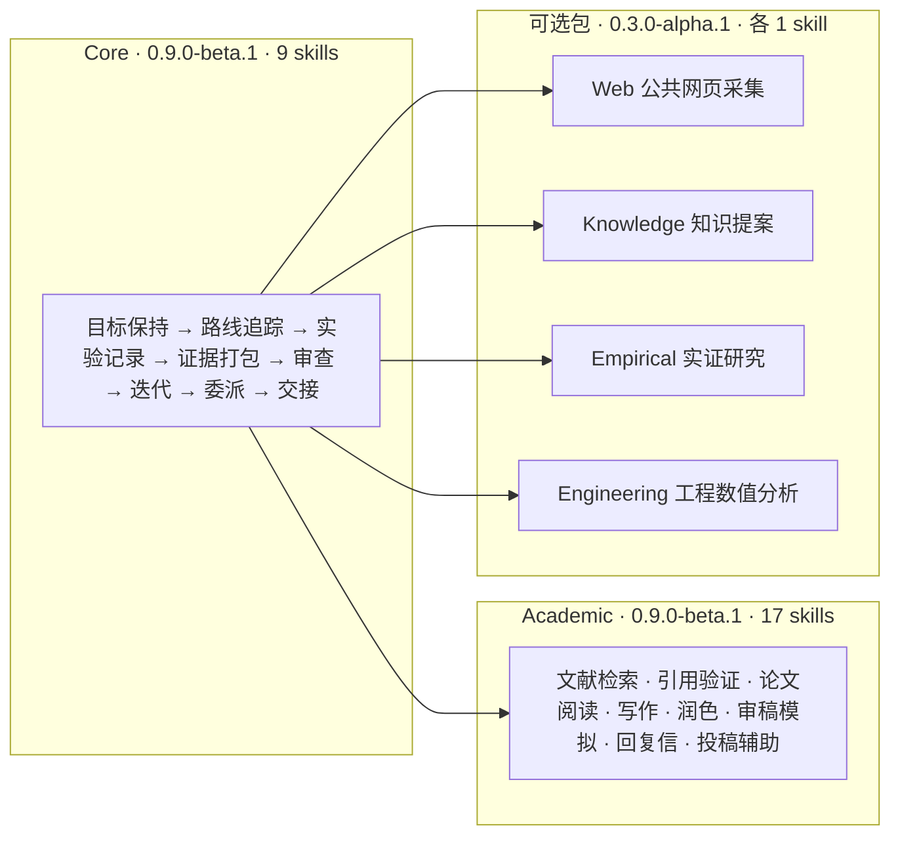
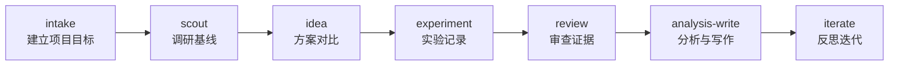

# DeepScientist Lite：科研小战斗群

[English README](README.md) · [用户指南](docs/user-guide.zh.md) · [AI 示教区域](teaching/README.zh.md) · [维护文档](docs/README.md) · [感谢名单](ACKNOWLEDGMENTS.md)

研究任务一长，聊天记录很快就撑不住了：换一个会话，不知道上次为什么选这条路；实验跑过了，却找不到当时的命令、指标和日志；一个高分结果看起来不错，但没人确认它有没有偷看测试标签。

DeepScientist Lite 用一组 Codex 技能和普通项目文件来解决这些交接问题。它不替你判断科学结论；对于已冻结、已授权且可审计的验收任务，它可以通过前台控制器连续推进、自动续跑和生成进度凭证，但不创建后台守护进程。它负责把目标、路线、实验和审查结果留下来，让下一次会话或另一位合作者能够接着做。

> **官方插件声明：** 这是 DeepScientist 的官方 Codex 插件。"DeepScientist" 用于说明上游研究工作流和平台。详见 [NOTICE](NOTICE)。

## 插件概览



| 包 | 版本 | Skills 数 | 一句话说明 |
| --- | --- | --- | --- |
| Core | `0.9.0-beta.1` | 9 | 领域中立的工作协议：目标保持、路线追踪、实验、证据、审查、迭代、委派、交接 |
| Academic | `0.9.0-beta.1` | 17 | Nature 级论文工作流：从文献检索到投稿辅助的完整链条 |
| Web | `0.3.0-alpha.1` | 1 | 公共网页采集与来源记录 |
| Knowledge | `0.3.0-alpha.1` | 1 | 审查门控的知识提案 |
| Empirical | `0.3.0-alpha.1` | 1 | 有界实证研究规范与结果交接 |
| Engineering | `0.3.0-alpha.1` | 1 | 有界工程数值分析与图形审计 |

**典型研究工作流：**



`intake` 建立项目目标与验收标准 → `scout` 调研基线与基准 → `idea` 对比方案 → `experiment` 记录实验契约与日志 → `review` 审查证据包 → `analysis-write` 总结发现与局限 → `iterate` 反思并推进下一步。

## 五分钟上手

### 1. 安装

需要 Codex 和 Python 3.10 或更高版本。插件运行脚本只使用 Python 标准库。

```bash
codex plugin marketplace add AlexenderSokolov/deepscientist-lite-codex-plugin
```

这条命令只添加插件来源。随后请在 Codex 的 `/plugins` 中选择这个 marketplace。默认只安装 `deepscientist-lite` Core（9 个技能）；Academic、Web、Knowledge、Empirical、Engineering 按需单独安装。安装或升级后重启 Codex Desktop，并打开一个新任务核对实际插件版本和技能数。

五个可选包不会假设 marketplace 自动安装 Core。首次使用前必须运行包内 doctor，显式提供 Core 根目录；缺失或版本不匹配时会停止。

### 2. 从一个问题开始

在你的项目目录里，把下面这段话交给 Codex：

```text
$ds-lite-intake 请从这个 questions 启动一个轻量研究项目：
"比较两个文本分类 baseline，在固定预算下判断哪个更值得继续。
先检查当前目录，不要覆盖已有文件；建立项目目标、验收标准、当前状态和下一步。"
```

接下来可以继续：

```text
$ds-lite 接手这个科研或工程工作区，读取 Mission Board，说明为什么插件适用。
$ds-lite-scout 审计基线和基准路线
$ds-lite-experiment 在研究地图中记录这次实验
$ds-lite-review 在分析前审查证据包
$ds-lite-analysis-write 总结发现和局限
$ds-lite-iterate 注册一次行动、验证、反思、汇报，然后停在检查点
$ds-lite-coordinate 规划两个独立任务，等待审批，然后收集并验证结果
```

中文项目标题在 Windows 上直接调用状态 CLI 时，建议把较长中文写入 UTF-8 文件，再使用 `--title-file` 等参数。

## 它能做什么

- **统一入口 `$ds-lite`：** 接手或恢复科研/工程工作区。它先判断当前目录是不是 DS Lite 项目，读取 Mission Board，然后路由到正确的下一步。对于已批准的多 gate 项目，它默认使用前台控制器连续推进所有就绪 gate：瞬态失败（网络、限流、超时）按合同自动重试；命令结束后静默轮询回执；会话中断后用 `--resume` 恢复，不重跑已完成或已冻结的身份。
- **前台控制器（`ds_lite_autonomy.py`）：** DAG 级的前台有界自治控制器。它不创建后台进程，而是在当前会话中推进已冻结、已授权的验收 gate，生成经过清理的进度凭证（`ds-lite.progress-report.v1`）。非幂等操作、有重复风险的外部写入和未授权发布会立即冻结。
- **有界循环适配器（`ds_lite_loop.py`）：** 连续执行多个有界迭代的适配器。每次迭代是一个完整的"执行 → 凭证 → 检查"闭环，外部执行边界 fail-closed。适配器本身不无限循环——达到终态（completed/blocked/failed）即停止。
- **无状态 Hook 系统（`ds_lite_hook.py`）：** 宿主触发、无状态的事件 Hook。在工具调用前后、用户提示提交和停止时收集脱敏事件，供学习系统和质量门使用。Hook 不持有状态、不创建持久连接。
- **项目初始化：** 创建 `PROJECT.md`、`STATUS.md` 和 `RESEARCH_MAP.md`，建立初始 Graph。
- **任务看板：** 通过 `mission` 和 `render-status` 将 Graph 投影为用户可见的 Mission Board，`STATUS.md` 显示发生了什么、下一步是什么、哪里可以回滚。
- **有界迭代：** 每次迭代记录一次动作、验证、反思、用户汇报和停止理由（`ds-lite.iteration.v1`），然后停止。
- **证据打包：** 运行前写入实验契约（指标、阈值、seed、预算、失败条件），运行后打包日志、指标和输出哈希，在结论审查前完成 Evidence Pack。
- **状态图：** 在 `research/state/graph.json` 中维护邻接表形式的状态图。
- **委派：** 记录最多三个独立子任务，各自拥有独立的路径所有权、结果引用和一个父级整合负责人。

### Graph v2 与 Evidence Pack v1

Graph v2 使用原子写入、版本号检查和项目相对路径（或符号化外部路径）。Evidence Pack v1 提供了独立的纯标准库 CLI，用于契约管理、清单、SHA-256 记录和严格验证。旧的 Graph v1 项目首次写入时自动迁移；如果项目包含绝对路径，请先阅读 [迁移指南](docs/maintainers/graph-v2-migration.md)。

## 项目里会多出什么文件

```
research/
  state/
    graph.json              ← 机器可读的状态图（唯一权威状态）
  status/
    STATUS.md               ← 当前节点、下一步、回滚点（给人看）
  artifacts/                ← 每一步做了什么，有什么公开依据
  evidence/<run-id>/        ← 实验契约、日志、指标、文件哈希
PROJECT.md                  ← 项目目标与验收标准（很少改）
RESEARCH_MAP.md             ← 研究地图（从 Graph 渲染，给人看）
```

`graph.json` 是机器权威状态；`STATUS.md` 和 `RESEARCH_MAP.md` 是给人看的投影。两者不一致时，以 `graph.json` 为准。

## 它能帮你什么

- **换会话不丢线索：** Codex 可以从项目文件恢复目标、当前节点和下一步。
- **失败也有去处：** 失败实验和未选路线不会被成功结果覆盖。
- **进度看得见：** Mission Board 把 Graph 投影成任务板，避免把内部文件当用户界面。
- **实验先约定再解释：** 指标、阈值、seed、预算和失败条件在运行前写入契约。
- **高分不自动通关：** 文件完整、指标达标和结论可用是三个不同的判断。
- **图可以检查和重建：** 机器状态保存在 `graph.json`，人读的地图可以重新渲染。
- **协作边界写得清楚：** 每个子任务有独立输入、可改路径、结果路径、预算和停止条件，父 worker 负责最终核验与整合。

## 它不会替你做什么

- 不证明论文结论为真，也不保证消除错误引用或"幻觉"。
- Core 不启动守护进程、不运行 Web/TUI、不安装本地模型、不暴露 MCP 服务器。Academic 的 MCP/API 与 Web 的托管后端都必须按工作区显式授权，不会静默修改全局配置。
- Web 包只处理公开资料，且默认 fail closed：`fetch`、`search`、`render`、`benchmark` 每次都必须显式传入一个或多个 `--allowed-domain`。不支持登录、复用 Cookie、提交表单、上传或自动安装浏览器。
- 不在 Codex 关闭后继续运行任务。
- 不把 `$ds-lite-iterate` 变成无限自动循环；一次调用只推进一轮并停在检查点。
- 不把 `$ds-lite-coordinate` 变成队列或后台 worker 服务；没有用户或 OpenScience 明确批准时只生成计划并停止。
- 不代替人工审查、领域知识、数据治理和研究伦理判断。
- Review 是一个单独的检查步骤和记录，不代表使用了另一模型或隔离执行环境。

## 遇到问题先看这里

### 新线程里找不到技能
先重启 Codex Desktop，再新建线程。旧线程可能仍使用升级前的插件缓存。

### Windows 中文参数乱码
直接调用状态 CLI 时，把较长中文写入 UTF-8 文件，再使用 `--title-file`、`--question-file`、`--summary-file` 或 `--reason-file`。

### Graph 提示 revision 冲突
不要覆盖文件，也不要手改 `graph.json`。重新读取最新状态，协调另一会话的改动，再带新的 `--expected-revision` 重试。

### 项目外数据路径被拒绝
Graph 不保存工作站绝对根目录。请使用 `external://<alias>/<relative-path>`，并通过 `DS_LITE_EXTERNAL_<ALIAS>` 提供本机根目录。

### 地图显示 stale
`graph.json` 已提交而 `RESEARCH_MAP.md` 还没同步时，运行 `render-map` 重建地图。Graph 才是机器权威状态。

## 从哪里继续

- 想理解 Graph、Evidence Pack 和 review 的设计：读 [用户指南](docs/user-guide.zh.md)。
- 想比较普通 Codex、单文件记忆和 DS Lite：看 [四案例对比实验](teaching/matched-control-pilot.zh.md)。

维护者统一验证入口：
```bash
bash tools/validation/run_validate.sh
```
