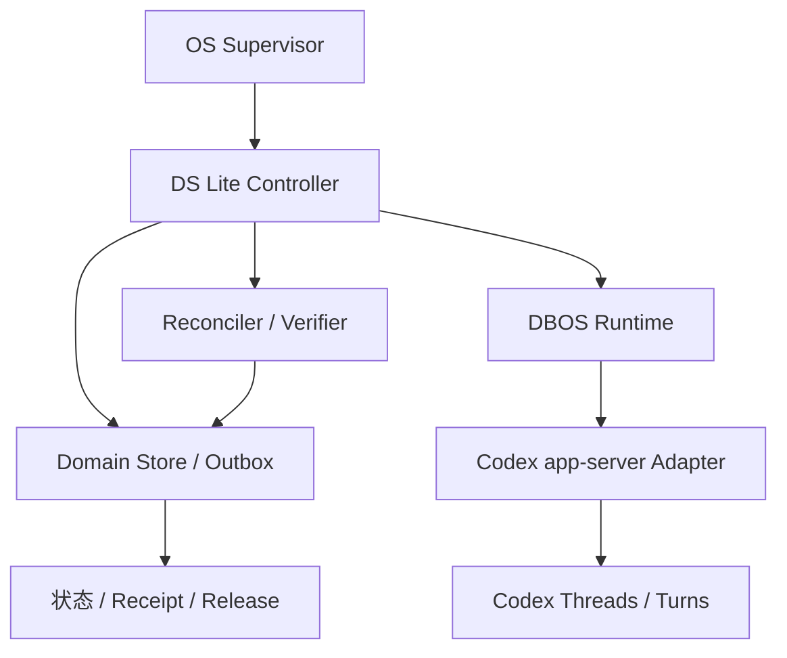
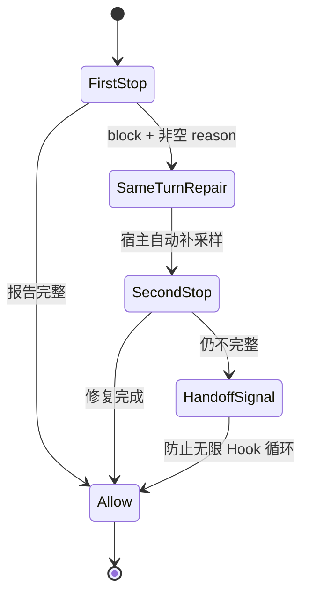
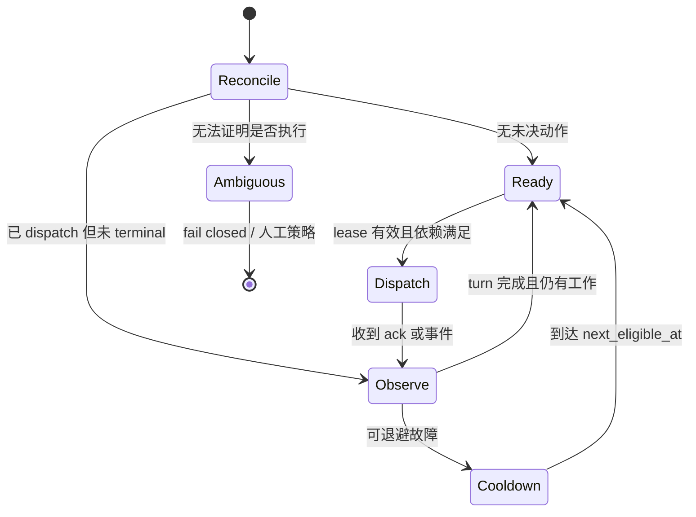
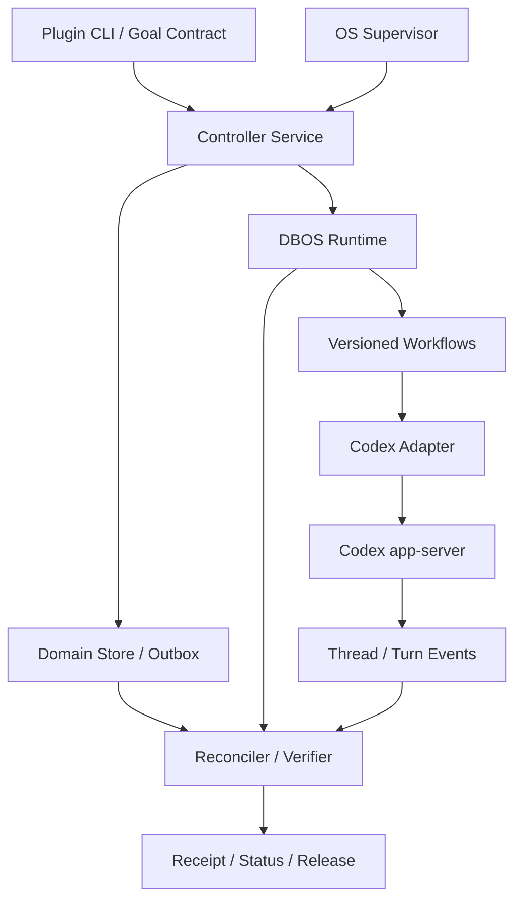

# DS Lite Hook、Auto‑Resume 与 DBOS 混合控制面研究及实施蓝图

> 初稿日期：2026-07-30；DBOS 混合控制器、结构图与资源基线修订：2026-07-31  
> 文档性质：架构研究、协议重构与验收计划；不是“已经实现/已经通过”的声明  
> 研究基线：DS Lite 0.8.1 事故交接、公开仓库当前主分支、Codex 官方文档与官方源码提交、DBOS、OpenSymphony、codex-sidecar、`codex-autoresearch` 等公开实现
> 已接受架构决策：控制器随 DS Lite 同仓同发行，DBOS 作为嵌入式持久执行内核；运行时仍保持独立 companion 进程

## 0. 证据标签

本文刻意使用三种标签，避免再次混淆“设计存在”和“真实发生”：

- **已证实**：能由官方文档、官方源码、公开仓库源码或既有 receipt 直接支持。
- **设计建议**：本文推荐的目标实现；在代码和 harness 完成前不能对外声称具备。
- **待真实验收**：必须在指定 Codex 版本、真实 Hook 信任流程、真实 app-server、真实进程重启或网络故障中观察到。

原始事故和验收背景见：[DS Lite 0.8.1 autonomy/hook/resume 事故交接](maintainers/ds-lite-0.8.1-autonomy-hook-resume-acceptance-incident-handoff-20260730.zh.md)。

---

## 1. 执行结论

### 1.1 最重要的语义纠正

**已证实：现有交接文档所假设的 Stop-first 链路不符合当前 Codex Hook 的官方行为。**

当前 Codex 中，Stop Hook 返回：

```json
{
  "decision": "block",
  "reason": "Run one more pass and repair the missing evidence."
}
```

宿主不会先结束当前外层 turn、等待外部控制器再发一个 `turn/start`；宿主会把 `reason` 作为 Hook continuation prompt，**在同一个外层 turn 内继续采样**，之后再次触发 Stop Hook。`stop_hook_active` 用于告诉 Hook：当前 turn 已经被 Stop Hook 续过。

这一点同时由当前 [Codex Hooks 官方文档](https://developers.openai.com/codex/hooks) 和官方源码提交支持：

- [`9a44a7e`: Stop continuation 与 `stop_hook_active`](https://github.com/openai/codex/commit/9a44a7e499f18eaed5d06aabb5acf9184deb06b8)
- [`267499b`: 将 Stop continuation 持久化为用户消息](https://github.com/openai/codex/commit/267499bed853c0011613a1ef26cf2e4db711e556)

因此，必须拆开两个不同能力：

| 能力 | 所有者 | 正确语义 |
|---|---|---|
| 回答交付前的微修复 | Hook + Codex 宿主 | Stop block 后，在**同一外层 turn**中自动补采样 |
| turn 结束后的持续科研 | 外部控制器 | 恢复 thread/session，创建**新的 turn**，调度下一工作项 |

原 `app_server_continuation` 若要求“Stop block → 外部 runner → 同线程新 `turn/start` → 第二次 Stop allow”，测到的不是当前官方 Stop continuation，应停止把它作为 Hook 成功的判据。

### 1.2 推荐方案

选择“**随插件交付、运行时独立、由 DBOS 提供持久执行的混合控制器**”，而不是继续堆补丁到 Hook 或单进程 shell 循环：

1. `ds-lite-control` 进入 DS Lite 同一仓库、同一版本和默认发布物，成为完整自动化模式的一等组件，而不是另一个需要用户自行拼装的项目。
2. “集成进插件”不等于“运行在 Hook 或 Codex 进程里”。控制器必须作为独立 companion 进程运行，并由 systemd user service、Windows Task Scheduler 或等价 OS supervisor 拉起；否则宿主停止时控制器也会失去所有权。
3. 使用 [DBOS Transact for Python](https://github.com/dbos-inc/dbos-transact-py) 作为嵌入式持久执行内核。默认使用本地 SQLite，不要求独立 DBOS Server、MCP、云控制面或容器集群；未来多机部署才考虑 PostgreSQL/Temporal 类后端。
4. DS Lite 自己的 SQLite domain store 仍保存 Job、WorkItem、Attempt、Action、DAG、lease/fencing、outbox、failure 和用户状态。DBOS 只拥有 workflow 的排队、持久 sleep、重试、并发和崩溃恢复，不能决定科学 gate 或发布状态。
5. 用稳定 `action_id` 作为 DBOS workflow ID，在 domain outbox 与 DBOS 系统状态之间建立可重放、可调和的桥；不假设两个数据库之间存在跨库原子事务。
6. Codex 适配层优先使用 app-server，并吸收 OpenSymphony 的 canonical thread、真实 `thread/resume`、归档状态调和和安装版本 schema 校验，以及 codex-sidecar 的 JSON-RPC 竞态处理。
7. 用 lease + 单调 fencing epoch 防止旧控制器恢复后继续修改 domain state；DBOS workflow 恢复不能替代业务所有权 fencing。
8. 用 write-once receipt 和最小化、脱敏的宿主事件 witness 保存真实证据。
9. 把 Hook 同-turn 修复、DBOS workflow 恢复、控制器跨进程接管和 Codex turn 对账分别验收。
10. 一个 gate 的退避、冻结或等待用户，不得停止其他无依赖 gate；严格聚合只决定“能否发布”，不能充当全局 runner 的停止信号。

因此，DS Lite 保持“轻量”的定义是：**单机、本地优先、无中央服务、可关闭、可检查、状态可导出**，而不是“完全没有依赖或后台进程”。可靠的跨会话自动化本身就需要一个不与聊天页面共生死的进程。

### 1.3 不能承诺的东西

控制器可以实现“持久意图、可恢复调度、可审计接管”，但不应声称通用的 exactly-once：

- 若 `turn/start` 已被 app-server 接受，而控制器在收到响应前崩溃，就存在响应缺口。
- 正确处理是先通过 thread/turn 事件和关联 ID 调和；无法证明是否已执行时，状态应为 `ambiguous` 并 fail closed。
- 对有外部副作用的科研工具，要使用幂等键、预检或显式人工确认；不能靠模型说“我应该没运行过”。

---

## 2. 现状审计

### 2.1 DS Lite 中应保留的设计

从事故交接可以确认，下列方向是正确的：

- 研究任务有显式边界、gate、artifact、review 和 release aggregate。
- receipt 不可覆盖，且“设计了 auto-resume”不能等同“观察到 auto-resume”。
- 一个可退避的外部故障只应冻结当前 attempt 身份，不应停止整个目标。
- 无依赖的 gate 应继续推进。
- Hook 不应承担长期调度；外部 runner/controller 持有连续性。
- 状态投影要向用户说明完成项、阻塞层、下一自动动作和发布状态。

这些约束应升格为可执行 invariant，而不是仅存在于说明文档。

### 2.2 当前公开 Hook 的两个协议风险

**已证实于研究日期的公开主分支；本地未提交的 0.8.1 代码可能不同，实施前必须重新比对。**

公开的 [`ds_lite_hook.py`](https://github.com/AlexenderSokolov/deepscientist-lite-codex-plugin/blob/main/plugins/deepscientist-lite/scripts/ds_lite_hook.py) 与当前 Hook 协议存在至少两个高风险差异：

1. `UserPromptSubmit` / `PostToolUse` 使用了顶层 `additional_context`；当前官方形状是：

   ```json
   {
     "hookSpecificOutput": {
       "hookEventName": "UserPromptSubmit",
       "additionalContext": "..."
     }
   }
   ```

2. Stop block 设置了 `decision = "block"`，但没有稳定输出非空顶层 `reason`。当前官方协议要求 block 时提供非空 `reason`，该内容才会成为 continuation prompt。

这两点足以导致“Hook 代码看起来运行了，但宿主没有按预期补充上下文或自动补跑”。修复时不能只改字段名；必须把 Codex 版本、生成 schema 的摘要和真实 Hook 事件一并写进 receipt。

### 2.3 `codex-autoresearch` 能借鉴什么

参考仓库 [`congwa/codex-autoresearch`](https://github.com/congwa/codex-autoresearch) 值得保留的思想：

- 目标合同和目标 hash 固化。
- 每轮计划和结果有落盘记录。
- 捕获 `codex exec --json` 的 JSONL。
- 要求显式 completion report，而不是仅凭自然语言结束。
- 能使用明确 session ID 续接。

但它当前的控制面不足以承担 DS Lite 的可靠性目标：

| 当前做法 | 风险 | DS Lite 目标做法 |
|---|---|---|
| 进程内 `fireAndForget` 循环 | 进程退出后所有权消失 | OS supervisor 管理独立控制器 |
| 固定约 3 秒循环 | 惊群、无持久退避、浪费配额 | 持久 `next_eligible_at` + full jitter |
| mutable `meta.json` | 无事务、无 lease、无 fencing | SQLite 事务 + write-once receipts |
| 找不到会话时可退回 `--last` | 会话漂移、错误接管 | 只允许精确 thread/session ID |
| 单一 `retryable` 布尔值 | 无法区分层级和处置 | layer + class + disposition |
| 模型 completion text 决定完成 | 自我证明 | 确定性 verifier + 独立 reviewer |
| 无 dispatch/ack/observed 分离 | 容易把意图当成事实 | transactional outbox + 事件调和 |
| 无明确进程树超时 | 沉默或子进程残留 | 分层 deadline + process-group 清理 |

相关源码：

- [`src/engine/job.ts`](https://github.com/congwa/codex-autoresearch/blob/main/src/engine/job.ts)
- [`src/engine/state.ts`](https://github.com/congwa/codex-autoresearch/blob/main/src/engine/state.ts)
- [`src/engine/codex.ts`](https://github.com/congwa/codex-autoresearch/blob/main/src/engine/codex.ts)

结论：可把它当作“可恢复循环的原型和输入样本”，不能把它当成持久控制器。

---

## 3. 必须成立的系统不变量

以下不变量应进入代码断言、数据库约束、验收 harness 和 release gate。

| ID | 不变量 | 违反时的处置 |
|---|---|---|
| INV-01 | Hook 只做当前事件的验证、上下文注入和有限次同-turn 修复 | Hook 失败；不得悄悄转为 runner |
| INV-02 | 每个 job 同时只有一个有效 controller owner | 标记完整性事故，暂停所有 dispatch |
| INV-03 | 每次控制状态写入携带当前 fencing epoch | 拒绝旧 owner 写入 |
| INV-04 | “状态迁移”和“待发送动作”在同一事务提交 | 回滚，不产生半状态 |
| INV-05 | `planned`、`dispatch_acknowledged`、`host_observed`、`terminal_observed` 分开存储 | 未观察到就不能升级证据等级 |
| INV-06 | 不使用 `--last` 推断会话 | 缺失精确 ID 时冻结 attempt |
| INV-07 | receipt 创建后不可更新、覆盖或删除 | 进入 integrity incident |
| INV-08 | 一个 gate 的失败不改变其他无依赖 gate 的 ready 状态 | scheduler 测试失败 |
| INV-09 | 科学结论为负不等于控制面失败 | 记录 valid negative result，继续设计迭代 |
| INV-10 | 模型文本不能直接设置 `passed` 或 `release_allowed` | verifier 拒绝 |
| INV-11 | 无法调和的响应缺口为 `ambiguous`，不能盲目重发 | 冻结或进入人工策略 |
| INV-12 | 用户状态只陈述可由 state/receipt 推导的事实 | 投影器拒绝自由发挥字段 |
| INV-13 | 只有存活 heartbeat、有效 lease 和持久 outbox 同时存在时，UI 才能说“系统会自动继续” | 否则显示“连续性未确认” |
| INV-14 | 严格 aggregate 只控制发布，不直接停止 scheduler | release blocked，但其他 work item 可运行 |
| INV-15 | 每个 durable action 使用同一个 `action_id` 作为 DBOS workflow ID | ID 漂移时停止 dispatch 并进入 integrity incident |
| INV-16 | DBOS workflow 状态不能直接设置 work item `passed` 或 `release_allowed` | verifier/aggregate 拒绝 |
| INV-17 | DBOS step 写 domain state 前必须验证 owner/fence epoch | 拒绝迟到 workflow 写入并重新调和 |
| INV-18 | 有有效 canonical thread 时，resume/unarchive 失败不得 fallback `thread/start` | 保留 thread ID，fail closed |
| INV-19 | domain、DBOS 与 Codex 三方冲突时不得靠最后写入者覆盖 | 进入 reconciliation/ambiguous，保存三方 witness |

---

## 4. 方案比较

### 4.1 持久执行内核

| 方案 | 能提供什么 | 与 DS Lite 的冲突/缺口 | 决策 |
|---|---|---|---|
| 加固现有 CLI loop | 低改动的 retry、heartbeat、JSON 文件 | 仍要手写持久 timer、队列、恢复、并发领取和升级兼容；最容易重复“设计了恢复但真实没恢复” | 只保留为诊断 wrapper |
| **DBOS 混合控制器** | Python 内嵌 durable workflow、稳定 workflow ID、queue、retry、sleep、recovery；本地可用 SQLite | 外部副作用仍不是 exactly-once；科研状态与 Codex dispatch 对账必须由 DS Lite 保留 | **采用** |
| Temporal | 成熟事件历史、signal、timer、worker failover、多机控制面 | 需要 server/worker，部署和运维超出当前 Lite 边界；Activity 同样要求幂等 | 未来多用户/多机后端 |
| Prefect | Python flow、调度、重试、UI、服务端状态 | 数据工作流语义较重；flow 重跑不能解决 Codex `turn/start` 响应缺口 | 不作核心 |
| LangGraph | thread/checkpoint/pending writes、节点恢复 | 与 DS Lite DAG 重叠，且节点重放仍要求副作用幂等 | 仅借鉴 checkpoint 术语 |

[DBOS Python](https://github.com/dbos-inc/dbos-transact-py) 适合本项目的关键点是：它作为 Python 库嵌入 companion，不要求额外编排服务器；[当前 Python 编程指南](https://docs.dbos.dev/python/programming-guide)支持默认 SQLite，本地部署仍是一个控制器进程和本地数据库。它降低的是“持久执行机械结构”的实现成本，而不是取消 DS Lite 的业务状态机。

DBOS 的 workflow/step 语义也必须按保守方式理解：workflow 可从已记录步骤恢复，但普通 step 对外部系统通常仍是 at-least-once；副作用发生后、完成记录写入前崩溃时，step 可能重试。参见 [DBOS workflow 教程与保证](https://docs.dbos.dev/python/tutorials/workflow-tutorial)。因此，调用 Codex 或科研工具的 step 必须“先调和、后决定是否发送”，不能把 DBOS 成功状态等同于科学任务成功。

SQLite 后端虽已由上游正式加入并作为默认本地路径，但它相对较新：上游曾修复[重复 dequeue 的隔离级别问题](https://github.com/dbos-inc/dbos-transact-py/commit/0beb275407f05ae4de95ade7ede38774eb67b796)、[线程退出竞态](https://github.com/dbos-inc/dbos-transact-py/commit/646009e29f443177075e2674a18e59436aa59f9c)和[锁竞争/时序问题](https://github.com/dbos-inc/dbos-transact-py/commit/60a909e9a85db02d5b0f269f0d6297700dbec6ad)。这不是拒绝采用的理由，但意味着 DS Lite 必须锁定版本、限制第一版为单机单 controller，并把 SQLite contention/duplicate-dequeue 纳入自己的混沌验收，不能只依赖上游测试结论。

### 4.2 Codex 控制器与运维外壳

| 公开项目 | 可直接学习的内容 | 不采用的部分 |
|---|---|---|
| [OpenSymphony](https://github.com/kumanday/OpenSymphony) | canonical thread、真实 `thread/resume`、resume 失败闭锁、archive/unarchive 可恢复中间态、安装版本 schema 校验、raw event 保留 | issue tracker 产品模型；默认 `approvalPolicy=never` / `dangerFullAccess` 自动化配置 |
| [codex-sidecar](https://github.com/nora/codex-sidecar) | JSON-RPC request correlation、notification 早于 response 的竞态、子进程退出清理 waiter、stderr 有界尾部、畸形 JSONL 隔离 | 内存态 pending map、固定单 turn timeout、缺少 outbox/lease/reconciliation |
| [Dagu](https://github.com/dagucloud/dagu) | 单二进制 UX、zombie 检测、scheduler lock、artifact/log UI、人类任务入口 | 让模型调用 `set_task_status` 的 controller 语义；CLI `harness.run` 不能证明 canonical Codex turn；GPL 代码不直接并入 |
| [Pueue](https://github.com/Nukesor/pueue) | 本地命令队列、日志与进程恢复体验 | 无科研 DAG、证据、会话和发布语义；最多用于开发期启动 |
| [`codex-autoresearch`](https://github.com/congwa/codex-autoresearch) | 目标 hash、逐轮记录、明确 session ID、completion report 输入样本 | 进程内循环、mutable state、`--last` 风险、模型自我完成 |

最终选型不是“找一个公开项目整体换皮”，而是：

```text
DBOS：持久执行内核
OpenSymphony：Codex 线程生命周期与 schema 兼容参考
codex-sidecar：JSON-RPC 通信竞态与测试参考
Dagu/Pueue：本地运维和状态界面参考
DS Lite：科研 domain truth、证据、审查、发布与安全边界
```

SQLite 适合单机/单工作区控制器；不要把数据库放在不保证锁语义的网络文件系统上。SQLite 的 WAL 与同步持久化语义可参考 [WAL 文档](https://www.sqlite.org/wal.html) 和 [PRAGMA 文档](https://sqlite.org/pragma.html)。

---

## 5. 目标架构

下图是实施时的总结构约束，不是概念示意图：Hook、持久控制器、DBOS 执行层和事实/发布层必须保持分工，不能为了少一个进程而重新合并。



### 5.1 组件职责

| 组件 | 持有 | 不持有 |
|---|---|---|
| DS Lite workflow core | 科研合同、DAG、artifact/review/release 规则 | Codex/DBOS 的内部系统状态 |
| Hook | 当前 turn 的输入补充、工具 guardrail、交付前验证、一次同-turn 修复 | 退避、网络循环、跨会话调度 |
| Codex host/app-server | thread/turn 生命周期、模型采样、Hook 调用、宿主事件 | 项目级 durable scheduler |
| Controller service | job 所有权、lease、DAG 决策、thread 绑定、对账、状态投影 | 依赖聊天页面维持存活 |
| DBOS runtime | workflow ID、执行队列、持久 timer、受控 retry、workflow 恢复 | gate pass、科学结论、release |
| Domain store | 可变控制状态、outbox、lease、事件索引、DBOS workflow 映射 | DBOS 私有执行历史、对外发布证据本体 |
| Receipt store | 不可覆盖的事实记录和摘要 hash | 可变当前状态 |
| Reviewer/aggregator | 独立审查、确定性 gate 和发布决定 | 修改 worker 产物 |
| OS supervisor | 控制器进程重启和开机恢复 | 研究状态判定 |

控制器与 DBOS 应作为同一 `ds-lite-control` Python 进程中的两个逻辑层部署。DBOS 是库和持久 runtime，不是第二个用户可见 daemon。OS supervisor 只拉起 `ds-lite control serve`；控制器启动后初始化 DBOS、完成 recovery pass，再开始调度。

推荐运行模式：

| 模式 | 启动方式 | 能力声明 |
|---|---|---|
| `manual` | 只有插件和 Hook | 单 turn/人工接续；不得显示“会自动继续” |
| `managed` | `ds-lite control run <job>` 前台运行 | 当前终端存活期间持续；可验证 DBOS 恢复，但不承诺退出后重启 |
| `supervised` | OS supervisor 运行 `ds-lite control serve` | lease、heartbeat、outbox 和 supervisor receipt 齐全后才可声明跨会话自动继续 |

### 5.2 Adapter 选择

优先级：

1. **AppServerAdapter**：首选。使用 `thread/start`、`thread/resume`、`thread/list`/`thread/read`、`thread/archive`、`thread/unarchive`、`turn/start` 和事件通知，能够区分 thread、turn 与失败类型。官方协议见 [Codex app-server](https://developers.openai.com/codex/app-server)。
2. **官方 SDK adapter**：若使用 Python，可评估官方 `openai-codex` SDK；它封装 app-server JSON-RPC，并携带匹配的 CLI runtime。见 [Codex SDK](https://developers.openai.com/codex/codex-sdk)。
3. **ExecAdapter**：仅作兼容后备。使用 `codex exec --json` 和 `codex exec resume <EXACT_SESSION_ID>`；绝不使用 `--last`。事件格式见 [非交互模式](https://developers.openai.com/codex/non-interactive-mode)。

每个 adapter 必须实现同一内部接口：

```text
start_thread(control_envelope) -> ThreadBinding
resume_thread(thread_id) -> ThreadSnapshot
start_turn(thread_id, action_id, input_hash, prompt, output_schema) -> DispatchAck
observe(thread_id, turn_id) -> HostEvent stream
read_thread(thread_id, include_turns=true) -> ThreadSnapshot
interrupt_turn(thread_id, turn_id, reason) -> InterruptAck
archive_thread(thread_id) -> ArchiveAck
unarchive_thread(thread_id) -> ArchiveAck
classify_transport_error(raw_error) -> NormalizedFailure
```

字段名和 JSON-RPC 参数必须来自**所固定 CLI 版本生成的 schema**，不能按本文伪接口直接猜测。每次升级 Codex：

```bash
codex app-server generate-ts --out ./controller/schemas/codex/<version>
codex app-server generate-json-schema --out ./controller/schemas/codex/<version>
```

把 CLI 版本、schema 目录摘要和 Hook 配置摘要写入每次真实验收 receipt。

适配层实现应显式吸收两个公开项目已验证的模式：

- 从 [OpenSymphony Codex 生命周期规范](https://github.com/kumanday/OpenSymphony/blob/main/docs/specs/codex-thread-lifecycle-spec.md) 学习“一项工作一个 canonical thread”“resume 失败绝不隐式 start”“pending archive 状态通过 app-server 事实调和”；但不能照抄其最大权限配置。
- 从 [codex-sidecar app-server client](https://github.com/nora/codex-sidecar/blob/main/src/codex/app-server-client.ts) 及其[竞态测试](https://github.com/nora/codex-sidecar/blob/main/src/codex/app-server-client.test.ts) 学习 notification 先于 response、子进程提前退出、畸形 JSONL 和 turn waiter 清理；把其中的内存态关联扩展为持久 action/event 关联。

### 5.3 体积、资源与“Lite”判断

2026-07-31 做了一次隔离探针，环境为 Linux x86_64、Python 3.12.13、全新 `venv`，安装当时 PyPI 提供的 DBOS 2.29.0。该探针只用于建立量级基线，不等于 DS Lite 已锁定此版本，也不替代 Windows、Linux/WSL 和完整控制器的正式验收。

| 项目 | 本次测量 | 解释 |
|---|---:|---|
| DBOS 及传递依赖 wheel 合计 | 11,022,674 bytes（10.51 MiB） | 近似首次下载安装流量，不含 pip 元数据缓存 |
| 全新 venv 安装净增 | 54,703,943 bytes（52.17 MiB） | 相对只有 pip 的基线 venv；包含 SQLAlchemy、psycopg、PyYAML、greenlet、websockets 等 |
| `dbos` 包本体 | 2,371,365 bytes（2.26 MiB） | 大部分磁盘增量来自传递依赖，不是 DBOS Python 源本身 |
| 首次初始化 DBOS SQLite | 176,128 bytes（172 KiB） | 只有空 system database；不含 domain DB、WAL、receipt 或 artifact |
| Python 空进程启动峰值 | 10,612 KiB | 同一 venv 的单样本 `ru_maxrss` 基线 |
| 仅 `import dbos` 启动峰值 | 65,468 KiB | 单样本高水位，不等同稳态 idle RSS |
| DBOS 初始化并 `launch` 启动峰值 | 68,108 KiB（66.51 MiB） | 禁用 OTLP/admin server、2 个 executor threads；仍不含 DS Lite adapter、scheduler 和状态投影 |

本次依赖中，即使使用 SQLite，也会安装 `psycopg-binary`；它及其动态库约占 19 MiB，SQLAlchemy 目录约占 21 MiB。这是未来可向上游推动“SQLite-only extra”的优化点，但第一版不得通过手工删依赖或 `--no-deps` 获得虚假的小体积。

预计完整集成后的量级应分开报告：

| 边界 | 初始目标 | 决策 |
|---|---:|---|
| DS Lite controller 源码、配置、schema、supervisor 模板 | 发布包内不超过 8 MiB，不含测试 evidence | 超过时先检查重复生成 schema、fixture 和 vendored 代码 |
| 默认安装相对现有插件的磁盘净增 | 目标不超过 100 MiB | 当前 DBOS 依赖基线约 52 MiB，仍有足够余量；Codex 二进制不得重复捆绑 |
| supervised controller 启动/空闲 RSS p95 | 目标不超过 150 MiB | 150–250 MiB 必须分析；超过 250 MiB 停止默认集成 |
| 空 DBOS + domain 控制数据库 | 目标低于 2 MiB | receipt、raw event 和科研 artifact 另算，禁止混入“插件包大小” |
| 100 个无大 artifact 的 control action | 控制数据增长不超过 25 MiB | 分别报告 domain DB、DBOS DB、WAL、receipt、private event |

结论是：**它仍然是轻量的本地控制面，但不再是微小的提示词包。** 更准确的产品定位是“随插件交付的小型本地自动化服务”：无中央 server、无容器、无第二套运维系统，安装磁盘预计约增加 60–100 MiB，控制进程预计处于 100–150 MiB 以内。相对 Codex 和真实科研工具链，这个绝对量可接受；相对原始 Markdown/Hook 插件，体积倍率会很大，发布说明必须明确披露。

DBOS 2.29.0 的本地启动日志仍明确提示 SQLite 面向 development/testing、生产推荐 PostgreSQL。因此 SQLite 作为 DS Lite 单机默认后端必须视为**待本项目混沌验收的架构风险**，不能仅凭“成功初始化”宣布可生产使用。当前决定仍是直接集成 DBOS；只有 Windows/Linux 正式探针触发上述 kill threshold，才把自治运行时改成同一插件发行和安装流程中的可选择组件，不能退回无持久性的 shell loop。

---

## 6. 四种“继续”必须分开命名

| 名称 | 触发条件 | 是否新 turn | 是否依赖外部 controller | 成功证据 |
|---|---|---:|---:|---|
| `hook_in_turn_repair` | Stop 验证发现交付缺口 | 否 | 否 | 同一 turn 中 Stop block、hook prompt、第二次 Stop、最终 turn complete |
| `controller_next_turn` | 当前 turn 完成，但 work item 未终结 | 是 | 是 | 持久 outbox、dispatch ack、新 turn host event、terminal event |
| `controller_cross_process_resume` | controller/host 重启，thread 可恢复 | 是或继续观察旧 turn | 是 | 新 owner epoch、精确 thread 恢复、无重复 dispatch、后续 terminal event |
| `fresh_attempt_after_failure` | 旧 attempt 已 terminal/frozen 且策略允许 | 通常是 | 是 | 旧 receipt 不变、新 attempt ID、lineage 和 retry reason |

### 6.1 Hook 微循环



### 6.2 Controller 宏循环



---

## 7. Hook 详细设计

### 7.1 Hook 的目标

Hook 是交互质量与协议完整性的最后一道同步检查：

- 每轮开始时注入紧凑、当前、可验证的任务状态。
- 工具调用前只阻止确定性的危险或越界动作。
- 工具调用后记录事实并提示缺失的验证。
- Stop 时验证用户可见报告是否完整、是否和状态/证据一致。
- 首次不完整时要求宿主在同一 turn 修复。
- 第二次仍不完整时结束当前 turn，并把后续责任交回 controller。

它不是：

- while-loop；
- 网络重试器；
- 会话选择器；
- release 决策器；
- 实验“成功与否”的裁判。

### 7.2 版本化 wire contract

新增 `hook_contract.py`，只负责：

1. 解析当前 schema 的输入。
2. 生成当前 schema 的输出。
3. 对未知字段 fail closed 或记录兼容性警告。
4. 把业务策略与宿主 JSON 形状分离。

建议接口：

```text
parse_hook_event(stdin_json, pinned_contract) -> HookEvent
render_user_context(additional_context) -> stdout_json
render_stop_block(reason) -> stdout_json
render_allow() -> stdout_json
```

Hook 的 stdout 只输出协议 JSON；诊断写 stderr 或独立 witness，避免污染协议流。

### 7.3 Stop 验证规则

Stop 校验不应只检查“有一段反思文本”。最低要求：

| 检查项 | 说明 |
|---|---|
| 身份 | `job_id`、`work_item_id`、`attempt_id` 与当前状态一致 |
| 本轮动作 | 陈述实际执行的动作，不把计划写成完成 |
| 产物 | artifact 引用存在，并带 hash/size 或 verifier 结果 |
| 验证 | 明确运行了什么检查、结果是什么 |
| 科学结果 | `positive`、`negative`、`inconclusive` 与证据区分 |
| 失败 | 若存在，提供 layer、class、disposition，而非泛化为“失败” |
| 下一步 | 来自控制状态；不能由模型随意承诺 |
| 用户动作 | 没有就明确为 `none` |
| 发布状态 | 由 aggregate 投影，模型不能自定 |

建议让 controller-owned turn 使用版本化结构输出，例如 `ds-lite.iteration-report.v1`；人类可读 Markdown 由同一结构渲染。若交互宿主无法强制 output schema，Stop Hook 从 transcript 的有界尾部解析嵌入式结构并进行相同验证。

### 7.4 一次修复预算

推荐策略：

```text
if report_valid:
    allow
elif stop_hook_active is false:
    block(reason = exact_missing_fields_and_evidence_deltas)
else:
    append hook_handoff witness
    allow
```

第二次仍失败时不要无限 block。controller 看到 `hook_handoff` 和未通过 verifier 的 terminal turn 后，创建新的 `controller_next_turn`。这样：

- Hook 保证交付前至少有一次宿主级修复机会；
- controller 保证交互修复不成功时仍可跨 turn 推进；
- 两者的 receipt 不会混为同一种“auto-resume”。

### 7.5 Hook witness

Hook 可写入最小化、append-only witness，但不直接修改主状态：

```json
{
  "schema_version": "ds-lite.hook-witness.v1",
  "event_id": "01...",
  "job_id": "job-...",
  "attempt_id": "attempt-...",
  "session_id": "...",
  "turn_id": "...",
  "hook_event": "Stop",
  "stop_hook_active": false,
  "decision": "block",
  "reason_code": "REPORT_MISSING_VERIFICATION",
  "observed_at": "...",
  "hook_contract_digest": "...",
  "hook_binary_digest": "..."
}
```

文件使用随机/ULID 名和 exclusive create。controller 后续摄取、验证和封存为 receipt。不要把完整 prompt、密钥、个人数据写入公开 witness。

---

## 8. Controller 详细设计

### 8.0 产品形态与部署边界

`ds-lite-control` 是 DS Lite 插件发行物的一部分，但不是 Hook 内部函数。建议同仓发布、同版本锁定、由同一个安装命令安装：

```text
DS Lite plugin package
├── workflow / Hook / schemas
├── ds-lite-control Python package
├── DBOS runtime dependency
├── app-server adapter
├── acceptance harnesses
└── supervisor templates
```

第一版只支持“一个本地用户、一个工作区根目录、一台机器”。这能让默认 SQLite 的锁、文件系统和信任边界保持明确。以下能力明确不进入第一版：

- 中央 SaaS 控制面；
- 多主写入和跨机器共享 SQLite；
- 通用 MCP 编排总线；
- 自动读取或搬运 Codex 私有凭据；
- 将 DBOS workflow 状态当作科学事实；
- 允许模型直接修改任务 terminal/release 状态。

安装建议提供 `ds-lite doctor`、`ds-lite control install-service`、`ds-lite control start|stop|status` 和 `ds-lite control run <job>`。`install-service` 生成可审阅的用户级 supervisor 配置，不能静默提升系统权限。

最小版本化配置示例：

```yaml
schema_version: ds-lite.controller.v1
mode: supervised
workspace_root: .ds-lite
runtime:
  backend: dbos
  application_name: ds-lite-control
  application_version: <controller-version>
  executor_id_source: controller_owner_id
  domain_database: .ds-lite/control.sqlite3
  system_database_url: sqlite:///.ds-lite/runtime.sqlite3
  max_active_workflows: 2
ownership:
  heartbeat_seconds: 10
  lease_ttl_seconds: 45
codex:
  adapter: app-server
  binary: codex
  required_schema_digest: <sha256>
  resume_policy: canonical_only
receipts:
  directory: .ds-lite/receipts
  raw_event_directory: .ds-lite/private-events
```

配置不得包含 Codex access token；环境/credential reference 只记录来源类型和脱敏摘要。未知字段默认拒绝，以免拼写错误悄悄退回不安全默认值。

#### 8.0.1 控制器内部结构与事实流

总结构图描述进程边界；下图进一步固定控制器内部的数据流。箭头指向 Codex 的路径是“尝试产生外部效果”，从 Codex、DBOS 和 domain store 汇入 reconciler 的路径才是“观察事实”。任何一条单独路径都不能直接宣布任务完成。



这张图规定四条实现约束：

1. `Controller Service` 先把 durable action intent 与 outbox 写入 domain store，再以稳定 `action_id` 提交 DBOS workflow。
2. `Versioned Workflows` 负责可恢复执行，不拥有 gate、review 或 release 决策。
3. `Codex Adapter` 只使用精确 canonical thread/turn identity；响应缺口先进入 reconciliation，禁止 fallback 到 `--last` 或隐式新建 thread。
4. `Reconciler / Verifier` 同时读取 domain、DBOS 和 host witness；只有可复核事实才能生成 terminal receipt、用户状态和 release 输入。

### 8.1 工作身份层级

```text
Job
└── WorkItem / Gate
    ├── Attempt 1
    │   ├── Action / Turn
    │   └── Receipts
    └── Attempt 2
        ├── Action / Turn
        └── Receipts
```

- `Job`：稳定研究合同及其 hash。
- `WorkItem`：DAG 中可独立调度的 gate、实验或 review。
- `Attempt`：一组冻结的输入、配置、环境和身份；一旦 terminal 不可改写。
- `Action`：一次明确 dispatch，例如 `turn/start`、verifier 或 reviewer。
- `ThreadBinding`：host、thread/session ID、最近 turn ID 和输入快照 hash。
- `WorkflowBinding`：稳定 `action_id` 对应的 DBOS workflow ID、workflow kind、代码版本和最近 runtime 状态。

每个可并行 gate 使用独立 thread binding；项目上下文来自 canonical state/evidence package，而不是依赖某一条聊天记录。对同一 work item 续接时优先恢复原 thread；需要 fresh thread 时必须记录 parent binding 和原因。

身份映射固定为：

```text
Job / WorkItem / Attempt / Action       DS Lite domain identity
action_id                               DBOS workflow ID
ThreadBinding.thread_id                 Codex canonical thread identity
ThreadBinding.last_turn_id              最近一次已关联 Codex turn
receipt_id                              不可覆盖的事实身份
```

不得把 DBOS 内部 UUID、进程 PID、Codex 的“最后会话”或日志行号用作 domain identity。

### 8.2 状态机

#### Job 状态

| 状态 | 含义 |
|---|---|
| `active` | 有可运行或运行中的 work item |
| `degraded` | 至少一项 cooldown/awaiting/frozen，但仍有其他可运行项 |
| `waiting` | 当前无可运行项，全部等待时间、外部条件或用户 |
| `releasing` | 所有必需 gate 已完成，正在独立审查/聚合 |
| `completed` | release receipt 已生成且允许发布 |
| `failed` | 仅用于全局不可恢复：状态损坏、目标被撤销、策略预算耗尽且无剩余路径等 |
| `cancelled` | 用户或上层系统明确取消 |

#### WorkItem 状态

`pending → ready → leased → running → passed`

侧路：

- `running → cooldown → ready`
- `running → awaiting_user`
- `running → awaiting_external`
- `running → frozen`
- `running → negative_result → ready`（若科学计划允许下一迭代）

“实验假设不成立”通常是一个成功执行的 negative result，不应被归类为基础设施 failure。

#### Attempt 状态

`queued | dispatching | running | reconciling | succeeded | retryable_failure | nonretryable_failure | ambiguous | orphaned | timed_out | cancelled`

terminal attempt 永不重新打开；重试必须新建 attempt。

### 8.3 SQLite 控制状态

建议核心表：

| 表 | 关键字段 |
|---|---|
| `jobs` | job_id, goal_hash, state, created_at, updated_at |
| `work_items` | id, job_id, type, state, priority, next_eligible_at, dependency_digest |
| `dependencies` | predecessor_id, successor_id, required_outcome |
| `attempts` | id, work_item_id, ordinal, state, input_hash, config_hash, failure_id |
| `thread_bindings` | attempt_id, adapter, thread_id, session_id, last_turn_id, schema_digest |
| `actions` | action_id, attempt_id, type, state, idempotency_marker, payload_hash |
| `outbox` | outbox_id, action_id, state, not_before, dispatch_count, last_error_id |
| `workflow_bindings` | action_id, backend, workflow_id, workflow_kind, code_version, runtime_state, last_reconciled_at |
| `host_events` | event_id, action_id, host_sequence, event_type, observed_at, witness_hash |
| `failures` | failure_id, layer, class, disposition, signature, retry_after |
| `leases` | resource_id, owner_id, fence_epoch, expires_at, heartbeat_at |
| `receipt_index` | receipt_id, entity_id, path, content_hash, previous_hash |
| `status_projection` | job_id, revision, rendered_hash, rendered_at |

配置建议：

- `PRAGMA journal_mode=WAL`
- `PRAGMA synchronous=FULL`
- 所有迁移版本化并有 downgrade 禁止保护
- 每次状态迁移使用 `BEGIN IMMEDIATE`
- 事务中只写小型控制数据；大 artifact 和 raw event 不塞进 SQLite

建议把两个职责不同的数据库分开：

```text
.ds-lite/control.sqlite3    # DS Lite domain truth，由 DS Lite migration 管理
.ds-lite/runtime.sqlite3    # DBOS system database，由固定 DBOS 版本管理
```

不尝试在两库之间做虚假的“原子事务”。domain store 先在一个事务中写入 action/outbox，再使用同一个稳定 `action_id` 向 DBOS 提交 workflow；若进程在两步之间崩溃，recovery pass 重新提交相同 workflow ID，并查询既有 workflow，而不是生成新 ID。这个协议必须用 kill-point 实验验证。

### 8.4 Lease 与 fencing

获取 owner：

1. 在事务内读取 `leases(job_id)`。
2. 仅在不存在、已过期或 owner 相同时更新。
3. 新 owner 获取时 `fence_epoch += 1`。
4. 所有后续 mutation 带 `WHERE fence_epoch = ? AND owner_id = ?`。
5. heartbeat 周期不超过 TTL 的三分之一。
6. 旧 controller 即使从暂停状态恢复，也无法通过 fencing 条件。

初始建议：heartbeat 10 秒、TTL 45 秒；作为配置而非协议常量。机器 suspend 后按过期接管，不能根据本机 PID 单独判断所有权。

DBOS 能阻止同一 workflow 的随意重复创建，但不能证明当前 domain owner 仍有效。所有 DBOS step 在写 domain store 前必须重新读取 `owner_id/fence_epoch`；过期 workflow 可以继续被 DBOS 恢复，但其 domain mutation 必须被 fencing 拒绝并转入重新调和。

### 8.5 Domain outbox 与 DBOS workflow bridge

在同一事务内完成：

1. 决定 work item 下一状态。
2. 新建 attempt/action。
3. 新建 `outbox(state=queued, not_before=...)`。
4. 提交。

dispatcher 只发送已持久化动作。发送阶段：

```text
queued
  -> workflow_submitting
  -> workflow_attached
  -> host_dispatching
  -> host_acknowledged
  -> host_observed
  -> terminal
```

bridge 协议：

1. domain 事务创建 `action_id`、payload hash 和 `outbox=queued`。
2. dispatcher 以 `workflow_id=action_id` 提交版本化 DBOS workflow。
3. 提交返回后写入 `workflow_bindings`；如果写入前崩溃，恢复器再次提交相同 ID 并关联既有 workflow。
4. DBOS workflow 每次进入 Codex step 前，先读取 domain action 和 fencing epoch。
5. workflow 执行结果只更新 action 的控制状态；是否通过 gate 仍由 verifier/reviewer 决定。
6. workflow 与 domain 状态不一致时进入 `reconciling`，禁止凭一方状态覆盖另一方。

若 controller 在任意箭头之间死亡，恢复器按 domain、DBOS 和 Codex 三方事实调和，而不是重新生成一个“看起来相同”的动作。

为每次 turn 写入非敏感关联标记 `action_id`。若 app-server 版本没有独立 metadata 字段，把稳定 control envelope 放入该 turn 的系统化输入，并在 thread transcript 中验证。若无法在宿主记录中找到关联标记，响应缺口不得盲目重发。

### 8.6 Scheduler

调度器每轮只做确定性决策：

1. 读取 DAG、状态、时间和全局/每 gate 并发预算。
2. 计算所有 `ready` work item。
3. 按 priority、等待时长和 gate 公平性排序。
4. 为可运行项创建独立 attempt/action/outbox。
5. 将每个 outbox action 绑定到短生命周期 DBOS workflow。
6. 遇到某 gate 的失败，只重算该 gate 的状态和依赖后继。
7. 只有全局 invariant 破坏时停止所有 dispatch。

推荐起始并发：

- 每个 thread 最多一个 active turn。
- 每个 gate 最多一个 active attempt。
- 每个 job 默认 2 个独立 gate 并行，可配置。
- retry dispatch 使用独立小预算，避免故障 gate 吞掉全部配额。

不要用永久 `while sleep(3)` 表达调度。使用数据库中的 `not_before/next_eligible_at` 和 DBOS durable sleep/queue 表达等待，并让 OS supervisor 负责控制器死亡后的重新启动。scheduler tick 必须有界：调和一批、派发一批、投影状态，然后让出控制权。

### 8.7 DBOS workflow 划分

不要把整个研究项目实现为一个运行数天、不断 replay 的巨大根 workflow。长根 workflow 会把代码升级、确定性约束和故障定位全部耦合到一个历史。第一版只使用以下版本化、短生命周期 workflow：

| Workflow | 输入 | 责任 | 明确不做 |
|---|---|---|---|
| `reconcile_job_v1` | job_id, expected_epoch | 调和 domain/DBOS/Codex，产生新的 durable action intent | 不直接判断科学结论 |
| `run_action_v1` | action_id, expected_epoch | reconcile-before-dispatch、发送或附着到 Codex turn、采集 terminal 事件 | 不盲目重发不确定 turn |
| `cooldown_action_v1` | action_id, eligible_at | durable sleep，到期后把局部 action 重新置为可调度 | 不持有 job lease 睡眠 |
| `verify_gate_v1` | work_item_id, evidence_set_digest | 调用确定性 verifier，写 verifier receipt | 不读取 worker 自报 pass |
| `review_gate_v1` | work_item_id, evidence_set_digest | 启动隔离 reviewer thread，生成 review sidecar | 不修改 worker artifact |
| `project_status_v1` | job_id, revision | 从 domain/receipt 生成用户状态投影 | 不生成无来源的承诺 |

`run_action_v1` 的外部副作用 step 必须采用以下骨架：

```text
load_action_and_check_fence
  -> inspect_exact_thread_and_turn
  -> classify: absent | active | terminal | ambiguous
  -> only-if-absent dispatch turn/start
  -> observe/persist raw events
  -> reconcile terminal state
  -> append receipt
```

DBOS retry 只包围这个“reconcile-before-dispatch”操作，不能只包围裸 `turn/start`。可重试 transport error 抛给 DBOS 之前，先把 normalized failure 和重试预算写入 domain store。`ambiguous`、auth/trust、schema drift、integrity incident 是显式非重试结果，不能制造 retry storm。

### 8.8 版本升级与回放兼容

持久 workflow 会跨进程甚至跨软件升级继续存在，因此控制器必须保存：

- DS Lite controller version；
- DBOS package version；
- workflow kind/version；
- domain schema version；
- Codex CLI/app-server version 与生成 schema digest；
- Hook contract digest；
- action payload digest。

升级规则：

1. 已启动的 `*_v1` workflow 对应代码至少保留一个兼容窗口，不能原地改变已记录步骤的含义。
2. 新 action 使用 `*_v2`；旧 workflow 完成后再删除 v1 代码。
3. 启动时发现 runtime/domain migration 不兼容，进入 L0/L1 fail closed，不自动重建数据库。
4. 固定 DBOS 版本进入 release lockfile；升级必须重跑 SQLite recovery、duplicate submission 和 kill-point harness。
5. 为 `.ds-lite/control.sqlite3`、`.ds-lite/runtime.sqlite3` 和 receipt 目录提供一致的停机备份命令；不得只备份其中一个后声称可恢复。

### 8.9 安全与依赖边界

- DBOS 依赖安装在 DS Lite 管理的 Python 环境中，版本和哈希进入 lockfile/SBOM。
- app-server 默认继承用户已存在的 Codex 登录状态，不读取、复制或记录私有 token。
- 权限策略按 work item 声明并进入 receipt；不能照抄 OpenSymphony 的 `dangerFullAccess` 作为默认值。
- 高风险科研工具使用隔离工作区、显式 allowlist 和可审计环境变量注入。
- DBOS dashboard、Dagu 或其他外层 UI 即使以后接入，也只能读取/触发 DS Lite API，不能直接写 gate/release 表。
- 如果用户关闭 controller，Hook/manual 模式仍可用，但状态投影必须降级为“自动连续性未启用”。

---

## 9. 故障分类与处置

### 9.1 失败层

用户可见状态必须显示层级：

| 层 | 名称 | 例子 |
|---|---|---|
| L0 | Contract / Trust | Hook 未信任、schema 不兼容、配置摘要漂移 |
| L1 | Supervisor / Controller | owner 冲突、数据库损坏、controller 崩溃 |
| L2 | Host / Transport | app-server overload、连接断开、HTTP 5xx |
| L3 | Turn / Model | context window、usage limit、响应反复失败 |
| L4 | Tool / Environment | 沙箱、权限、命令超时、外部服务故障 |
| L5 | Scientific | 假设不成立、效应不显著、数据不足 |
| L6 | Evidence / Review / Release | receipt 缺失、独立审查失败、aggregate blocked |

### 9.2 DBOS 与 Codex 错误映射

app-server 当前公开错误类型包括 `ContextWindowExceeded`、`UsageLimitExceeded`、`HttpConnectionFailed`、`ResponseStreamConnectionFailed`、`ResponseStreamDisconnected`、`ResponseTooManyFailedAttempts`、`BadRequest`、`Unauthorized`、`SandboxError`、`InternalServerError` 和 `Other`。必须以所固定版本生成 schema 为准。

| 归一化错误 | 默认 disposition | 行为 |
|---|---|---|
| DBOS 相同 workflow ID、相同 payload | `attach_existing` | 查询/附着既有 workflow，补写 binding |
| DBOS 相同 workflow ID、不同 payload/hash | `integrity_incident` | 全局暂停 dispatch，禁止覆盖 |
| DBOS system DB locked/transient unavailable | `retry_controller_io` | 小预算退避；domain outbox 保持 queued，其他已运行 host turn 继续观察 |
| DBOS runtime schema/version 不兼容 | `freeze_contract` | 停止新 dispatch，保留数据库和升级指导 |
| DBOS workflow step 重入 | `reconcile_before_effect` | 重新检查 fencing/domain/Codex，不直接重复副作用 |
| app-server JSON-RPC `-32001` overload | `retry_after_backoff` | 指数 full jitter；不结束其他 gate |
| `HttpConnectionFailed` + 408/429/5xx | `retry_after_backoff` | 优先服从 `Retry-After` |
| `ResponseStreamConnectionFailed` | `reconcile_then_retry` | 先查 thread/turn，再决定是否新 attempt |
| `ResponseStreamDisconnected` | `ambiguous_until_reconciled` | 不盲目重发 |
| `UsageLimitExceeded` | `awaiting_external` 或 `awaiting_user` | 有 reset 时间则持久等待；无则请求用户 |
| `Unauthorized` / 401 / 403 | `awaiting_user` | 不做网络型 retry |
| `BadRequest` / 其他确定性 4xx | `freeze_contract` | 保存请求摘要和 schema 版本，修配置 |
| `ContextWindowExceeded` | `handoff_fresh_thread` | 编译状态包，新 thread 继承 lineage |
| `SandboxError` / approval/trust | `awaiting_user_or_config` | 明确缺少的权限或信任 |
| `ResponseTooManyFailedAttempts` | `open_circuit` | 冻结相同失败签名 |
| `InternalServerError` | `retry_with_budget` | 退避；预算耗尽后冻结当前 gate |
| 未知 `Other` | `freeze_unknown` | fail closed，继续其他 gate |
| 实验 negative/inconclusive | `scientific_outcome` | 保存有效结果，按计划生成下一研究迭代 |

### 9.3 退避和预算

建议 full jitter：

```text
delay = random(0, min(cap, base * 2^retry_ordinal))
next_eligible_at = now + max(delay, server_retry_after)
```

初始配置建议，而非硬编码保证：

- overload/5xx：`base=2s`、`cap=5m`、每 attempt 最多 8 次 transport dispatch。
- stream disconnect：先调和，最多 3 个新 attempt。
- 同一 normalized failure signature 连续 5 次：打开 15 分钟 circuit。
- auth、trust、确定性 4xx：0 次自动重试。
- 整个 job 的 retry 并发不超过 1，正常独立 gate 仍可用剩余并发。

退避状态必须持久化；controller 不持有 lease 睡眠到期。它可以释放本轮工作并由定时唤醒或 supervisor 再次运行。

### 9.4 超时

为不同沉默位置设不同 deadline：

| Deadline | 检测 |
|---|---|
| runtime-init | DBOS system database/migration/worker 未就绪 |
| workflow-submit | workflow ID 提交/查询无返回 |
| spawn/connect | app-server 或 CLI 未启动 |
| handshake/schema | JSON-RPC 初始化未完成 |
| first-event | `turn/start` 后没有任何宿主事件 |
| idle-event | 已有事件但长时间无新事件 |
| turn-total | 整体运行超过策略上限 |
| process-exit | terminal event 后进程/pipe 不结束 |
| verifier/reviewer | 后处理挂起 |

超时只说明对应层没有按期给出证据。Codex turn 超时时先请求正常 interrupt，再终止完整 process group/process tree；DBOS submit 超时时先用相同 workflow ID 查询/重提；仅“stdout 沉默”或“workflow 尚未返回”不能推断成功或失败。

---

## 10. 跨进程、跨会话接管

controller 每次启动都执行 recovery pass：

1. 打开 domain 与 DBOS system database，校验版本、WAL、integrity、备份代际和 lockfile。
2. 获取 job lease，增加 fencing epoch。
3. 扫描 domain outbox 与 `workflow_bindings`，用稳定 `action_id` 查询或重新附着对应 DBOS workflow；缺失 binding 时重提相同 workflow ID，而不是生成新 ID。
4. 扫描 `workflow_submitting/host_dispatching/host_acknowledged/host_observed` 的未 terminal action。
5. 启动或连接匹配版本 app-server。
6. 对每个精确 canonical `thread_id` 检查 active/archived/missing 状态；需要恢复时先完成 pending archive/unarchive 调和，再执行真实 `thread/resume`。
7. 比对 `action_id` 关联标记、DBOS workflow 状态、turn ID、宿主状态和事件 witness。
8. 按以下顺序调和：

   - 宿主仍显示 active：订阅/继续观察，不创建重复 turn。
   - 宿主已 terminal 且事件齐全：封存 terminal receipt。
   - thread 为 archived：记录 `unarchiving`，调用 app-server unarchive，确认真实 active 后再 resume。
   - thread 为 not-loaded：恢复同一 canonical thread 后再读取；`thread/resume` 本身不算研究继续成功。
   - canonical thread missing/manifest invalid：fail closed，保留精确 ID 和修复说明；不得因 resume 失败调用 `thread/start`。
   - action 已持久化但没有 dispatch 证据：安全发送。
   - 有可能已发送但无法定位 turn：标记 `ambiguous`，不重发。
   - context-window 等策略明确允许 fresh thread：先冻结旧 attempt，编译 state/evidence handoff package，再创建具有 parent binding 的新 attempt；这不是 resume fallback。
   - DBOS 显示完成但 domain/host 无 terminal 证据：以 domain/host 为准进入 reconciliation，不升级 gate。
   - domain 已 terminal 而 DBOS workflow 仍运行：请求取消/停止旧 workflow；所有迟到写入仍受 fencing 拒绝。

9. 重算 DAG，继续调度不依赖冻结项的 work item。
10. 原子更新用户状态投影，并写 recovery receipt。

canonical thread 规则采用 OpenSymphony 已公开验证的保守原则：

1. 一个 WorkItem/连续 Attempt lineage 至多一个 canonical thread。
2. manifest 有有效 canonical ID 时，任何 retry 都不得调用 `thread/start`。
3. `thread/resume`、unarchive 或 response validation 失败时保留原 ID 并显式失败。
4. full workflow prompt 只有在第一次 `turn/start` 被宿主接受后才标记 seeded。
5. 首次新建 thread 后若 manifest 持久化失败，best-effort archive 新线程并报告 ID；不得继续启动 turn。
6. terminal archive 使用 `active → archiving → archived`；debug/reopen 使用 `archived → unarchiving → active`，每个中间态都可在下一进程中查询真实宿主状态后修复。

### 10.1 何时才能写“自动续跑成功”

至少同时具备：

1. 旧 controller 终止或 owner epoch 改变的证据。
2. 新 controller 取得有效 lease。
3. 相同 `action_id` 已重新附着到既有 DBOS workflow，或明确创建了新的 durable action/workflow。
4. 精确恢复了预期 canonical thread/session，或按显式 context-handoff 策略创建了带 lineage 的 fresh thread。
5. 新 action 的 dispatch ack 或宿主关联事件。
6. 新 turn 的至少一个可验证 host event。
7. terminal event 或仍 active 的当前证据。

只有“outbox 已排队”“DBOS workflow 已启动”“代码调用了 resume”“日志打印 preparing resume”都不能算成功。

### 10.2 OS 监督

controller 本身必须由宿主外的进程监督：

- Linux/支持 systemd 的 WSL：user service 运行 `ds-lite control serve`，`Restart=on-failure`，持久工作目录和显式环境。
- Windows：Task Scheduler 或服务包装器运行同一入口，设置失败重启和开机/登录触发。Task Scheduler 的重启设置见 [RestartOnFailure](https://learn.microsoft.com/en-us/windows/win32/taskschd/taskschedulerschema-restartonfailure-settingstype-element)。
- systemd 行为见 [`systemd.service`](https://www.freedesktop.org/software/systemd/man/systemd.service.html)。

安装器只生成用户级模板并显示即将安装的命令、工作目录、日志目录和环境来源。它不复制 Codex credential，也不默认注册系统级服务。

tmux、IDE terminal 或对话页面不能作为持久所有权证据。OS supervisor 只保证进程回来；业务恢复仍由 lease、domain outbox、DBOS workflow 恢复和三方 reconciliation 完成。

---

## 11. Receipt 与真实证据

### 11.1 Receipt 最小字段

```json
{
  "schema_version": "ds-lite.receipt.v1",
  "receipt_id": "01...",
  "receipt_type": "turn_terminal",
  "job_id": "job-...",
  "work_item_id": "gate-...",
  "attempt_id": "attempt-...",
  "action_id": "action-...",
  "workflow_backend": "dbos",
  "workflow_id": "action-...",
  "workflow_kind": "run_action_v1",
  "workflow_runtime_version": "...",
  "owner_id": "controller-...",
  "fence_epoch": 17,
  "adapter": "app-server",
  "host_version": "...",
  "host_schema_digest": "...",
  "hook_digest": "...",
  "input_state_digest": "...",
  "config_digest": "...",
  "started_at": "...",
  "ended_at": "...",
  "observations": [],
  "terminal_status": "completed",
  "failure": null,
  "artifact_refs": [],
  "previous_receipt_hash": "...",
  "receipt_hash": "...",
  "redaction_policy_version": "v1"
}
```

### 11.2 写入协议

1. canonical JSON 序列化。
2. 在单 writer/fencing 保护下计算 `previous_receipt_hash`。
3. 以 receipt ID 命名，使用 exclusive create。
4. `fsync(file)` 后 `fsync(directory)`。
5. 在 SQLite `receipt_index` 写入路径和 hash。
6. 若同 ID 重放且内容 hash 相同，视为幂等；不同则 integrity incident。

hash chain 只能做到本地 tamper-evident，不能单独证明攻击者从未改写全部历史。若未来要求更强证明，可将批次 Merkle root 签名或锚定到外部 append-only 存储；在此之前不要宣传为“不可伪造”。

### 11.3 观察证据等级

| 等级 | 内容 | 可支持的声明 |
|---|---|---|
| E0 | 模型/代码声明 | 只能作为待验证说法 |
| E1 | 本地 artifact、命令退出、hash | “本地生成/检查过” |
| E2 | 宿主 Hook/turn 事件 witness | “宿主观察到该事件” |
| E3 | controller 跨 epoch 恢复并调和 | “发生了跨进程接管” |
| E4 | 独立 reviewer + 确定性 aggregate | “满足发布 gate” |

每个验收 gate 应显式规定最低等级。例如 auto-resume 必须是 E3；不能用 E0/E1 替代。

### 11.4 隐私与可追溯性

- receipt 保存摘要、hash、结构化状态和最小事件片段。
- raw transcript/JSONL 可保存在私有 spool，receipt 只引用其 hash 和访问策略。
- 默认不记录完整用户 prompt、API key、cookie、绝对私人路径或数据行。
- 错误日志先规范化/脱敏，再进入用户状态和公开 evidence pack。

---

## 12. 用户可见进度

`status.md` / UI 状态是数据库和 receipt 的**派生投影**，不是控制源。

建议结构：

```text
总体状态：DEGRADED（控制器存活，2 个工作项仍可自动推进）
状态时间：2026-07-30T...
控制连续性：owner epoch 17；最近 heartbeat 8 秒前
执行内核：DBOS ready；2 个 active workflow；runtime 对账于 6 秒前完成

已完成：
- gate X：passed；review receipt ...

正在运行：
- gate Y / attempt 4 / workflow A：附着 app-server canonical thread S / turn T...

阻塞：
- gate Z：L2 Host/Transport；429；下次可运行时间 ...

系统接下来会做：
- ...（来源：durable outbox action A...）

需要用户做：
- none

发布状态：
- BLOCKED，已通过 10/15；缺失 gate ...
```

真实性规则：

- 没有有效 supervisor witness、lease/heartbeat 时写“控制器连续性未确认”，不能写“会自动继续”。
- `next automatic action` 必须来自持久 domain outbox，并能关联 DBOS workflow 或尚未提交的确定状态，同时显示 `not_before`。
- DBOS workflow `queued/running/completed` 只描述执行层；没有 Codex host event、artifact 或 verifier receipt 时，UI 不得把它翻译为“研究已运行/已完成/已通过”。
- 失败显示 layer、class、影响范围和处置，不只显示一段异常文本。
- 每个状态迁移后立即投影；运行期间至少每 60 秒更新观察时间。
- 状态超过两倍刷新周期未更新时，UI 明确标记 stale。
- 发布状态与运行状态分开：`release=BLOCKED` 不等于 `job=FAILED`。

---

## 13. 独立审查与发布

### 13.1 Reviewer 隔离

每个要求严格复核的 gate：

1. worker 生成 artifact 和 evidence pack。
2. deterministic verifier 检查文件、schema、hash、命令结果、样本量等硬条件。
3. reviewer 使用独立 thread/session，只读 evidence pack；不继承 worker 的自然语言结论。
4. reviewer 输出版本化 review sidecar。
5. aggregate 读取 verifier、review 和 receipt，确定 `passed/blocked`。

Reviewer 不得：

- 修改 worker artifact；
- 自行补造缺失 evidence；
- 因“看起来合理”跳过硬条件；
- 直接设置全局 `release_allowed`。

### 13.2 科学失败与系统失败分离

例：

- 实验顺利运行，结果无显著效应：控制 attempt `succeeded`，科学 outcome `negative`。
- 实验缺少关键数据：科学 outcome `inconclusive`，可能产生新 work item。
- 进程中断且输出不完整：控制 attempt `failed/ambiguous`。
- 证据完整但 reviewer 不同意结论：review gate `blocked`，原 artifact/receipt 保持不变。

这一区分能避免“任何实验没达到目标值就停止自动化”。

### 13.3 发布 aggregate

发布器只读取：

- 必需 gate 清单及版本；
- 每 gate 的 terminal verifier/reviewer receipt；
- artifact digest；
- 环境、宿主、Hook 和 schema digest；
- 未解决的 ambiguity/integrity incident。

任一必需项缺失则 `release_allowed=false`。同时 scheduler 可继续处理尚未完成的 gate；aggregate 不能发送全局 cancel。

---

## 14. 验收 harness 重构

### 14.1 Gate 命名和边界

建议替换含混的单一 `app_server_continuation`：

| 新 gate | 证明什么 | 不证明什么 |
|---|---|---|
| `trusted_hook_lifecycle` | 真实宿主加载并信任当前 Hook，关键事件被调用 | Stop 自动补跑 |
| `hook_in_turn_repair` | Stop block 在同一外层 turn 触发宿主补采样并最终结束 | controller 跨进程恢复 |
| `controller_cross_process_resume` | controller 重启后恢复精确 thread 并创建/观察新 turn | Hook 同-turn 行为 |
| `controller_mid_turn_reconciliation` | dispatch 响应缺口或中途崩溃不造成盲目重复 | 外部工具天然 exactly-once |
| `dbos_duplicate_submission` | domain/DBOS 提交缺口下，相同 action ID 只关联一个逻辑 workflow | Codex 外部副作用 exactly-once |
| `dual_store_recovery` | domain DB、DBOS system DB 与 receipt 在支持的备份/重启流程后能重新调和 | 任意时点的热拷贝都安全 |
| `workflow_upgrade_compatibility` | v1 workflow 存活时升级到 v2 不改写历史或丢失 action | 所有未来 DBOS 版本自动兼容 |
| `independent_gate_progress` | 一个 gate cooldown/frozen 时其他 gate 继续 | 被阻塞 gate 最终通过 |
| `receipt_immutability` | receipt 不覆盖、hash chain 可验证 | 外部攻击者不可伪造 |
| `status_truthfulness` | UI 状态由证据推导且 stale 可见 | 发布已允许 |

### 14.2 `hook_in_turn_repair` 的正确预期轨迹

在固定 Codex 版本和真实 app-server 中：

1. controller 发送且仅发送一次 `turn/start`，得到 turn `T1`。
2. 真实 Hook lifecycle 事件被观察。
3. 首次回答故意缺少一个可修复字段。
4. Stop Hook 返回 `block` 和非空 `reason`。
5. 宿主在**同一 `T1`**中持久化/应用 hook prompt，并再次采样。
6. 第二次 Stop Hook 运行；`stop_hook_active` 为 true。
7. 第二次返回 allow，或按策略写 handoff witness 后 allow。
8. `T1` 出现 terminal `turn/completed`。

必须断言：

- 轨迹中只有一个 controller `turn/start`；
- 两次 Stop witness 的 session/thread/turn 身份一致；
- 第一条 block 的 reason 与后续 hook prompt 可关联；
- 最终报告通过或明确产生 handoff；
- receipt 包含 host version、schema digest、Hook digest 和真实时间。

若 app-server 版本的事件通知不公开 decision 字段，用 Hook 自身最小 witness 补证；字段名以生成 schema 为准，harness 不得猜字段。

### 14.3 `controller_cross_process_resume`

至少在三个切点杀死 controller：

1. outbox 已提交、尚未 dispatch；
2. request 已发出、尚未记录 ack；
3. ack 已记录、terminal event 尚未封存。

重启后分别验证：

- 新 fencing epoch；
- 未发送动作只发送一次；
- 响应缺口先调和；
- 已 active/terminal turn 不重复创建；
- 同 thread 身份或明确 fresh-thread lineage；
- 新 host event 和 terminal receipt；
- 其他 ready gate 在此期间继续。

### 14.4 `controller_mid_turn_reconciliation`

构造带幂等 marker 的测试工具：

- 工具第一次调用创建唯一 marker。
- 在 PostToolUse 前后分别杀 controller/app-server。
- 重启后读取 thread、turn、artifact 和 marker。
- 已发生副作用时不得再执行。
- 无法判断时必须进入 `ambiguous`，不得假装成功或自动重做。

### 14.5 故障注入矩阵

| 注入点 | 预期局部状态 | 其他 gate | 必需证据 |
|---|---|---|---|
| Hook 未信任 | affected gate `awaiting_user` / L0 | 继续 | trust/config witness |
| Stop JSON 缺 `reason` | contract gate fail | 继续 | Hook stdout + host event |
| domain commit 后、DBOS submit 前死亡 | outbox queued/reconciling | 继续 | 相同 action/workflow ID |
| DBOS 接受后、binding 写前死亡 | attach existing workflow | 继续 | duplicate-submission receipt |
| 旧 DBOS workflow 在新 epoch 恢复 | stale workflow/fenced | 继续 | rejected mutation + epoch |
| DBOS runtime schema 不兼容 | controller L0/L1 freeze | 停止新 dispatch，保留观察 | version/schema witness |
| app-server `-32001` | cooldown / L2 | 继续 | normalized failure + next time |
| 429 + Retry-After | awaiting_external | 继续 | header/status witness |
| stream disconnect | reconciling/ambiguous | 继续 | thread read 与事件差异 |
| controller SIGKILL | lease 到期后接管 | 继续或短暂停顿 | owner epoch 变化 |
| host 在 turn 中死亡 | interrupted/reconcile | 继续 | terminal/thread 状态 |
| 机器暂停超过 TTL | 新 owner epoch | 继续 | wall-clock/lease receipt |
| context window | fresh thread handoff | 继续 | parent binding + state pack hash |
| 实验结果为负 | scientific negative | 继续下一设计 | artifact + analysis receipt |
| reviewer 驳回 | release blocked | 继续修复 work item | 独立 review sidecar |
| receipt 覆盖尝试 | integrity incident | 全局暂停 dispatch | exclusive-create failure |
| 状态 120 秒无刷新 | UI stale | 依真实 owner 而定 | projection timestamp |

### 14.6 Fresh Desktop / OpenScience / matched-effect

保留为独立 gate，不要用控制器单元测试替代：

- **Fresh Desktop**：真正重启宿主，重新经过 Hook 信任/加载，记录版本和 Hook digest。
- **OpenScience**：验证公开材料不含私密 raw transcript/凭据，同时 artifact/receipt 可复核。
- **Matched effect**：盲化或独立评估包，worker 不可读取 reviewer 判定标准之外的信息。

每个 gate 的 harness 应输出自己的 receipt；总 aggregate 只引用，不复制或重写。

### 14.7 DBOS 混合控制器的研究问题

后续实验不是为了证明“DBOS 很可靠”，而是检验“DS Lite 与 DBOS、Codex、SQLite 组合后是否满足本项目不变量”。预注册以下研究问题：

| ID | 研究问题 | 可证伪假设 |
|---|---|---|
| RQ-1 | 控制器在任意持久化边界崩溃后能否接管？ | 新进程能通过相同 action/workflow/thread identity 恢复，不把意图说成执行事实 |
| RQ-2 | domain→DBOS 与 DBOS→Codex 的两个响应缺口会不会产生重复？ | 相同 action 只关联一个逻辑 DBOS workflow；Codex 状态不确定时不盲目创建新 turn |
| RQ-3 | 一个 gate 的故障会不会饿死其他 gate？ | A 进入 cooldown/ambiguous 时，无依赖 B 在并发预算内继续到 terminal |
| RQ-4 | DBOS 恢复会不会绕过 lease/fencing？ | 旧 epoch workflow 的所有 domain mutation 均被拒绝，并由新 owner 调和 |
| RQ-5 | 用户状态是否始终诚实？ | 每个“运行、阻塞、将自动执行、已恢复”字段都能回指当前 state/receipt |
| RQ-6 | 集成后是否仍然称得上 Lite？ | 无中央服务；安装、空闲内存、启动、磁盘增长和运维步骤处于预先定义预算内 |
| RQ-7 | 版本升级会不会破坏在途 workflow？ | v1 在途 action 能在包含 v1/v2 的升级版本中结束，新 action 只进入 v2 |

### 14.8 对照组和实验层级

使用相同研究合同、固定随机种子、相同 fake/real host 场景比较：

| 组 | 控制面 | 用途 |
|---|---|---|
| A：legacy baseline | 现有 autoresearch/CLI loop | 量化当前停止、重复和状态失真，不作为发布候选 |
| B：DBOS managed | 前台 `ds-lite control run` | 隔离 DBOS/domain/Codex 协议正确性 |
| C：DBOS supervised | OS supervisor + `serve` | 验证真正跨进程、跨登录/宿主接管 |

按证据成本从低到高晋级：

1. **E0 单元/性质测试**：状态迁移、fencing、ID 稳定性、schema、receipt canonicalization。
2. **E1 fake app-server 确定性混沌**：所有 kill point 每点至少 100 次、固定种子可重放。
3. **E2 本地真实 app-server 协议 smoke**：initialize、schema、thread lifecycle、重连、notification 顺序；能避免模型调用的场景优先。
4. **E3 真实模型小任务**：每个关键 kill point 至少 10 次，观察真实 Hook、turn 和工具副作用。
5. **E4 Fresh Desktop/机器暂停/网络故障**：真实 supervisor、登录恢复、网络断开和配额错误。
6. **E5 独立复核与 release aggregate**：由未参与实现者读取脱敏 evidence pack。

低层通过不能替代高层证据。E1 的 10,000 次成功也不能证明真实 Codex Hook 已自动续跑；E3/E4 未观察前仍标记为“待真实验收”。

### 14.9 可控 fake app-server

先实现一个最小协议模拟器，而不是直接消耗真实模型配额。模拟器需：

- 使用固定 schema subset，实现 initialize、thread start/resume/list/read、archive/unarchive、turn start/interrupt；
- 将每个 request、response、notification 和 thread/turn 状态追加到独立 append-only journal；
- 支持 response 与 notification 任意排序，包括 `turn/completed` 先于 `turn/start` response；
- 支持“请求已接受但 response 丢失”“事件发送一半断流”“进程重启后 thread 仍存在”；
- 支持 action marker 查询、重复请求计数和可控副作用 marker；
- 支持 overload、429/Retry-After、401、schema drift、context window、畸形 JSONL；
- 由独立 fault driver 在精确 barrier 发送 SIGKILL/TerminateProcess，不能让被测控制器自己假装崩溃。

fake host journal 是测试 oracle，不进入实际控制器决策。控制器若读取测试 oracle 才能通过，harness 判定无效。

### 14.10 两段响应缺口的 kill-point 矩阵

| ID | 精确切点 | 恢复后必须发生 | 严禁 |
|---|---|---|---|
| K1 | domain action/outbox commit 后、DBOS submit 前 | 相同 `action_id` 被提交 | 新 action ID |
| K2 | DBOS 接受 workflow 后、binding 写回前 | 重提相同 ID 并附着既有 workflow | 第二个逻辑 workflow |
| K3 | workflow 开始后、读取 fencing 前 | 新 owner 调和或旧 workflow退出 | 旧 epoch 写 domain |
| K4 | Codex request 尚未写入 pipe | 证明 absent 后发送一次 | 将 planned 记为 acknowledged |
| K5 | request 写入后、response 前 | 查询 exact thread/turn；active/terminal 则附着 | 直接再发 `turn/start` |
| K6 | notification 先到、response 后到 | 缓冲并最终关联同一 action/turn | 丢弃早到 terminal |
| K7 | ack 持久化后、terminal 前 | 重新 observe 同一 turn | 新建 turn |
| K8 | terminal event 后、receipt fsync 前 | 从 host event 重建同内容 receipt | gate 直接 passed |
| K9 | receipt fsync 后、index commit 前 | hash 相同视为幂等并补 index | 覆盖不同内容 |
| K10 | owner 暂停超过 TTL，新 owner接管后旧 owner恢复 | 旧写入被 fence，新 owner继续 | 双 owner 都显示 active |
| K11 | cooldown workflow 睡眠中重启 | 到期后仅局部 gate ready | 阻塞无依赖 gate |
| K12 | terminal archive 的 pending state 中崩溃 | 查询 Codex 真实 archive 状态并补迁移 | 用错误字符串猜状态 |

### 14.11 主指标与发布阈值

安全指标优先于存活指标：

| 指标 | E1 阈值 | E3/E4 阈值 |
|---|---:|---:|
| domain 重复 action identity | 0 / 全部运行 | 0 |
| 同 action 重复逻辑 DBOS workflow | 0 | 0 |
| 已证明发生的工具副作用重复 | 0 | 0 |
| 不确定 dispatch 被盲目重发 | 0 | 0 |
| stale owner 成功写入 | 0 | 0 |
| receipt 覆盖/不同内容同 ID | 0 | 0 |
| 无依赖 gate 被局部错误停止 | 0 | 0 |
| 状态无证据地宣称“自动恢复成功” | 0 | 0 |
| 自动恢复率 | 允许发现并修复实现缺陷 | ≥95%，其余必须安全冻结且可解释 |

“0 次安全违规”只是当前测试样本的发布阈值，不得写成数学意义的 exactly-once 证明。

存活/性能指标记录分布而不是只报平均值：

- controller 接管延迟 p50/p95/max；
- lease 过期到新 owner 首个有效 mutation 的时间；
- action 从 eligible 到 dispatch 的调度延迟；
- DBOS retry 次数、workflow replay/恢复次数；
- 独立 gate 在故障期间的进展率；
- idle CPU、idle RSS、启动时间、每 100 action 的 DB/receipt 增长；
- 用户状态 projection 的最大陈旧时间。

“Lite”初始预算作为待校准目标：

- 无中央服务或额外容器；
- idle CPU 中位数低于单核 1%；
- controller idle RSS 目标不超过 150 MiB，超过 250 MiB 必须停止默认集成并分析；
- 本地冷启动 p95 目标不超过 5 秒；
- 100 个无大 artifact 的控制 action 产生的控制数据目标不超过 25 MiB。

预算需在 Windows、Linux/WSL 各测一次；若硬件差异明显，报告原始分布，不通过降低采样透明度“达标”。

#### 14.11.1 Lite 资源实验规程

资源 gate 必须可重复，不允许拿开发机上一次 `du` 或任务管理器截图当发布证据。每个候选版本执行：

1. 在干净 Windows 与 Linux/WSL 环境中分别建立“现有插件基线”和“完整 controller 安装”，关闭 pip/包管理器缓存后记录压缩下载量、安装净增、文件数、依赖树、lockfile 与 SBOM 摘要。
2. 分别测 `manual`、`managed`、`supervised`。每种模式做 30 次冷启动和 30 次热启动；报告 ready receipt 延迟的 p50/p95/max，而不是只测 Python import。
3. supervised 模式空闲 30 分钟，按 1 秒采样 CPU、RSS、线程/handle 数和 SQLite I/O；前 2 分钟作为启动阶段单独报告，不与稳态平均。
4. 用固定种子运行 0、100、1,000 个“无大 artifact” action，再运行 100 个含典型 Codex raw event 的 action；逐项记录 domain DB、DBOS DB、WAL、receipt、private event 和日志增长。
5. 执行 controller/app-server kill、机器 suspend、DB checkpoint 与正常重启后重测，确认资源不因孤儿进程、失效 waiter 或未截断 WAL 单调泄漏。
6. 将运行时包与测试 evidence 分开计量。harness fixture、失败日志、论文数据和科研 artifact 可以很大，但不能伪装成 controller 本体；同时也不能从长期存储预算中删掉。
7. 每次测量生成 write-once `lite-resource.v1` receipt，包含 OS、硬件、Python、Codex、DBOS、DS Lite 版本、依赖 hash、采样脚本 hash、原始序列和汇总值。

当前 Linux 单样本只用于设定先验量级。正式 go/no-go 要求两个平台都满足安装净增不超过 100 MiB、冷启动 p95 不超过 5 秒、idle RSS p95 不超过 150 MiB，并且 1,000-action 运行不存在持续资源泄漏。任一平台超过 250 MiB RSS、需要中央服务才能恢复，或 SQLite 在既定并发下无法通过 K1–K3，则判定当前默认集成 no-go。

### 14.12 真实 Codex 验收场景

在固定 Codex CLI/app-server 版本、真实登录和真实 Hook 信任流程中，至少执行：

1. 同一 canonical thread 三个连续 turn，中间杀 controller，断言只有一个 thread。
2. `thread/resume` 故意失败，断言没有 fallback `thread/start`。
3. Stop Hook 首次 block、同 turn 修复、第二次 allow，断言 controller 只发送一次 `turn/start`。
4. `turn/start` response 人为丢弃但 host 已 active，重启后只观察原 turn。
5. 工具写唯一 marker 后断流，重启后不重复副作用。
6. A gate 持续返回 429，B gate 正常完成。
7. controller 与 app-server 分别被杀，区分“workflow 恢复”和“host/thread 恢复”。
8. 机器 suspend 超过 lease TTL，恢复后验证 fencing。
9. controller 版本升级，v1 在途 workflow 完成，新 action 进入 v2。
10. terminal thread 在 archive 中途崩溃，下一进程调和并可通过 debug/reopen unarchive。

每次运行保存：固定版本、schema digest、Hook digest、fault seed/切点、owner epoch、action/workflow/thread/turn ID、host events、artifact hash、receipt chain 和最终 aggregate。失败运行同样保存，不得只发布成功样本。

### 14.13 可行性判定与停止规则

进入正式实现前先做一个 3–5 天 protocol spike，只回答三个问题：

1. DBOS SQLite 模式能否稳定完成 K1–K3 的相同 workflow ID 恢复？
2. 当前固定 Codex app-server 是否提供足够的 thread/turn 查询能力调和 K5？
3. 控制器空闲资源和安装复杂度是否仍符合 Lite 预算？

任一条件不成立时：

- K1–K3 不成立：停止 DBOS 默认集成，回到 native outbox executor 或评估 Temporal；不在其上继续堆科研功能。
- K5 无法可靠调和：保留 `ambiguous` 安全冻结，限制自动工具副作用；不能用 prompt 猜测弥补协议缺口。
- Lite 预算失败：先剖析依赖和运行模式；必要时将 DBOS 变为 `autonomy` extra，但控制器协议和验收不降低。

只有 spike receipt 通过后，才进入完整 DAG、review 和 release 集成。

---

## 15. 建议目录与现有文件迁移

目标目录示例：

```text
plugins/deepscientist-lite-core/
├── hooks/hooks.json
├── scripts/
│   ├── ds_lite_hook.py
│   ├── ds_lite_hook_contract.py
│   ├── ds_lite_hook_policy.py
│   └── ds_lite_hook_witness.py
├── controller/
│   ├── pyproject.toml
│   ├── requirements.lock
│   ├── THIRD_PARTY_NOTICES.md
│   └── ds_lite_control/
│       ├── __main__.py
│       ├── cli.py
│       ├── config.py
│       ├── domain/
│       │   ├── store.py
│       │   ├── schema.sql
│       │   ├── lease.py
│       │   ├── outbox.py
│       │   └── state_machine.py
│       ├── runtime/
│       │   ├── dbos_backend.py
│       │   ├── workflow_registry.py
│       │   └── workflows_v1.py
│       ├── adapters/
│       │   ├── app_server.py
│       │   ├── jsonrpc_transport.py
│       │   └── exec_cli.py
│       ├── reconciliation/
│       │   ├── job.py
│       │   ├── workflow.py
│       │   └── codex_turn.py
│       ├── receipts.py
│       ├── failure.py
│       ├── scheduler.py
│       ├── status.py
│       └── review.py
├── schemas/
│   ├── ds-lite.iteration-report.v1.schema.json
│   └── codex/<pinned-version>/
├── supervisor/
│   ├── ds-lite-control.service.template
│   └── windows-task.template.xml
└── teaching/
    ├── fake_app_server.py
    ├── fault_driver.py
    ├── trusted_hook_lifecycle_acceptance.py
    ├── hook_in_turn_repair_acceptance.py
    ├── dbos_duplicate_submission_acceptance.py
    ├── controller_cross_process_resume_acceptance.py
    ├── controller_mid_turn_reconciliation_acceptance.py
    ├── dual_store_recovery_acceptance.py
    └── independent_gate_progress_acceptance.py
```

`controller/` 进入插件仓库、版本清单和发布包，安装器负责创建隔离 Python 环境并安装锁定的 DBOS 依赖。运行时它仍通过 `ds-lite control ...` 作为独立 companion 启动；Hook 不 import DBOS，也不在 Hook 生命周期内初始化数据库。

插件在 controller 未启动时仍能执行单次、人工驱动的工作流，但这是明确的 `manual` 降级模式，不是完整自治模式。UI 必须显示“自动持续运行未启用”，并提供可审阅的启用命令。

### 15.1 文件级迁移

| 现有/交接路径 | 建议 |
|---|---|
| `scripts/ds_lite_hook.py` | 拆分 contract/policy/witness；先修当前 JSON wire shape |
| `ds_lite_autoresearch_runner.py` | 弃用为主控制器；暂保留兼容 wrapper，转发到 `ds-lite-control` |
| `ds_lite_autonomy.py` | 业务状态逻辑迁入 controller domain/scheduler；不迁入 DBOS workflow 私有状态 |
| `ds_lite_recovery.py` | 拆为 domain/DBOS/Codex 三方 reconciliation；禁止猜 `--last` |
| `app_server_continuation_acceptance.py` | 退休或改名；拆成 Hook 同-turn 与 controller 跨进程两个 harness |
| `formal_release_gate.py` | 更新 gate ID；同时拒绝 ambiguity、stale status 和缺失 schema digest |
| 依赖与发行配置 | 增加锁定 DBOS 版本、许可证文本、SBOM/第三方 NOTICE 和升级 harness |

实施前先对本地 0.8.1 工作树做一次只读清点，因为事故交接说明多个关键文件可能尚未提交。不要用公开主分支覆盖本地实验代码。

---

## 16. 分阶段实施计划

### Phase 0：纠正事实与固定协议

目标：先停止错误验收和过度声明。

1. 固定一个 Codex CLI/app-server 版本。
2. 生成并提交该版本的 app-server schema 摘要。
3. 建立 Hook 输入/输出 golden fixtures。
4. 修复 `additionalContext` 与 Stop `reason`。
5. 把旧 `app_server_continuation` 标记为语义不适用。
6. release aggregate 加入：缺少真实 host receipt 时不得声明 Hook/auto-resume 通过。

退出条件：

- Hook contract 离线测试通过；
- 文档和 UI 不再把同-turn Hook continuation 与 controller resume 混称；
- 尚未完成的真实 gate 显示为未通过，而不是“代码已有”。

### Phase 0.5：DBOS/Codex protocol spike

目标：在大规模迁移前证明选型的三个关键假设。

1. 在隔离 Python 环境锁定一个 DBOS 版本，验证默认 SQLite 初始化、workflow ID 重提、durable sleep 和进程重启。
2. 实现最小 domain `actions/outbox/workflow_bindings/leases` 表，不接科研 DAG。
3. 实现 `run_action_v1` 最小 workflow，只调用 fake app-server。
4. 跑 K1–K6，每点至少 100 次。
5. 固定真实 Codex app-server 版本，验证 canonical thread start/resume/list/read/archive 生命周期。
6. 测量安装增量、冷启动、idle RSS/CPU 和 DB 增长。

退出条件：

- 相同 action ID 没有产生第二个逻辑 workflow；
- 旧 fencing epoch 无法写 domain；
- response 缺口可进入 active/terminal/ambiguous 的确定分类；
- Lite 预算没有触发停止规则；
- 生成一份 spike receipt 和明确 go/no-go 决定。

### Phase 1：混合控制器基础

目标：单 job、单 work item 能在 controller 重启后恢复。

1. SQLite schema、migration、integrity check。
2. lease/fencing。
3. domain transactional outbox。
4. DBOS backend、workflow registry 和 `action_id=workflow_id` bridge。
5. 版本化 `reconcile_job_v1/run_action_v1/project_status_v1`。
6. write-once terminal receipt。
7. `managed` 前台命令和 doctor。

退出条件：

- K1–K3 和 receipt K8/K9 均能恢复；
- domain、DBOS runtime 和 receipt 三者可由支持的停机备份恢复；
- 无模型自我完成判定；
- UI 能准确显示 owner、heartbeat、workflow 和 next durable action。

### Phase 2：Codex canonical thread 与响应缺口

目标：把 durable workflow 安全连接到真实 Codex，而不是只做到“DBOS 会重跑”。

1. AppServerAdapter 的 initialize/start/resume/list/read/archive/unarchive/start-turn/observe。
2. 安装版本 schema 生成和请求校验。
3. OpenSymphony 风格 canonical thread manifest 与 pending archive state。
4. codex-sidecar 风格 request/notification 竞态、waiter 清理和 raw event journal。
5. reconcile-before-dispatch 与 `ambiguous` 安全冻结。
6. K4–K7、K12 和真实 response-loss 小任务。

退出条件：

- 一个三次 turn 的 work item 始终只有一个 canonical thread；
- resume 失败不会隐式 start；
- notification 早到/断流不丢 terminal event；
- 无 `--last`，不确定请求不盲目重发；
- 真实 app-server receipt 清楚区分计划、workflow 恢复、host ack 和 terminal。

### Phase 3：失败策略与多 gate 调度

目标：外部故障不再停止整个科研目标。

1. 归一化 failure taxonomy。
2. DBOS durable sleep + domain `next_eligible_at`、Retry-After、circuit breaker。
3. DAG ready 计算和 bounded concurrency。
4. 每 gate 独立 thread binding。
5. context-window fresh-thread handoff。
6. 响应缺口 `ambiguous` 调和。
7. supervisor 安装/卸载/状态命令和 K10/K11。

退出条件：

- A gate 被 429/cooldown 时 B gate 能完成；
- auth/trust 不进行无意义网络 retry；
- stream disconnect 不产生重复工具副作用；
- negative scientific result 能进入下一研究迭代。

### Phase 4：证据、状态和独立审查

目标：从“能跑”升级为“能证明如何跑过”。

1. receipt schema、hash chain、exclusive create。
2. raw witness 脱敏和私有 spool。
3. 状态投影器与 stale 检测。
4. deterministic verifier。
5. 独立 reviewer thread 和 review sidecar。
6. strict release aggregate。

退出条件：

- 任一状态陈述能回指 receipt/state；
- overwrite 测试失败并触发 integrity incident；
- reviewer 不可修改 worker artifact；
- release blocked 不停止剩余 work item。

### Phase 5：真实宿主、升级与混沌验收

目标：只在真实证据下晋级发布。

1. Fresh Desktop + Hook trust。
2. 真实 app-server Hook in-turn repair。
3. controller/app-server 进程 SIGKILL。
4. 网络断开、5xx、429、stream disconnect。
5. v1 在途 workflow + v2 新 action 的升级兼容。
6. DBOS/Codex 依赖升级兼容性检查。
7. OpenScience 脱敏包。
8. matched-effect 独立审查。
9. Windows 与 Linux/WSL 的 Lite 资源预算。

退出条件：

- 每个 gate 有独立 write-once receipt；
- 真实宿主事件、DS Lite/DBOS/Codex 版本和 schema digest 齐全；
- formal release aggregate 全部通过；
- 任何未观察能力仍明确标记为未验收。

---

## 17. 建议 PR 顺序

为降低同时改协议和控制面的风险：

1. **PR-1：Hook contract correction**  
   只修 wire shape、golden fixtures、一次修复预算和错误 gate 命名。

2. **PR-2：DBOS protocol spike**  
   锁定依赖、最小 domain bridge、fake app-server、K1–K6 和 Lite 资源基线；用 go/no-go receipt 结束。

3. **PR-3：Durable domain foundation**  
   SQLite、migration、lease/fencing、domain outbox、workflow binding、receipt exclusive create；不接真实模型。

4. **PR-4：DBOS workflows and recovery**  
   版本化 workflow、duplicate submission、dual-store recovery、K1–K3/K8/K9。

5. **PR-5：App-server adapter and canonical thread**  
   固定 schema、真实 resume、archive lifecycle、事件 ingestion、竞态和 K4–K7/K12。

6. **PR-6：DAG scheduler and failure isolation**  
   并发 gate、backoff/circuit、科学结果分离。

7. **PR-7：Supervisor and status truthfulness**  
   managed/supervised 模式、安装/卸载/doctor、heartbeat、stale 和 K10/K11。

8. **PR-8：Status/review/release**  
   用户投影、独立 reviewer、strict aggregate。

9. **PR-9：Upgrade and real-host acceptance evidence**  
   v1→v2 workflow、Fresh Desktop、真实 Hook/Codex/网络 receipt；不在同一个 PR 中再改核心语义。

每个 PR 的评审问题不是“代码看起来合理吗”，而是：

- 新增了什么可观察事实？
- 哪个 invariant 被机器验证？
- 哪些能力仍然没有真实 receipt？
- 失败时其他独立工作是否继续？

---

## 18. 完成定义

以下全部成立后，才能声称“DS Lite 具备可靠 Hook + auto-resume”：

- [ ] 当前固定 Codex 版本的 Hook wire contract 测试通过。
- [ ] 真实 Hook 信任与 lifecycle 有 receipt。
- [ ] Stop block 在同一外层 turn 自动补跑有 receipt。
- [ ] 第二次仍不完整时能安全 handoff，不无限循环。
- [ ] controller 由 OS supervisor 管理。
- [ ] controller 随 DS Lite 同仓同版本发布，但 Hook 与 controller 保持进程隔离。
- [ ] DBOS 依赖版本、hash、许可证、SBOM/第三方 NOTICE 已固定。
- [ ] SQLite lease/fencing 阻止双 owner 写入。
- [ ] domain outbox→DBOS 使用相同 `action_id/workflow_id`，K1/K2 不产生第二个逻辑 workflow。
- [ ] 迟到 DBOS workflow 不能越过 fencing 写 domain。
- [ ] domain、DBOS runtime 和 receipt 的支持备份/恢复路径通过。
- [ ] 精确 canonical thread/session 绑定；无 `--last`，resume 失败不 fallback start。
- [ ] 响应缺口先调和，不能证明时进入 `ambiguous`。
- [ ] notification 早于 response、断流和子进程退出的竞态测试通过。
- [ ] 一个 gate 的 retry/freeze 不停止独立 gate。
- [ ] 科学 negative result 不被误判为系统失败。
- [ ] receipt exclusive-create、hash chain 和脱敏策略通过。
- [ ] 用户状态展示 layer、影响范围、下一持久动作和 stale 状态。
- [ ] 模型不能直接设置 gate pass/release。
- [ ] 独立 reviewer 与 deterministic aggregate 通过。
- [ ] v1 在途 workflow 能在升级后结束，新 action 进入 v2。
- [ ] Windows 与 Linux/WSL 的 Lite 资源预算已公开记录。
- [ ] Fresh Desktop、OpenScience、matched-effect 分别有真实 receipt。
- [ ] formal release aggregate 只接受观察到的证据，不接受设计声明。

---

## 19. 明确禁止的反模式

- 用 Stop Hook 启动无限循环或 sleep/backoff。
- 把 Stop block 之后外部 `turn/start` 当成当前官方 Hook continuation。
- 找不到 session 时使用 `--last`。
- controller 打印“准备 resume”就写成功 receipt。
- DBOS workflow 显示 completed 就把科研 gate 标为 passed。
- 为绕过 domain→DBOS 提交缺口生成新的 workflow ID。
- 把裸 `turn/start` 放进自动重试 step，而不先读取 canonical thread/turn。
- 让恢复中的旧 DBOS workflow 绕过 fencing 写 domain store。
- 把 domain DB、DBOS runtime DB 或 receipt 任意一个单独恢复后直接继续 dispatch。
- 原地修改在途 `run_action_v1` 的步骤含义而不保留兼容代码。
- 重启后直接重发未调和的 `turn/start`。
- 用一个可覆盖的 `status.json` 同时充当事实历史和当前状态。
- 因一个 gate 的 429/网络错误把整个 job 标为 failed。
- 因实验没有显著结果把 runner 标为基础设施失败。
- 让 worker 审批自己的 release。
- 照抄公开项目的 `dangerFullAccess` 自动化配置作为默认安全策略。
- 直接并入 GPL 项目代码却没有完成许可证评估和发行义务。
- 把 tmux/IDE terminal/聊天页面当成持久 supervisor。
- 把 hash chain 宣传成不可伪造。
- 在用户状态中承诺下一动作，但数据库中没有有效 lease 和 outbox。

---

## 20. 建议立即执行的第一批动作

按优先级：

1. 暂停把现有 `app_server_continuation` 结果计入正式发布。
2. 固定本地 Codex 版本并生成 app-server schema。
3. 对本地实际 `ds_lite_hook.py` 做协议 diff，确认是否仍有 `additional_context` 和缺失 `reason`。
4. 新建 `hook_in_turn_repair` harness，只允许一次 `turn/start`。
5. 在插件仓内建立 `controller/` Python package、锁定 DBOS 版本并加入许可证/NOTICE；暂不迁移全部业务逻辑。
6. 实现最小 domain action/outbox/workflow binding 和 fake app-server。
7. 完成 3–5 天 protocol spike：K1–K6、canonical thread 协议 smoke 和 Lite 资源测量。
8. spike 通过后再实现完整 `controller_cross_process_resume`，与 Hook gate 完全分离。
9. 将 runner 的任何 `--last` fallback 删除或改为明确冻结。
10. 将“一个 failure 停全局”的路径改为 per-gate disposition。
11. 将 status 的“会自动继续”绑定到 lease + heartbeat + domain outbox + DBOS workflow 四项证据。
12. 只有上述基础成立后，再接 Fresh Desktop、升级和真实网络混沌测试。

这组顺序的目的，是先修复“系统在证明什么”，再扩大自动运行时间；否则运行得更久只会产生更多无法区分计划、尝试和事实的日志。

---

## 21. 主要来源

- [Codex Hooks 官方文档](https://developers.openai.com/codex/hooks)
- [Codex app-server 官方文档](https://developers.openai.com/codex/app-server)
- [Codex 非交互模式](https://developers.openai.com/codex/non-interactive-mode)
- [Codex SDK](https://developers.openai.com/codex/codex-sdk)
- [OpenAI Codex Stop continuation 官方提交 `9a44a7e`](https://github.com/openai/codex/commit/9a44a7e499f18eaed5d06aabb5acf9184deb06b8)
- [OpenAI Codex Hook prompt 持久化官方提交 `267499b`](https://github.com/openai/codex/commit/267499bed853c0011613a1ef26cf2e4db711e556)
- [DS Lite 公开仓库](https://github.com/AlexenderSokolov/deepscientist-lite-codex-plugin)
- [`codex-autoresearch` 参考仓库](https://github.com/congwa/codex-autoresearch)
- [DBOS Transact for Python](https://github.com/dbos-inc/dbos-transact-py)
- [DBOS Python Programming Guide](https://docs.dbos.dev/python/programming-guide)
- [DBOS Workflow Tutorial / Guarantees](https://docs.dbos.dev/python/tutorials/workflow-tutorial)
- [DBOS SQLite isolation fix](https://github.com/dbos-inc/dbos-transact-py/commit/0beb275407f05ae4de95ade7ede38774eb67b796)
- [DBOS SQLite threading fix](https://github.com/dbos-inc/dbos-transact-py/commit/646009e29f443177075e2674a18e59436aa59f9c)
- [DBOS SQLite contention/timing fix](https://github.com/dbos-inc/dbos-transact-py/commit/60a909e9a85db02d5b0f269f0d6297700dbec6ad)
- [OpenSymphony](https://github.com/kumanday/OpenSymphony)
- [OpenSymphony Codex app-server harness](https://github.com/kumanday/OpenSymphony/blob/main/docs/codex-app-server-harness.md)
- [OpenSymphony canonical Codex thread lifecycle](https://github.com/kumanday/OpenSymphony/blob/main/docs/specs/codex-thread-lifecycle-spec.md)
- [OpenSymphony Codex adapter](https://github.com/kumanday/OpenSymphony/blob/main/crates/opensymphony-codex/src/lib.rs)
- [codex-sidecar app-server client](https://github.com/nora/codex-sidecar/blob/main/src/codex/app-server-client.ts)
- [codex-sidecar app-server client tests](https://github.com/nora/codex-sidecar/blob/main/src/codex/app-server-client.test.ts)
- [Dagu](https://github.com/dagucloud/dagu)
- [Dagu harness.run reference](https://github.com/dagucloud/dagu/blob/main/skills/dagu/references/harnesses.md)
- [Dagu controller DAG specification](https://github.com/dagucloud/dagu/blob/main/specs/032-controller-dag.md)
- [Temporal](https://github.com/temporalio/temporal)
- [Temporal Activity definition](https://docs.temporal.io/activity-definition)
- [Prefect](https://github.com/PrefectHQ/prefect)
- [LangGraph](https://github.com/langchain-ai/langgraph)
- [Pueue](https://github.com/Nukesor/pueue)
- [SQLite WAL](https://www.sqlite.org/wal.html)
- [SQLite PRAGMA](https://sqlite.org/pragma.html)
- [Windows Task Scheduler RestartOnFailure](https://learn.microsoft.com/en-us/windows/win32/taskschd/taskschedulerschema-restartonfailure-settingstype-element)
- [systemd.service](https://www.freedesktop.org/software/systemd/man/systemd.service.html)

---

## 22. 开源致谢与采用边界

DS Lite 的仓库 README、正式文档、`THIRD_PARTY_NOTICES.md` 和相关 release notes 应维护公开致谢。即使只学习架构、许可证未强制要求署名，也应说明思想来源；若复制或改写具体代码，则必须同时满足对应许可证的版权和通知要求。

| 项目 | 许可证（研究时核查） | DS Lite 的采用边界 | 应写入的致谢 |
|---|---|---|---|
| [DBOS Transact Python](https://github.com/dbos-inc/dbos-transact-py) | [MIT](https://github.com/dbos-inc/dbos-transact-py/blob/main/LICENSE) | 作为锁定依赖直接集成，承接 durable workflow/queue/sleep/recovery | README、NOTICE、SBOM、lockfile |
| [OpenSymphony](https://github.com/kumanday/OpenSymphony) | [MIT](https://github.com/kumanday/OpenSymphony/blob/main/LICENSE) | 学习 canonical thread、resume 闭锁、archive reconciliation、schema validation；若移植代码/测试则保留版权通知 | 架构文档、NOTICE；移植文件头/提交说明 |
| [codex-sidecar](https://github.com/nora/codex-sidecar) | [MIT](https://github.com/nora/codex-sidecar/blob/main/LICENSE) | 学习 JSON-RPC 竞态、waiter 和子进程退出测试；不直接采用其内存控制面 | 架构文档、NOTICE；移植测试时保留通知 |
| [`codex-autoresearch`](https://github.com/congwa/codex-autoresearch) | [`package.json` 标注 MIT](https://github.com/congwa/codex-autoresearch/blob/main/package.json) | 目标 hash、逐轮记录和 session continuation 的早期参考 | README/研究文档 |
| [Dagu](https://github.com/dagucloud/dagu) | [GPL-3.0](https://github.com/dagucloud/dagu/blob/main/LICENSE) | 仅学习单机 UX、zombie 检测和 artifact UI；默认不复制/链接代码，不采用模型自设 terminal 状态 | 架构文档；若未来集成需单独许可证评估 |
| [Temporal](https://github.com/temporalio/temporal) | [MIT](https://github.com/temporalio/temporal/blob/main/LICENSE) | durable execution 和 Activity 幂等语义参考；未来多机 backend 候选 | 架构文档 |
| [Prefect](https://github.com/PrefectHQ/prefect) | [Apache-2.0](https://github.com/PrefectHQ/prefect/blob/main/LICENSE) | workflow UI、zombie/调度观察参考，不作为核心 | 架构文档 |
| [LangGraph](https://github.com/langchain-ai/langgraph) | [MIT](https://github.com/langchain-ai/langgraph/blob/main/LICENSE) | thread/checkpoint/pending writes 概念参考 | 架构文档 |
| [Pueue](https://github.com/Nukesor/pueue) | [MIT](https://github.com/Nukesor/pueue/blob/main/LICENSE.MIT) / [Apache-2.0](https://github.com/Nukesor/pueue/blob/main/LICENSE.APACHE) 双许可 | 本地命令队列和日志体验参考，不承担科研状态 | 架构文档 |
| [OpenAI Codex](https://github.com/openai/codex) | [Apache-2.0](https://github.com/openai/codex/blob/main/LICENSE) | Hook 与 app-server 官方协议、schema 和测试宿主 | README/协议文档 |

实施时维护一份机器可读的 `third_party_sources.yml`，至少记录：

```yaml
- project: dbos-transact-py
  repository: https://github.com/dbos-inc/dbos-transact-py
  adopted_as: runtime_dependency
  version_or_commit: <locked>
  license: MIT
  files_or_ideas_used:
    - durable workflow runtime
  notice_path: controller/THIRD_PARTY_NOTICES.md
```

对每个直接移植的代码或测试，记录上游 URL、commit、原许可证、修改摘要和本地文件。GPL 项目只做概念借鉴并不自动产生代码合规问题，但“是否构成衍生/链接”的判断不应由本文替代；一旦计划复用代码或捆绑二进制，应单独做许可证评估。

---

## 23. 最终判断

DS Lite 当前真正缺少的不是“更强硬地告诉模型不要停”，而是一个能区分并持久记录以下四件事的控制面：

1. **想做什么**：durable action intent；
2. **宿主接受了什么**：dispatch ack / host event；
3. **实际发生了什么**：terminal event、artifact 和 witness；
4. **这些事实是否足以发布**：独立 verifier/reviewer/aggregate。

Hook 应当成为一个短、确定性、可版本化的交互协议；随插件交付但运行时独立的 controller 应当成为唯一持久所有者；DBOS 应当只负责可靠执行机制；receipt 应当成为不可覆盖的事实记录；状态视图应当只讲它能证明的事情。

采用 DBOS 之后，DS Lite 不需要从零重写 durable queue、sleep 和 workflow recovery，但也不能把可靠性责任“外包给框架”。真正决定系统是否可信的仍是：稳定 action identity、domain outbox、lease/fencing、canonical Codex thread、reconcile-before-dispatch、独立 verifier/reviewer 和真实故障 receipt。按这一分工实现并通过分层混沌实验后，网络波动、宿主停止、对话切换和单个实验失败才会从“整个系统停下”变成可分类、可恢复、可接管的普通状态转换。
