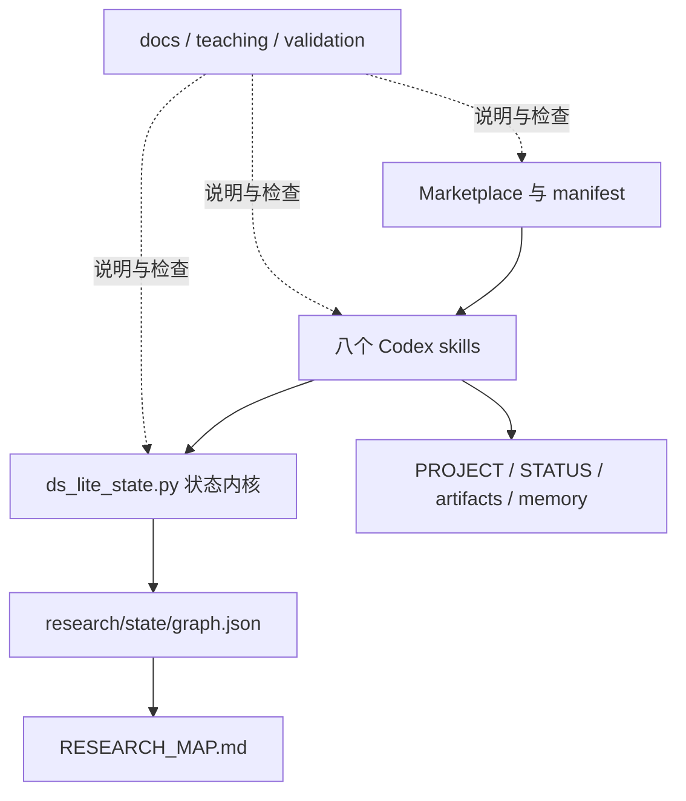
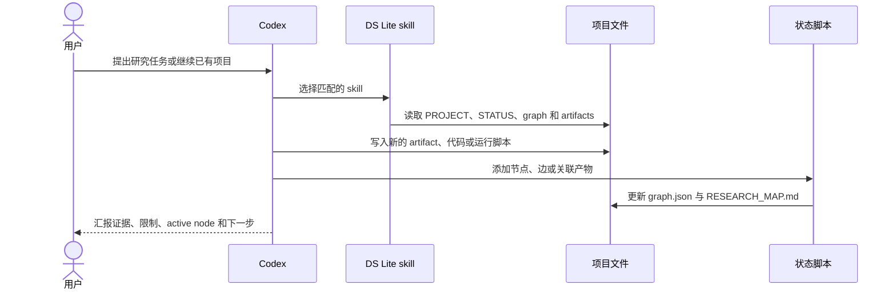

# DeepScientist Lite：设计、实现、现状与演进审视

本文是 DeepScientist Lite 的主要中文设计文档，面向插件维护者、授课教师，以及希望深入理解实现方式的用户。它不是安装教程，也不是版本宣传稿；它要回答的是：插件为什么存在、当前代码实际做了什么、哪些能力只是设计目标、现在还存在哪些缺口，以及后续应按什么顺序完善。

第一次使用插件请先读[中文 README](../README.zh.md)；想理解文件和机制但不需要维护细节，请读[用户指南](user-guide.zh.md)。本文保留 schema、CLI、迁移和发布证据等维护者内容。

本文保留 `0.1.4` / Graph v1 的审视记录，并以 `0.4.0-beta.2`、`ds-lite.graph.v2` 和 `ds-lite.evidence.v1` 作为已发布实现基线；未发布 v0.5 源码另含 Factor Card 与 bounded delegation，最近一次事实核对日期为 **2026-07-17**。当文档与实现不一致时，应依次以 manifest、skills、状态/证据脚本和验证结果为准，再同步修正文档。

## 阅读约定

- **已实现**：当前仓库中存在对应代码或协议，并已通过至少一种自动检查。
- **部分实现**：主路径可以工作，但缺少边界处理、跨平台验证或强制约束。
- **未实现**：属于可能的演进方向，不能作为当前插件能力对外承诺。

## 1. 项目背景与设计动机

完整 DeepScientist 面向的是长期运行的本地科研系统。它包含 daemon、API、Web/TUI、runner、connector、MCP、artifact service、memory service、Git quest、配置与部署等多个层次。这些能力适合完整平台，但也提高了安装、理解、教学和二次开发的门槛。

DeepScientist Lite 选择另一条路线：不复刻平台，而是抽取其中最适合教学和小型项目的科研协议，把它压缩为 Codex 可以直接发现和执行的 skills、普通文件模板，以及一个无第三方依赖的状态图脚本。

它试图保留的不是界面或服务数量，而是以下研究行为：

- 先建立项目合同，再开始探索。
- 把 scout、idea、experiment、analysis 等阶段变成可检查的产物。
- 让每个主张能够回到实验、代码、数据或文献证据。
- 保留失败、分支、回滚和被替代的路线。
- 让下一次 Codex 会话或另一位研究者可以从文件恢复上下文。

状态图采用“步骤节点、邻接表、产物关联和路线回溯”的通用设计思想。该思路受到 TraceableCodeAgent 一类可回溯智能体的启发，但本项目没有复制其代码，也不把它作为运行依赖；图结构、命令接口和科研语义均为面向 DS Lite 文件协议的独立实现。

插件本身是主要产品。范式比较实验等项目用于验证协议、暴露缺口和制作教学案例，不应被误解为插件的核心交付，也不能用单个实验结果替代插件质量证据。

## 2. 产品定位与适用范围

DeepScientist Lite 适合：

- 用 20 至 30 分钟解释自动化科研为何需要显式状态、artifact 和路线回溯。
- 从一句研究问题启动一个文件化的小型科研项目。
- 接入已有代码和笔记，做不覆盖原结论的 intake audit。
- 在 Codex 中进行一轮或多轮轻量 scout、idea、experiment 和 analysis。
- 用 Git diff、Markdown 和 JSON 审查研究过程。

它不等同于完整 DeepScientist，也不提供以下能力：

- 常驻 daemon、任务队列或长时 runner。
- Web/TUI 工作台、connector 或多渠道消息入口。
- MCP server、artifact service、向量记忆服务或数据库。
- 本地模型安装、模型路由和算力调度。
- 自动创建 Git worktree、自动提交或自动合并研究分支。

所谓“持续科研”，在当前版本中是由 **Codex 会话 + 项目文件 + 可复现脚本 + 可选 Codex automation** 共同实现的。插件本身不会在后台醒来，也不会在用户不知情时继续运行实验。automation 可以成为外部调度手段，但不是 `0.4.0-beta.2` 插件包的一部分。

## 3. 核心设计原则

### Prompt-led 与 skill-led

工作方法放在 skills 中，由 Codex 根据任务选择和执行。插件不实现一个硬编码的中央阶段调度器，因此阶段可以回退、跳转或分支，但执行质量依赖模型是否遵循 skill 协议。

### File-led

跨会话状态写入项目目录，而不是依赖聊天历史。用户可以直接阅读、修改、版本控制或迁移这些文件。

### Artifact-first

idea、experiment、analysis 和写作结论应先形成 artifact，再挂接到图节点。聊天中的口头结论不是持久证据。

### 显式状态优于隐式上下文

当前节点、阻塞、下一步、路线和证据路径都应显式记录。状态图只保存公开摘要，不保存隐藏 chain-of-thought、内部推理轨迹或不可审计的思考过程。

### 保留历史而不是覆盖历史

失败实验、候选分支和旧结论应保留，通过 `rollback`、`supersedes` 等关系表达路线变化。这样 Git 历史和研究图可以共同回答“为什么走到这里”。

### 轻量与可移植

状态脚本只使用 Python 标准库；核心状态采用 JSON、Markdown 和 shell 脚本。这个选择降低了部署成本，也意味着并发、事务、索引和自动检索能力需要明确让位。

### 进程生命周期归属

长任务采用“外部稳定 owner 负责进程，DS Lite 负责文件化交接和证据”的模型。对话、Codex worker、tmux、实验进程和工件必须分开判断：tmux 只让进程脱离当前终端，不能保证它脱离创建它的临时 shell、cgroup、容器、宿主机或调度节点。因而 `agent-ephemeral` 或未知上下文只能准备 launch-ready handoff；持久运行结论必须来自同一启动边界上的 persistence probe、断线模拟以及 owner/PID/job/日志/checkpoint 的恢复核对。

该协议复用现有 artifact 与 Evidence Pack，按 attempt 追加 `external-task-*` 记录。它不增加 daemon、launcher、tmux/systemd/Slurm 管理器，也不改变 Graph 或 `STATUS.md` schema。恢复遵循 `recover first, resubmit last`，防止重复计算、重复调用和预算双花。

### tmux 人工供给握手

tmux 路径拆成两个互相引用但不争夺权威性的 artifact：`external-tmux-plan-*` 保存容量、固定 socket、人工创建命令、server 指纹、probe 和授权槽位；`external-task-*` 保存每个真实 attempt 的 PID、日志、预算、Evidence Pack 和恢复状态。计划从 `draft` 进入 `awaiting-user-bootstrap`，经用户创建、只读观察和真实断线 probe 后才能成为 `verified`；运行状态始终以 task artifact 为准。

外部启动遵守单写者：每个 plan 只登记一个 launch authority，启动前持久化 `plan_id + slot_id + task_id + attempt + command_hash` claim；若宿主不能提供原子 claim，就停止并请求协调，不能让多个 worker 竞速启动。

用户拥有 tmux server 和顶层 session/window/pane 的创建与清理权。Codex 不实现 tmux manager，也不自动扩容，只能连接已验证 socket 并在计划槽位中启动一次命令。一个 pane 中的 Codex CLI child worker 仍是普通外部进程；其 provider thread/task ID 和恢复能力需要独立记录。这样既允许用户供给的 tmux 承载多个 worker，又不会把“server 还活着”错误提升为“对话或实验已经恢复”。

## 4. 总体架构与代码组成

插件由五层组成：分发层负责让 Codex 找到插件；方法层描述科研阶段；状态层维护图结构；数据层保存项目事实；支持层负责文档、教学和验证。



安装用插件位于 `plugins/deepscientist-lite/`。仓库主要目录如下：

```text
.agents/plugins/marketplace.json       # Marketplace 索引
plugins/deepscientist-lite/
  .codex-plugin/plugin.json            # 插件 manifest
  skills/<skill-id>/SKILL.md            # 方法协议
  skills/<skill-id>/agents/openai.yaml  # Codex 展示和默认提示元数据
  scripts/ds_lite_state.py              # 邻接表状态脚本
  assets/templates/                     # 项目文件示例模板
  references/                           # skills 运行时参考资料
docs/                                   # 设计和维护文档
teaching/                               # 教学提纲、演示和案例
tools/validation/                       # 仓库检查工具
```

运行时包只包括 `plugins/deepscientist-lite/`。`docs/`、`teaching/` 和 `tools/validation/` 属于仓库支持材料，不会因为 skills 路径声明而自动成为 Codex 的运行时上下文。

审视实现时可以从以下入口开始：

- [Marketplace 索引](../.agents/plugins/marketplace.json)
- [插件 manifest](../plugins/deepscientist-lite/.codex-plugin/plugin.json)
- [状态图脚本](../plugins/deepscientist-lite/scripts/ds_lite_state.py)
- [状态图协议](../plugins/deepscientist-lite/references/state-graph-protocol.md)
- [教学区](../teaching/README.zh.md)
- [仓库验证器](../tools/validation/validate_repo.py)

各组成部分的职责如下：

| 组成 | 当前职责 | 是否为公开兼容接口 |
| --- | --- | --- |
| Marketplace | 声明仓库内插件来源、安装策略和分类 | 是，影响安装发现 |
| Manifest | 声明名称、版本、skills 路径和 UI 元数据 | 是 |
| Skills | 定义何时触发、需要读取什么、产生什么文件 | 是，名称和行为影响用户提示 |
| `agents/openai.yaml` | 提供技能显示名、短描述和默认 prompt | 是，影响 Codex 展示 |
| 状态脚本 | 创建和查询 graph、渲染 Research Map | 是，CLI 是用户可调用接口 |
| Graph schema | 保存节点、边和活跃路线 | 是，需要版本化 |
| Templates | `init` 和地图渲染的单一模板来源 | 是，修改后需通过占位符和初始化测试 |
| Runtime references | 为实验比较、数学探索和图协议提供细则 | 是，影响 skill 行为 |
| Docs/teaching/tools | 解释、演示和验证仓库 | 否，不属于运行时协议 |

一次正常的研究推进不是“skill 自动替用户完成所有科研”，而是 Codex 按 skill 读取已有文件、执行必要工具、写 artifact、调用状态脚本，再把可恢复状态交给下一次会话。



## 5. Manifest 与分发设计

`plugin.json` 当前声明插件名 `deepscientist-lite`、版本 `0.4.0-beta.2`、Apache-2.0 许可证、仓库地址、非官方身份说明、UI 描述和 `skills: "./skills/"`。manifest 没有 `mcpServers`、`apps` 或 `hooks` 字段。

这种最小 manifest 有三个目的：

1. 避免用户把安装插件误解为启动完整平台。
2. 让教学重点落在科研协议，而不是部署复杂度。
3. 让插件可以通过标准 Codex marketplace 布局安装和验证。

仓库级 `.agents/plugins/marketplace.json` 使用相对来源 `./plugins/deepscientist-lite`。其中 `INSTALLED_BY_DEFAULT` 表示用户添加该 marketplace 后的安装策略，不表示插件会随所有 Codex 安装自动出现。

Manifest 和 marketplace 属于对外接口。修改插件名、skills 路径、版本或 source path 时，必须同时检查安装、缓存升级、新线程技能发现和文档中的安装命令。

## 6. 八个 Skills 的职责与协作

八个 skills 组成一个最小科研闭环和一个可选的有界协调入口，但不是必须线性执行的流水线。每个 `SKILL.md` 的 frontmatter 只包含 `name` 和 `description`，触发说明尽量覆盖真实用户表达；具体工作流、约束和交接要求写在正文中。

| Skill | 主要输入 | 主要动作 | 持久输出 | 常见状态变化 |
| --- | --- | --- | --- | --- |
| `ds-lite-intake` | 研究问题，或已有代码、笔记和结果 | 新项目初始化；旧项目审计；建立目标、约束和验收标准 | `PROJECT.md`、`STATUS.md`、graph、初始 Research Map | 创建 `intake-root`；保持已有结论不被静默覆盖 |
| `ds-lite-scout` | 项目合同、当前节点、已有资料 | 澄清问题，检查文献、数据、baseline、benchmark、metric 和风险 | `scout-*.md` artifact | 通常以 `next` 进入 scout；证据不足时可标记 blocked |
| `ds-lite-idea` | scout 证据、项目约束 | 比较 2 至 3 个可验证候选，选出最小有用实验 | `idea-*.md` artifact | 候选使用 `branch`；选中路线成为 active |
| `ds-lite-experiment` | active idea、代码、运行脚本 | 先写契约，再运行并封装日志、指标、环境说明和输出哈希 | `experiment-*.md`、Evidence Pack、结果文件、`run_*.sh` | 成功和失败均保留，完成后交给 review |
| `ds-lite-review` | experiment artifact、contract、manifest 和结果 | 运行确定性 verify，审查完整性、规范、引用和方法对齐 | `review-*.md`、`ds-lite.review-result.v1` JSON | typed pass review 才能成为 analysis 的父节点；fail/needs-human 时 blocked |
| `ds-lite-analysis-write` | 通过的 review、实验 artifacts、结果文件和图状态 | 建立 claim table，分析置信度、限制和缺失检查，形成阶段总结或写作产物 | `analysis-*.md`、`math-*.md` 或 `paper-*.md` | 只从 passing review 创建 analysis/write/finalize 节点 |
| `ds-lite-iterate` | Mission Board、当前 graph、用户或主管预算 | 选择一个 bounded action，写 frontier decision，更新 graph 和 STATUS 后停止 | `frontier-decision-*.md`、`STATUS.md` | 一次只推进一轮；常见动作是 branch、debug、review、analysis、stop 或 ask-human |
| `ds-lite-coordinate` | 一个 work unit 中两到三个独立任务、明确授权和父级验收能力 | 验证 delegation plan，等待批准，调用宿主子任务并核验独立回传 | `delegation-*.json`、approval/result artifacts | 不新增科研阶段；父 worker 整合后决定下一次单动作 |

### Skill 之间如何交接

skill 的交接不是通过内存对象完成，而是通过以下公开信息完成：

- `STATUS.md` 给下一次会话一个 Mission Board 短入口。
- `research/work-unit.json` 说明当前有界任务、mode、profile、claim requirement 和 typed evidence refs。
- `active_node_id` 指出当前路线位置。
- 节点关联的 artifact 提供本阶段事实。
- Evidence Pack manifest 提供可机器复核的日志、指标和输出哈希。
- Review Markdown 公开解释审查结论，typed review result 机器绑定 work unit、profile、Evidence Pack 和 verdict。
- `PROJECT.md` 保存不应随一次实验频繁改变的项目合同。
- `run_*.sh` 和 evidence path 提供可复现入口。

### 旧项目接入

旧项目不是简单运行一次 `init`。`ds_lite_state.py init` 在 graph 已存在时只返回 `exists`，并不会自动修复所有缺失文件或理解旧结论；真正的 intake audit 由 Codex 按 skill 读取现有资料后完成。这是“脚本管理结构、skill 负责语义”的典型边界。

### 行为约束的强度

skills 仍是指令协议，不是事务系统；但 Evidence Pack CLI 可以确定性检查契约、路径、必需文件、指标和哈希，Graph strict validation 会发现缺少 pack 或 review 的新路线。当前没有钩子阻止模型完全跳过 skill，也没有后台服务保证 `STATUS.md`、artifact 和 graph 跨文件原子同步。这仍是轻量设计的核心权衡。

## 7. 状态图内核与数据模型

`ds_lite_state.py` 是只依赖 Python 标准库的图状态脚本。`ds_lite_evidence.py` 负责 contract、finalize、SHA-256 和 verify；`ds_lite_protocol.py` 负责 `ds-lite.work-unit.v1`、`ds-lite.review-result.v1`、`ds-lite.factor-card.v1` 与 `ds-lite.delegation.v1` 的严格结构、路径、敏感字段和 ID 校验。三者都不负责理解论文、运行模型或自动判定真实科学结论。

机器可读权威状态是 `research/state/graph.json`；`RESEARCH_MAP.md` 是由脚本生成的人类可读投影，不应反向作为机器状态来源。

### Graph v2 顶层结构

```json
{
  "schema_version": "ds-lite.graph.v2",
  "revision": 0,
  "project": {"id": "", "title": ""},
  "root_node_id": "",
  "active_node_id": "",
  "nodes": {},
  "adjacency": {}
}
```

顶层字段的含义如下：

| 字段 | 含义 |
| --- | --- |
| `schema_version` | 当前为 `ds-lite.graph.v2`；v1 可读，并在首次写入前迁移 |
| `revision` | 从 0 开始单调递增，用于检测并发会话的陈旧写入 |
| `project` | 当前只保存稳定项目 `id` 和显示 `title` |
| `root_node_id` | 路线回溯的默认起点，初始化时为 `intake-root` |
| `active_node_id` | 当前推进节点，供下一会话和 `status`/`trace` 使用 |
| `nodes` | 以 node id 为键的节点对象 |
| `adjacency` | 以 source node id 为键的有向边列表 |

### 节点模型

每个节点必须包含：

- `id`：稳定且唯一的节点标识。
- `kind`：`intake`、`scout`、`idea`、`experiment`、`review`、`analysis`、`write`、`decision` 或 `finalize`。
- `status`：`proposed`、`active`、`blocked`、`done`、`superseded` 或 `abandoned`。
- `title`：便于地图和交接阅读的短标题。
- `summary`：可以公开审计的结果摘要，不是隐藏推理。
- `artifact_paths`：idea、experiment、analysis 等说明文件。
- `memory_paths`：长期事实卡片。
- `evidence_paths`：代码、日志、数据、图表、报告或其他直接证据。
- `created_at`、`updated_at`：UTC ISO 时间戳。

脚本明确拒绝节点包含 `thought`、`chain_of_thought`、`hidden_thought` 和 `reasoning_trace` 字段。这个限制是安全和可审计边界，而不是要求研究者减少必要的公开解释；公开假设、观察、失败原因和决策理由应写入 artifact 或 `summary`。

### 边模型

每条边包含 `to`、`relation`、`reason` 和可选语义上的 `artifact_path`。允许的关系为：

| Relation | 预期语义 |
| --- | --- |
| `next` | 正常阶段推进 |
| `branch` | 可以独立验证并可能回访的候选路线 |
| `supports` | 来源节点或其证据支持目标节点 |
| `blocks` | 来源节点指出目标路线存在依赖或证据缺口 |
| `supersedes` | 新证据或新方案替代旧路线，但不删除旧节点 |
| `rollback` | 失败后返回一个仍然有效的历史节点 |

代码会检查引用完整性、progression 可达性、progression 环和语义重复边，但不会强行判断 `supports` 的科研意义或 Codex 何时应该使用 `rollback`。高层关系含义仍由 skills、artifact 证据和维护者共同保证。

### 活跃路线与渲染

`trace` 使用广度优先搜索；默认 `progression` 模式只沿 `next`、`branch` 和 `supersedes`，`--mode all` 才遍历所有关系。`render-map` 使用 progression 路径列出 Active Route，同时输出完整 Mermaid 图、节点表和边表。

这种分层避免证据边或 rollback 回边制造 Active Route 快捷路径。Active Route 仍是 progression 子图中的最短可达路径，而不是完整 provenance chain；完整关系应结合边表和 artifact 阅读。

Graph schema、CLI 参数、skill 名称和项目文件职责都属于插件的兼容接口。v1→v2 通过带永久备份的迁移实现；未来修改字段或关系含义时也必须提升 schema 或提供迁移，而不是静默重解释已有 graph。

### Work Unit、Evidence Pack 与 Typed Review

P0 保持 `ds-lite.graph.v2` 不变，在 `research/work-unit.json` 增加独立 `ds-lite.work-unit.v1` sidecar。它记录一个有界科研或工程任务的稳定 ID、`none|inline|external|human` execution mode、profile、状态、prerequisites、capabilities、claim-bearing `evidence_requirements`、evidence refs、开放资源限制和 subjects。未知字段只能进入 `extensions`，敏感键、隐藏推理、路径逃逸和 ID 冲突会被拒绝。

新项目默认 profile 是 `core-planning`，没有 claim requirement，因此 `evidence_strength=planning`、`claim_readiness=none`。普通 artifact、日志、`PROJECT.md`、`STATUS.md` 或任意非空 `evidence_paths` 都不能升级。声明 claim requirement 后，缺少适用 validator、validator 未运行或失败时为 `needs-evidence/blocked`；当前只有 `experiment-run` 的 `ds-lite.evidence.v1` 已验证。

每个新的 claim-bearing experiment 先用 `ds-lite.experiment-contract.v1` 声明假设、命令、输入、指标阈值、seed、预算、输出和失败解释。`ds_lite_evidence.py finalize` 将 UTF-8 日志、数值指标、白名单环境说明和输出路径写入 `ds-lite.evidence.v1` manifest，并为项目内文件计算 SHA-256；完整环境变量和凭据不会被自动采集。

`verify --strict` 检查文件存在性、大小、哈希、必需指标、阈值和预期输出。进程退出失败与证据损坏是不同状态：失败实验仍可形成完整 evidence，但默认 `claim_readiness=inconclusive`，不会自动 supportable。

`ds-lite-review` 同时生成 Markdown 与 `ds-lite.review-result.v1` JSON。`verdict=pass|fail|needs-human` 只表达审查门；`claim_assessment=none|inconclusive|refuted|supportable` 独立表达 claim readiness。只有 review node done、sidecar 合法、work unit/profile/node/evidence refs 和 digest 全部匹配时，Mission 才返回 `reviewed`。active review、空 artifact 或 Markdown-only review 都不够。旧 Graph v2 不迁移；缺 sidecar 时保留兼容告警。

Mission 的 `evidence_detail` 给出 work unit/profile、validated/negative evidence、typed review 数量、最新 refs 和 blocking reasons。`waiting_for_user` 只由 active-route blocked、active-route blocker edge、typed `needs-human` 或 blocked work unit触发；off-route blocked 与警告继续可见，但不无条件阻塞当前路线。文学证据、数学探索、软件评测和数值仿真 profile 目前均为 `reserved / not-validated`，不包含领域默认规则。

### Scientific Factor Card

`ds-lite.factor-card.v1` 是 idea 阶段的独立 decision artifact，不改变 Graph v2、Evidence Pack v1、work unit 或 review-result schema。它固定记录 `novelty`、`feasibility`、`evidence_strength`、`cost`、`risk` 和 `alignment` 六项，每项包含 `null|0..4` score、confidence、evidence refs、公开摘要、不确定性和 `extensions`。cost/risk 分数越高表示负担越大，因此禁止计算默认加权总分。

卡片的核心约束是“评价必须回到证据，但评价本身不是证据”。非空 score 需要项目相对或 `external://` ref；没有来源对照时 novelty 必须未知。`validate-factor-card` 只检查结构、路径、enum、敏感字段、ID/因子冲突和证据引用存在形式，不判断科学主张为真，也不参与 Mission evidence promotion。

该方法只化用了本地审计的 DeepScientist v0.1.5 研究流程中的高层思想：先写机制假设、分离 idea 与验证状态、显式诊断失败、保留不确定性、选择下一项有界测试。Finance Factor 是 pressure fixture，不是默认 profile；金融字段、公式、数据、阈值和凭据均未进入插件。

### Bounded Delegation

`ds-lite.delegation.v1` 是一次有界协调的机器 sidecar，不是 Graph 新阶段或长期运行时。它固定记录 parent work unit、`parallel|sequential`、显式 approval、唯一 integration owner、`max_children<=3`、`nested_delegation=false` 和一至三个 task contracts。每项 task 声明最小输入 refs、互斥写入/结果路径、验证命令、开放资源限制、停止条件、状态与 result ref。

`validate-delegation` 拒绝缺字段、错误 enum、ID 冲突、路径逃逸或重叠、敏感/隐藏推理字段、未知顶层字段、未批准的 active 状态、缺 result ref 的 terminal task，以及与子任务状态矛盾的 terminal delegation；即使放在 namespaced `extensions`，daemon、queue、scheduler、background worker 和 retry policy 也会被拒绝。它只证明计划和回传结构一致；不能证明宿主实际创建了独立 worker，也不能把 child 的完成文字升级成证据。父 worker 是唯一 integration owner，必须检查 artifacts、scoped diffs、每项验证和项目全量验证。

`ds-lite-coordinate` 在 approval 为 required 时只生成计划并停止。获得用户或 OpenScience 明确批准后，才可调用宿主已有的子任务能力；插件本身不提供 daemon、queue、scheduler、后台 worker 所有权、nested delegation 或自动重试。transport 状态不明或 duplicate risk 必须记录为 partial/blocked 并交回主管。真实 fresh-agent 行为属于外部验收门，静态 validator 不能替代。

## 8. 文件协议与长期记忆

一个 DS Lite 项目通常包含：

| 文件或目录 | 生命周期 | 应记录的内容 | 不应记录的内容 |
| --- | --- | --- | --- |
| `PROJECT.md` | 项目长期 | 背景、核心问题、假设、输入、验收标准、稳定工作流和重要设计决策 | 每次 smoke 的流水账、短期阻塞 |
| `STATUS.md` | 高频更新 | Mission Board、active node、最近结果、候选队列、阻塞、rollback target、下一项具体动作和更新时间 | 完整历史和长篇结果分析 |
| `RESEARCH_MAP.md` | graph 更新后重建 | active route、全图、节点表和边表 | 手工维护的权威状态 |
| `research/state/graph.json` | 每次状态变更 | 节点、边、active/root 和证据路径 | 隐藏推理和大体积原始数据 |
| `research/work-unit.json` | 当前有界任务变化时 | `ds-lite.work-unit.v1`、mode、profile、claim requirement、refs 和开放限制 | 领域硬编码、凭据、绝对工作站根目录 |
| `research/memory/*.md` | 发现长期事实时 | 有来源的稳定事实、约束、环境结论或方法决策 | 未经验证的临时猜测 |
| `research/artifacts/*.md` | 每个研究阶段 | idea、baseline、experiment、analysis、decision 和写作记录 | 只有口号、没有证据的结论 |
| `research/artifacts/factor-card-*.json` | idea 比较或证据变化时 | 六项分解评价、refs、不确定性、decision 与 minimal test | 自动总分、隐藏推理、claim evidence |
| `research/artifacts/review-*.json` | 每次 review 完成时 | typed verdict、claim assessment、Evidence Pack refs/digest 和匹配身份 | Markdown 解释、隐藏推理或任意未知顶层字段 |
| `research/evidence/<run-id>/` | 每次 claim-bearing run | contract、manifest、日志、指标、白名单环境说明和哈希 | 凭据、完整环境变量、未经授权复制的外部数据 |
| `run_*.sh` | 运行方法变化时 | 可重复执行的研究、实验或分析命令 | 只在某次终端中有效的隐式步骤 |

### 四种状态载体的关系

- `graph.json` 回答“有哪些研究节点，它们如何连接，现在在哪里”。
- artifact 回答“某个节点具体做了什么，得到了什么”。
- evidence path 回答“原始证据在哪里”。
- memory card 回答“哪些事实以后仍然需要快速复用”。

当前 memory 只是可版本控制的 Markdown 文件。插件没有向量索引、相似度检索、自动遗忘或跨项目记忆服务；Codex 必须通过读取项目文件来恢复它。这样的实现透明而轻量，但项目很大时需要更好的索引策略。

### 权威性与同步责任

`graph.json` 是图状态的机器权威来源，`RESEARCH_MAP.md` 可以随时重建。`PROJECT.md` 和 `STATUS.md` 具有不同语义，状态脚本不会自动从 graph 完整生成二者。Codex 在完成阶段工作后，需要同时维护 artifact、graph 和必要的项目文档。

## 9. 状态脚本命令接口

命令行入口为 `plugins/deepscientist-lite/scripts/ds_lite_state.py`。安装后的物理路径由 Codex 插件缓存决定，skills 应优先从已安装插件目录解析脚本，而不是假设固定的用户目录。

| 命令 | 类型 | 当前行为 |
| --- | --- | --- |
| `init` | 写 | 建立目录、graph、PROJECT、STATUS、Research Map、四个 `run_*.sh` 和共享运行时；已有 graph 时返回 `exists` |
| `add-node` | 写 | 创建节点，可同时建立父边、关联路径、设为 active 并选择渲染 |
| `update-node` | 写 | 更新节点 title、summary 或 kind，支持 UTF-8 文件输入 |
| `add-edge` | 写 | 在已有节点间添加一条指定关系的有向边 |
| `link-path` | 写 | 追加 artifact、memory 或 evidence path；`link-artifact` 是兼容别名 |
| `set-active` | 写 | 将目标设为 active，并把之前的 active 节点设为 done |
| `set-status` | 写 | 修改单个节点状态；设为 active 时同步 active id |
| `migrate` | 写/预览 | 预览或执行 v1→v2 迁移，保留原图备份并处理外部别名 |
| `trace` | 读 | 按 progression 或 all 模式从 root 回溯，输出 JSON 或 Markdown |
| `trace-artifact` | 读 | 查找 artifact、memory 或 evidence 列表中包含指定路径的节点 |
| `validate` | 读 | 检查结构、active、可达性、progression 环、重复边、时间、路径和地图 revision；strict 可按全图或当前路线判定警告 |
| `render-map` | 写 | 根据 graph 重写 `RESEARCH_MAP.md` |
| `mission` | 读 | 从 graph、work unit、typed evidence/review 和验证结果派生 Mission Board，输出 `claim_readiness`、`evidence_detail` 与 route-scoped waiting，保留字符串 `next_action` |
| `render-status` | 写 | 将 Mission Board 写入 `STATUS.md`，不改变 Graph schema 或 revision |
| `status` | 读 | 输出项目、active node、节点数和边数的 JSON 摘要 |

### 最小路线示例

下面的示例使用占位变量，避免假设插件安装在固定路径：

```bash
STATE_SCRIPT="$PLUGIN_ROOT/scripts/ds_lite_state.py"

python "$STATE_SCRIPT" init \
  --root . \
  --title "Small Research Project" \
  --question "Can the proposed method beat the baseline under a fixed budget?"

python "$STATE_SCRIPT" add-node \
  --root . \
  --id scout-baseline \
  --kind scout \
  --parent intake-root \
  --relation next \
  --title "Audit baseline and metric" \
  --artifact-path research/artifacts/scout-baseline.md \
  --active \
  --render

python "$STATE_SCRIPT" trace --root . --format markdown
python "$STATE_SCRIPT" validate --root .
```

Windows 命令行传递中文时可能受终端编码影响。`init` 提供 `--title-file` 和 `--question-file`，`add-node` / `update-node` / `add-edge` 还提供 `--summary-file`、`--reason-file` 等 UTF-8 文件入口；需要传递较长或非 ASCII 文本时应优先使用这些参数。

## 10. 典型工作流

### 新项目初始化

Codex 读取用户问题，运行 `init`，再把模板中的 TBD 内容改成真实背景、输入和验收标准。初始化成功不等于 intake 完成；只有项目合同和下一步都清楚后，才应进入 scout。

### 旧项目 intake audit

Codex 先读取已有 README、笔记、代码、脚本和结果，区分可信结论、过期结论和待验证假设，再补充缺失的 DS Lite 文件。不得为了套模板而覆盖用户已有结论。

### Idea 分支与路线选择

`ds-lite-idea` 形成少量可证伪候选。真正可能回访的候选建立 `branch` 节点；被选中的路线成为 active，未选中路线保持 proposed 或明确记录延后原因。

### 失败实验和路线变化

失败实验仍写入 artifact 和 experiment 节点。如果失败只否定当前实现，可 rollback 到先前 idea；如果新证据使旧方案失效，可用 supersedes 建立替代关系。旧节点和负结果不删除。

### 跨会话恢复

新会话依次读取 `PROJECT.md`、`STATUS.md`、graph 的 active node、对应 artifact 和运行脚本。恢复成功的最低标准是能回答：项目目标是什么、当前证据是什么、为什么位于这个节点、下一条可执行命令是什么。

## 11. 教学区与支持材料

`teaching/` 是独立教学区，包含20/30/45/90分钟课程、现场演示、学生工作表、教师评分表、确定性 fixture 和标准库 `lab_runner.py`。它不进入插件运行时路径。

runner 支持 quickstart、evidence、branches、route、paths 和 revision 六类实验。student 模式只准备数据、Graph 状态和故障现场；reference 模式才生成明确标记的教师答案。脚本不会调用 Codex skill，也不会把预写 review 伪装成自动审查结果。

每门课同时提供逐步引导和一段式 Codex 挑战。前者减少模型波动，适合第一次学习；后者用于检查 Codex 是否能在真实项目中遵守同一协议。案例中的算法结论和固定分数都不是插件能力声明。

运行时 `references/` 只保留 skills 会直接使用的协议材料：状态图协议、Evidence Pack、Scientific Factor Card、bounded delegation、外部长任务管护、比较实验模板、数学探索模板和教学说明。发布检查、已知问题和产品状态放在 `docs/maintainers/`，避免给每个运行中的 skill 增加无关上下文。

这个分层维持了清楚的主次关系：

- `plugins/deepscientist-lite/` 是产品运行时。
- `teaching/` 解释如何教和演示。
- `docs/` 解释为什么这样设计以及如何维护。
- `tools/validation/` 检查仓库是否仍符合约定。

## 12. 验证体系与当前证据

仓库验证入口位于 `tools/validation/`。推荐运行：

```bash
python tools/validation/validate_repo.py
```

当前统一验证流程覆盖：

- manifest 名称、版本、skills 路径和禁止字段。
- 八个 skill 是否存在，frontmatter 是否只有 `name` 和 `description`。
- TODO 残留和 description 的最低长度。
- README 导航、文档目录和运行时 references 边界。
- 临时项目中的 planning→typed evidence→typed review→analysis smoke，以及 Graph v2、Evidence Pack、work unit/review schema 负例、revision、迁移、路径、哈希、并发、锁超时、路线语义和地图同步单元测试。
- Windows/Ubuntu 与 Python 3.10/当前 3.x 的 GitHub Actions 矩阵。

`run_validate.sh` 和 `run_validate.ps1` 是单一验证入口，依次执行 unittest、仓库 smoke 和 Python 语法检查；它们按任务类别留在 `tools/validation/`。

截至 2026-07-17，已发布 `0.4.0-beta.2` 与未发布 v0.5 源码的验证证据必须分层记录：

- 仓库验证器执行通过，并覆盖 `mission` / `render-status` 的 Mission Board smoke。
- Codex 官方 `plugin-creator/scripts/validate_plugin.py` 在具备 PyYAML 的 Python 环境中执行通过。
- `0.4.0-beta.2` 发布包包含七个 skills；未发布 v0.5 源码包含第八个 `$ds-lite-coordinate`，其结构、quick validator 和仓库发现门可验证，但实际新线程发现与子任务行为仍待授权验收。
- manifest 已统一到 `0.4.0-beta.2`；source/package tag 不代表 cache 安装态已同步。
- Graph v2 单元测试覆盖并发无丢写、锁超时、revision 冲突、迁移和外部别名。
- Evidence Pack 单元测试覆盖 UTF-8、空格路径、哈希、篡改、失败进程、重复 finalize、外部显式哈希和敏感字段拒绝。
- OpenScience handoff 文档说明主管如何读取 `mission --format json`、触发一轮 `$ds-lite-iterate`、收集 Evidence Pack/review/analysis。
- Delegation 单元测试覆盖批准门、最多三个任务、nested delegation 拒绝、互斥路径、result ref、敏感字段和 forward compatibility；这些测试不冒充 fresh-agent forward test。

这些证据不能替代：

- 独立新用户从 GitHub marketplace 安装的反馈。
- Windows PowerShell、Git Bash、Linux 和 macOS 的完整交叉验证。
- Codex Desktop 升级缓存被占用时的可重复恢复测试。
- 更大规模 graph 的性质测试和长时间压力测试。

## 13. 当前版本判断

`v0.4.0-beta.2` 是面向 **worker-protocol beta / source-package prerelease** 的证据审查版本。它在 Graph v2、Evidence Pack 和 review gate 基础上补充 Mission Board、`mission`/`render-status` CLI、`ds-lite-iterate` 单轮 worker 协议和 AIResearch 复盘规则，但在获得独立安装、macOS、缓存升级和真实 OpenScience 调用证据前，仍不应被描述为 stable 或自动科研平台。

### 已经成立

- Marketplace 和 plugin manifest 布局完整。
- 七个 skills 的结构和元数据可验证；安装态发现仍需手工验收。
- 未发布 v0.5 的第八个 coordinate skill 与 delegation validator 已在源码成立；宿主执行和安装态发现尚未成立。
- 新项目可以初始化项目文件和状态图。
- 可以通过完整写接口维护节点、边、三类路径和状态，并检测陈旧 revision。
- Graph 可以校验结构与关键语义，以 progression 路径渲染 Mermaid/Markdown。
- v1 可以安全迁移到 v2，永久保留备份并阻止外部绝对路径静默进入 graph。
- graph 写入具备跨平台锁、原子替换和并发回归测试。
- 比较实验、数学探索和教学讲解有专用参考模板。
- 新实验可以先声明契约、封装证据并经过 review，再进入 analysis/write。
- Mission Board 可以从现有 graph/evidence 派生 `STATUS.md`，显示 active route、下一步、候选队列、阻塞、rollback target、指标方向和证据强度。
- Mission Board 只接受适用 typed validator 提升 evidence，并通过独立 `claim_readiness`、`evidence_detail` 与 route-scoped waiting 暴露依据。
- 教学区有跨平台六类实验、20/30/45/90分钟课程、student/reference 模式、工作表、rubric 和答案。
- 插件没有引入 daemon、MCP 或第三方 Python 运行依赖。

### 部分成立

- 旧项目可由 intake skill 接入，但语义审计主要依赖 Codex，脚本不会自动完成 reconcile。
- 跨会话恢复在文件规模较小时可行，但没有索引或自动摘要压缩。
- 负结果和分支可以表达，关键图语义已校验；科研层面的关系正确性仍依赖 artifact 和人工判断。
- Git 友好已经成立，但 worktree 和提交策略只停留在方法建议。
- Codex automation 可以辅助定时推进，但插件没有提供 automation 安装和治理层。

### 尚未成立

- 不能在没有 Codex 会话的情况下长期自主运行。
- 不能保证每次 skill 执行都以事务方式同步 artifact、graph、STATUS 和 PROJECT。
- 不能把当前教学案例的实验结果视为插件的通用性能证明。
- 尚未获得足够的独立安装、跨平台和真实教学反馈，不能宣称 stable。
- 文学证据、数学探索、软件评测和数值仿真只注册了 `reserved / not-validated` 扩展位，尚无领域 validator 或真实通过 fixture。
- P1 action envelope/iteration receipt 与 P2 external-long typed profile 尚未实现；当前 `ds-lite-iterate` 仍是 skill 约束的一次一轮协议。

## 14. v0.1.4 技术债关闭情况与剩余风险

以下条目保留原审视脉络，并标明 v0.2 的处理结果，避免把已解决问题继续当作当前缺口。

### 已解决：模板双重来源

`init` 和地图渲染现在严格读取 `assets/templates/`，缺失模板或未满足占位符会失败；Python 不再保存初始化正文副本。

### 已解决：状态更新接口不完整

Graph v2 提供 `update-node`、`set-status` 和通用 `link-path --type`；涉及 graph 的 skills 明确禁止直接编辑 graph，并规定 revision 冲突恢复方式。`ds-lite-coordinate` 先维护独立 delegation sidecar，只有父 worker 接受结果后才由相应状态 skill 更新 graph。

### 兼容保留：CLI 冗余参数

`status --json` 作为弃用 no-op 暂时保留；写命令默认渲染，并提供 `--no-render`。兼容参数将在未来 major 版本再评估移除。

### 已解决主体：Graph 校验只覆盖结构基础

当前 `validate` 已检查：

- active 唯一性和 `active_node_id` 一致性。
- progression 可达性与环。
- artifact、memory、evidence 和 edge artifact 路径策略。
- 语义重复边、UTC 时间和 map revision。

它不会判断某条 `supports` 是否在科研意义上成立，也不会替代人工核验 claim 与 evidence。

### 已解决：路线算法没有关系语义

默认路线只遍历 `next`、`branch` 和 `supersedes`；`trace --mode all` 保留全关系诊断能力。

### 已解决主体：写入缺少事务与并发保护

写命令使用永久 lock file、Windows `msvcrt` / Unix `fcntl` 锁、锁内重读、expected revision、语义校验、`fsync` 和同盘原子替换。地图与 graph 无法成为单个文件系统事务，因此通过 revision 检测并允许 `render-map` 修复。

### 已解决主体：路径协议边界不一致

Graph v2 只接受项目相对路径或 `external://alias/path`。外部根通过环境变量解析；v1 外部绝对路径迁移必须显式映射。

### 已解决：缺少 schema migration

v1 保持只读兼容；首次写入或显式 `migrate` 升级到 v2，并永久保存带时间戳的 v1 备份。未来 schema 变化仍需新的显式迁移。

### 已解决：中文验证样例不够可信

smoke 和 unittest 使用自然中文标题、问题和带空格路径，并检查完整字符串往返。

### Skill 协议缺少强制执行层

Codex 可以按 skills 正确写入 artifact 和 graph，但当前没有 hook、事务或后台审计器阻止漏写、顺序错误或状态不同步。增加强制层会提升一致性，也会增加插件复杂度；是否引入必须服从教学轻量定位。

### Git、worktree 与 automation 不是内置能力

当前文档可以推荐使用 Git、worktree 和 Codex automation，但插件没有封装这些操作，也没有自动化策略文件。对外介绍时必须区分“可与 Codex 生态组合”与“插件已经实现”。

## 15. 演进路线与决策建议

### P0：v0.2 已实现的可靠性基线

- 真实中文与空格路径测试、模板单一来源、Graph v2 和完整写接口。
- 锁、revision、原子写、语义校验、外部路径别名及 v1 迁移备份。
- Windows/Ubuntu 的 Python 3.10 与当前 3.x 自动验证。

### P1：延期的 action 与 iteration transaction

- `ds-lite.action-envelope.v1`、canonical idempotency key、expected revision 和 `ds-lite.iteration.v1` receipt 尚未实现。
- 当前 `$ds-lite-iterate` 仍由 skill 约束“一轮一个动作”，不能宣称具备事务 receipt 或跨文件 partial-write 修复。

### P2：延期的 typed external-long profile

- `ds-lite.work-profile.external-long.v1`、failure taxonomy、retry policy 和资源/subject helper 尚未实现。
- 现有 external task/tmux Markdown 是人工可读协议，不是 typed profile runtime；只有外部稳定 owner 可以持有长任务。

### P3：延期的安装与跨模式发布闭环

- cache 安装、新线程技能发现、真实 tmux 断线、provider resume、macOS 和完整跨模式矩阵仍待验收。
- 文献、数学、软件和仿真 profile 保持 `reserved / not-validated`，教学 fixture 不能把它们升级成领域支持声明。

## 16. 稳定版验收门槛

在宣布 stable 之前，至少应满足：

1. 全新用户可以从 marketplace 安装，并在重启后的新线程发现目标版本声明的全部 skills；`0.4.0-beta.2` 为七个，v0.5 候选为八个。
2. 新项目和旧项目各完成一次 intake 到 analysis 的最小闭环，并至少触发一次 `$ds-lite-iterate` 单轮 checkpoint；原有文件不被静默覆盖。
3. Windows PowerShell、Git Bash 和一种 Unix-like 环境通过核心状态脚本测试。
4. 真实中文、空格路径和项目外路径行为有明确测试与文档。
5. Graph 写入具备基本原子性，校验可以发现 active 状态冲突、不可达节点、陈旧 map 和 active-route 外警告。
6. Mission Board 能让用户打开 `STATUS.md` 读懂当前目标、阶段、最近动作、下一步、候选队列、rollback target、证据强度和是否等待用户。
7. README、设计文档、teaching 和 runtime references 各守边界，没有把维护状态塞回用户入口。
8. 至少有一位非维护者完成安装和教学流程，并留下可复现反馈。
9. CHANGELOG、release notes、已知问题和升级恢复步骤齐备。

即使进入 stable，以下事项仍默认不做：完整 DeepScientist daemon、Web/TUI、connector、本地模型打包、隐藏推理存储，以及未经用户控制的长期自动运行。

## 17. 后续审视方法

未来每次重要迭代，应从四个问题出发：

1. 这项改动是在加强核心科研协议，还是把 Lite 重新膨胀成平台？
2. 它改变了 manifest、skill 名称、CLI、graph schema 或文件职责中的哪个兼容接口？
3. 它是否有真实用户或测试证据，还是只有设计上的吸引力？
4. 新能力是否仍然可以让学生在一次短课中理解，并让用户直接检查自己的研究状态？

设计审视的目标不是让功能列表越来越长，而是让“可恢复、可审计、可教学的科研推进”越来越可靠。

`run_validate.sh` 和 `run_validate.ps1` 是按验证任务类别维护的统一入口，所以放在 `tools/validation/`，不在仓库根目录重复放置。
