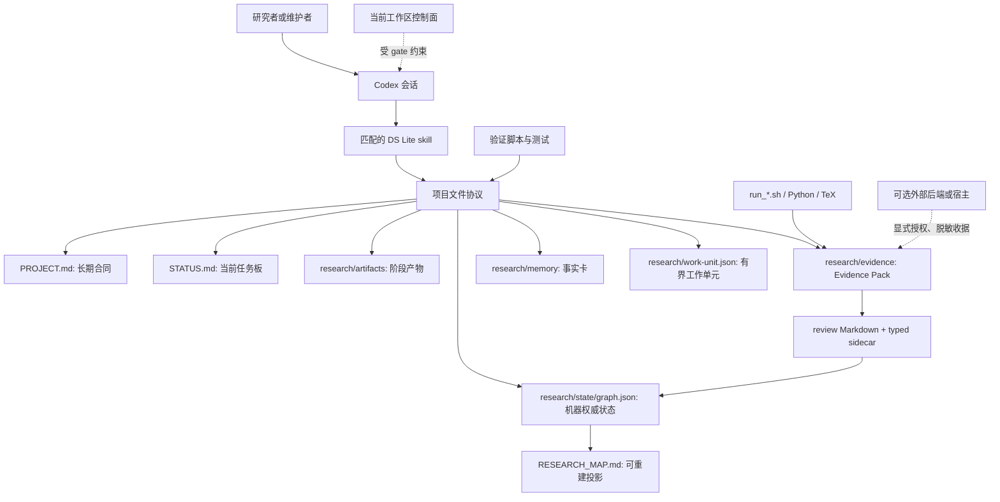
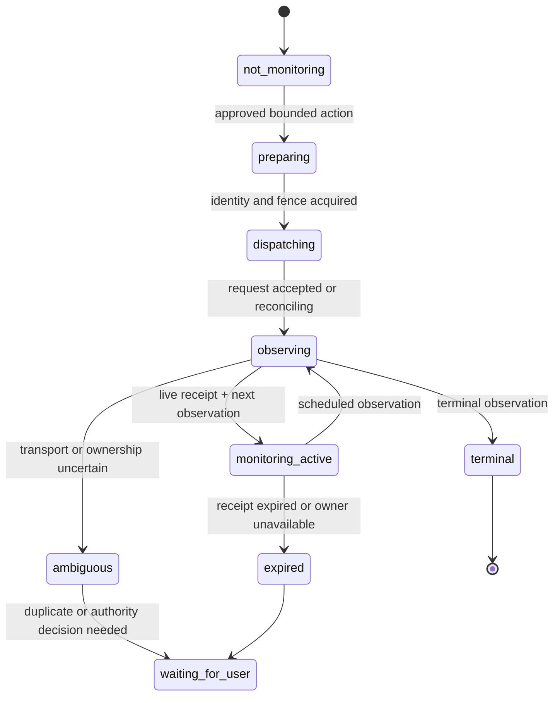

# DeepScientist Lite：功能设计、开发复盘与下一阶段路线图

> 观察截点：2026-07-31。本文面向需要继续讨论产品边界、科研工作流和持续执行架构的工程助手与维护者，而不是面向首次安装的用户教程。

## 摘要：这不是一个“替用户做科研”的黑箱

DeepScientist Lite（下文简称 DS Lite）是一个面向 Codex 的、以本地文件为中心的科研与研究工程协作协议。它的第一目标并非自动生成论文、自动运行无限实验，或把聊天记录包装成“智能体记忆”。它更关心一个朴素但经常被忽略的问题：当研究跨越多次会话、多个实验、不同执行环境和不同负责人时，下一位人或智能体能否看懂当前目标、已做动作、证据强度、失败边界、下一步和可回退路线。

这一定义决定了 DS Lite 的基本取舍：用可读 Markdown、版本化 JSON、可复现脚本和确定性校验器记录项目状态；让 Codex skill 提供工作方法与交接纪律；让状态图、Evidence Pack、review sidecar 和收据承担不同层次的事实；而不试图在早期版本复刻一个常驻 daemon、通用队列、向量数据库、浏览器服务、模型调度平台或“无人值守科学家”。

当前仓库已经从单一轻量插件演化为六个可拆装的插件包，并在当前工作区实现了一个受到严格边界约束的控制面原型。前者主要解决研究过程的可恢复、可审计和可教学问题；后者尝试解决“有界的、可恢复的前台连续执行”问题。二者不能混为一谈：文件协议已经是产品的核心能力，控制面 Phase 3 的真实多 gate provider 验收尚未通过，因此它不能被宣传为已经具备可靠自治、持续后台执行或可发布的自动控制器。

本文的目标有四个：

1. 解释当前插件的功能设计、目录结构、数据模型、记忆策略与产物治理方式。
2. 还原从最初的文件协议到拆包、证据门、教学验证、上游适配和控制面的主要决策过程。
3. 将已发布或已验收的事实、当前工作区实现和下一步设想明确分开，避免“代码存在”被误读为“能力已经可靠可用”。
4. 给网页端 GPT 或后续架构讨论提供一个可审计的共同起点：哪些问题已解决，哪些只是局部证据，下一步应先验证什么，而不是再堆叠多少功能。

## 0. 阅读约定、资料边界与证据口径

### 0.1 三层事实等级

仓库在 2026-07-31 存在已提交历史和大量未提交工作区改动，且不同文档代表的版本截点不同。因此本文不用单一“已完成/未完成”二分法，而使用以下标记：

| 标记 | 含义 | 可否对外承诺 |
| --- | --- | --- |
| **[P] 已发布或已验收** | 有已提交实现，或有明确的、与主张匹配的自动化/真实宿主验收证据。 | 可以，但必须带上适用边界。 |
| **[W] 当前工作区实现** | 当前工作区有代码、协议或测试，但未必已纳入发布版本；可能依赖本机临时验证资源。 | 不应包装为已发布能力。 |
| **[H] 假设、路线图或未证实能力** | 设计目标、预留接口、局部 fake/offline 证据，或被真实环境阻塞的能力。 | 不可承诺，只能描述为下一步。 |

这里“真实验收”并不意味着科学结论正确，而是指在目标宿主、真实 Codex/app-server、真实 Hook、真实 provider 或真实外部进程边界上观察到相应协议行为。相反，固定种子的 fake host、单元测试和离线故障矩阵能证明局部实现具有某种性质，但不能外推为 provider 可达、桌面宿主已经加载、对话真的恢复或外部进程真的保持存活。

### 0.2 本文的资料来源

本文依据当前工作区中的 manifest、skills、模板、协议、控制面状态文档、上游登记、验证脚本、冻结 receipt 说明和 Git 提交历史整理。最关键的来源包括：

- `plugins/*/.codex-plugin/plugin.json` 与 `.agents/plugins/marketplace.json`：插件拆包、发现与版本事实。
- `plugins/deepscientist-lite-core/references/`：状态图、Evidence Pack、交接、委派、长任务、循环与沟通协议。
- `plugins/deepscientist-lite-core/controller/`：控制面 schema、DBOS/SQLite bridge、fencing、broker、故障 harness 与备份恢复实现。
- `docs/maintainers/ds-lite-control-plane-phase*-status-20260731.zh.md`：按阶段冻结的验收结论。
- `docs/implementation.zh.md`、`CHANGELOG.md`、`PROJECT.md` 与 Git 历史：早期版本、产品边界和演进路径。
- `plugins/deepscientist-lite/references/upstream-project-registry.json`、`THIRD_PARTY_NOTICES.md`、上游采用审计：第三方来源、固定 commit 与许可证边界。

本文不会记录完整聊天转录、隐藏推理、原始 provider 内容、密钥、token、机器绝对路径或可用于恢复凭据的环境信息。它描述的是可公开审计的项目状态和设计决策。

### 0.3 读者怎样使用本文

如果只想快速判断产品方向，可依次阅读第 1、2、7、10、11 节；如果要继续实现，请重点阅读第 3 至第 9 节和第 12 节的验收建议；如果要审查开源关系，直接阅读第 10 节。不要把某一份 Markdown、一次测试通过或某个“completed”自然语言总结单独当作系统真相，DS Lite 的设计本身就在反对这种做法。

## 1. 问题定义与产品边界

### 1.1 要解决的不是“缺一个 Prompt”，而是研究状态会蒸发

常见的 AI 辅助科研工作有一个结构性问题：研究者和模型在单个会话内能形成丰富上下文，但会话一旦结束、换人、换机器或遇到长任务失败，事实、假设、实验条件和下一步就退化成零散对话。即便目录中有代码与图表，也常无法回答几个最基本的问题：

- 这个项目真正要验证的问题是什么，什么结果才算成功或失败？
- 当前走的是哪一条路线，哪些候选被放弃或被替代？
- 一条主张对应的是代码、数据、日志、文献、人工判断，还是模型的口头推断？
- 这次实验的命令、预算、随机种子、指标方向和输出完整性是否可复核？
- 外部任务是仍在运行、已经失败、观察不到，还是仅仅失去了创建它的聊天会话？
- 下一位参与者可以做什么，什么不能重试，什么需要用户授权？

DS Lite 将这些问题改写为项目文件中的协议。它假设对中小型研究、教学项目和研究工程任务而言，显式、版本控制友好的文件比隐含在模型上下文中的“记忆”更可靠，也比立即引入常驻服务更容易安装、审查和迁移。

### 1.2 目标用户与适用任务

**[P]** DS Lite 的原始目标是教学、快速启动和小型科研项目。它适合从一句研究问题建立项目合同、接入已有代码进行 intake audit、安排一轮 scout/idea/experiment/review/analysis、保留失败分支、把实验收据交给下一次会话，以及通过 Git diff 审查研究过程。它同样可以服务于有限范围的研究工程，例如数值分析、信号处理、经验研究设计和公共网页证据采集。

它不适合被当作以下系统的替代品：

- 完整 DeepScientist 的 daemon、API、Web/TUI、connector、artifact service、memory service 或长期调度平台；
- 通用作业队列、HPC/Slurm 管理器、tmux 管理器、容器编排器或模型路由器；
- 自动判断科学主张为真的裁判；
- 无用户授权的浏览、登录、付费 API 调用、数据上传或无限自动重试系统；
- 用“有一个运行中的 pane/会话”来证明实验或对话仍可恢复的监控产品。

这种边界不是谦辞，而是架构防线。每增加一种后台所有权、外部状态或凭据表面，都需要增加相应的真相来源、失败恢复、权限模型和验收。若在证据尚未闭环时把它们塞进“轻量插件”，最终会得到一个难以判断是否还活着、也无法解释为什么重试的系统。

### 1.3 四条长期设计原则

**文件优先（file-led）。** 跨会话状态写入用户项目，而非依赖某个聊天线程、平台缓存或隐式记忆。文件应能被人阅读、由 Git 追踪、被脚本校验，并在必要时迁移。

**产物优先（artifact-first）。** idea、实验、评审、分析与写作主张先形成项目内产物，再与路线关联。对话中的一句结论不是持久证据；一个文件存在也不自动等于研究已经推进。

**显式状态优于叙述性进度。** 当前节点、阻塞、执行模式、证据强度、主张准备度、下一步与回退目标必须能在 `STATUS.md` 和状态图中看到。系统只保存可审计摘要，不保存隐藏思维链。

**保留历史而不是静默覆盖。** 失败实验、负面证据、旧指标解释、被替代路线和中止的验收都应继续可见。新的结论通过新的 artifact、`rollback` 或 `supersedes` 表达；不得改写旧 evidence 来让新叙述显得一致。

## 2. 当前产品形态：从单体插件到六个可选包

### 2.1 Marketplace 与包结构

当前 marketplace 将 DS Lite 拆为六个可安装单元。`deepscientist-lite-core` 是唯一的领域中性内核，其他五个包是显式可选扩展。拆包的意图不是制造更多“产品 SKU”，而是把稳定的恢复与证据协议从高依赖、强领域或高外部效果的能力中隔离出来。

| 包 | 当前版本/状态 | 主要职责 | 明确不承担的职责 |
| --- | --- | --- | --- |
| `deepscientist-lite-core` | `0.8.1-beta.1`，**[W]** | 九个核心 skills、项目状态、证据、评审、迭代、交接、委派与有界前台自治协议。 | 不提供 daemon、浏览器、知识库、调度服务。 |
| `deepscientist-lite-academic` | `0.8.1-beta.1`，**[W]** | 17 个选择性适配的 Nature 学术搜索、写作、审稿、数据、图表、引用和投稿 workflow。 | 不静默注册 MCP、凭据或全局工具。 |
| `deepscientist-lite-web` | `0.2.0-alpha.1`，**[W]** | 公共网页采集、后端能力记录与来源 provenance。 | 不登录、不提交表单、不上传、不过度声称后端已执行。 |
| `deepscientist-lite-knowledge` | `0.2.0-alpha.1`，**[W]** | 将经过审查的来源记录转为待发布的知识提案。 | 不拥有论文库，不直接写入正式知识库。 |
| `deepscientist-lite-empirical` | `0.2.0-alpha.1`，**[W]** | 经验研究中的 estimand、样本、识别、诊断、稳健性和负结果交接。 | 不另建数据库或第二套状态机。 |
| `deepscientist-lite-engineering` | `0.2.0-alpha.1`，**[W]** | 数值、信号、仿真和研究图的审计性分析。 | 不替代领域方法学或自动认定图形正确。 |

早期单体包 `plugins/deepscientist-lite/` 仍保留在仓库，记录了 `0.6.0-beta.1` 的过渡形态、vendor 快照和兼容材料。它不应与 marketplace 指向的 Core 包混作同一个发布事实。早期文档中提到的 `0.4.0-beta.2` 也应该被理解为当时的已发布基线，不是当前工作区所有功能的版本标签。

### 2.2 总体组件关系

这个图里有三个关键分界：第一，skill 是方法与行为协议，不是把所有语义硬编码进脚本的调度器；第二，Graph JSON 是机器状态，`RESEARCH_MAP.md` 是由它渲染的阅读投影；第三，控制面和外部宿主只能通过限定接口、收据与证据 ref 影响项目，不能把“外部系统看起来还在”直接写成项目完成。

### 2.3 Core 的九个 skill 是怎样协作的

**[W]** Core 的九个入口包括统一路由器 `ds-lite`，以及 `ds-lite-intake`、`ds-lite-scout`、`ds-lite-idea`、`ds-lite-experiment`、`ds-lite-review`、`ds-lite-analysis-write`、`ds-lite-iterate`、`ds-lite-coordinate`。它们不是强制线性流水线：研究可以回到 scout、建立多个 idea 分支、让失败实验成为证据，或者在明确授权下做一次小规模委派。其共同约束是每次进入项目都要从公开文件恢复状态，并以一个可见 checkpoint 结束。

| 阶段 | 核心问题 | 主要输入 | 主要持久输出 | 不能越过的门 |
| --- | --- | --- | --- | --- |
| Intake | 项目到底要研究什么，现有结论能否信任？ | 用户目标、已有目录、笔记、代码。 | 项目合同、任务板、根节点、初始地图。 | 不能静默覆盖既有结论。 |
| Scout | 已知基线、数据、指标、风险是什么？ | 项目合同与已有资料。 | scout artifact、阻塞与证据缺口。 | 未查到的事实只能标为未知。 |
| Idea | 哪个候选值得最小验证？ | scout 资料与约束。 | idea artifact、Factor Card、分支。 | 评分不能替代实验或证据。 |
| Experiment | 这次行动承诺了什么、实际发生了什么？ | active idea、代码、预算、命令。 | contract、Evidence Pack、结果与失败记录。 | 指标方向、输出哈希和预算不可模糊。 |
| Review | 实验记录是否足以进入分析？ | Evidence Pack、源文件、artifact。 | review Markdown、typed result sidecar。 | Markdown 评语不是 promotion。 |
| Analysis/Write | 哪些主张可被支持，限制是什么？ | passing review 与结果。 | claim table、analysis/paper artifact。 | 不从未通过 review 的实验升级主张。 |
| Iterate | 一个完整行动闭环是否完成？ | Mission Board、工作单元、预算。 | iteration receipt、反思、终态。 | 每轮只做一个有界动作，不对不明请求自动重试。 |
| Coordinate | 哪些独立子任务可在父级验收下分开？ | delegation plan、授权、互斥路径。 | delegation record、子任务结果 ref。 | 未授权、路径冲突或嵌套委派都停止。 |

上述分工还说明了 DS Lite 的一个重要判断：所谓“智能体体验”不是模型自称思考了多少，而是一个动作之后是否留下验证、失败层、回退点和下一步。没有可见闭环时，即便文本很流畅，也只是一次聊天输出。

## 3. 记忆设计：不是向量召回，而是分层、可归责的项目状态

### 3.1 为什么不把所有东西叫作 memory

许多 agent 系统把长上下文、摘要、缓存、数据库和知识库统称为“记忆”。这在工程上会掩盖事实来源：一条研究结论究竟来自项目合同、当前计划、实验记录、可复核日志、用户授权，还是某次模型摘要？DS Lite 有意拆分这些角色，宁可让使用者多看到几个文件，也不让一个“memory”对象同时承担命令、证据、路线和长期背景。

| 层级 | 权威文件或对象 | 保存什么 | 更新频率 | 不保存什么 |
| --- | --- | --- | --- |
| 项目合同 | `PROJECT.md` | 背景、核心问题、假设、输入、工作流、运行入口、验收标准、设计决策。 | 低；只有长期事实变化时更新。 | 临时运行输出、逐轮聊天摘要。 |
| 当前任务板 | `STATUS.md` / Mission Board | active node、阶段、工作单元、证据强度、下一动作、阻塞与回退。 | 每次状态提交后更新。 | 完整证据与隐藏推理。 |
| 机器状态 | `research/state/graph.json` | 节点、边、revision、active route、artifact/memory/evidence refs。 | 经 state CLI 的受锁定写入。 | 人类长篇解释或完整日志。 |
| 人类地图 | `RESEARCH_MAP.md` | Graph 的路线、节点、边和 revision 投影。 | 随 Graph 提交重建。 | 独立的机器权威状态。 |
| 长期事实卡 | `research/memory/*.md` | 一条耐久事实、来源、适用范围、最后核查日。 | 事实获得或失效时更新。 | 未校验的直觉、完整对话。 |
| 阶段产物 | `research/artifacts/*` | 某一步做了什么、证据、结果、下一步。 | 每个阶段性动作。 | 代替完整项目合同。 |
| 可验证证据 | `research/evidence/<run-id>/` | contract、manifest、日志、metrics、environment、hash。 | 实验 init/finalize/verify。 | 科学真理判决。 |
| 有界动作状态 | `research/work-unit.json`、iterations、delegation/handoff 记录 | 本轮授权、输入、资源、停止条件、结果 refs。 | 每个工作单元或交接。 | 永久的总项目叙事。 |

这种分层提供的是“可追责的记忆”，不是为了最大化检索召回率。下一次会话不用相信前一次会话说“已经做完”，而是可以读取任务板，沿 active node 找到 artifact、Evidence Pack 和 review sidecar；如果某件事只是一个候选，则它应该只在 Factor Card 或 idea 分支中出现，而不会伪装成已验证结论。

### 3.2 `PROJECT.md`：项目级慢变量

`PROJECT.md` 被定义为项目级记忆，而不是每一轮任务的日志。理想情况下，它包含研究背景、核心问题、假设、输入、工作流、运行脚本、验收标准、当前设计决策与已废弃方案。它的主要价值是让后续执行者在不阅读全部 Git 历史的前提下理解“哪些东西不应轻易改变”。

因此，对 `PROJECT.md` 的修改要克制：新增长期约束、替换已经废弃的设计、记录稳定运行入口和验收标准是合理的；把一次 timeout、临时命令或未验证猜想逐条塞进去会把慢变量污染成流水账。短期状态应进入 `STATUS.md`、artifact 或 receipt。本文本身就是一个跨模块、长期有价值的设计总结，因此会在本仓库的 `PROJECT.md` 中留下索引，而不会把正文复制进去。

### 3.3 `STATUS.md` 与 Mission Board：给下一位执行者的最小入口

`STATUS.md` 是人先打开的文件。Graph 的 `mission` 命令从 active route、证据验证、分支队列、rollback target、blocker 和指标面推导出 Mission Board。一个合格的任务板至少要回答：当前节点是什么、处于哪个阶段、什么 evidence 已验证、主张能否支持、是否等待用户、下一步是什么、回退到哪里。

Mission Board 有意使用诸如 `planning`、`needs-evidence`、`inconclusive`、`refuted`、`supportable` 等状态，而不是把所有非空目录都叫作“done”。它还区分 active route 的 blocker 与离线路线的 blocker：一个候选失败应保持可见，却不必错误地阻塞正在进行的另一条路线。

### 3.4 Graph v2：可写的路线，而不是漂亮的流程图

Graph 的权威文件是 `research/state/graph.json`，schema 为 `ds-lite.graph.v2`。顶层保存项目标识、`revision`、根节点、当前 active 节点、节点集合与邻接表。每个节点有 `id`、`kind`、`status`、短标题、公开摘要、artifact/memory/evidence refs 和 UTC 时间；边表达 `next`、`branch`、`supports`、`blocks`、`rollback`、`supersedes` 等不同关系。

图的作用不是强行把研究锁成 intake 到 paper 的直线。`branch` 表示候选路径，`rollback` 表示回到此前可用位置，`supersedes` 表示后来结论替代旧解释，`supports` 只表示某项证据或判断关系。这样失败实验可以仍然是一个 done 或 blocked 节点，负面结果也能定义搜索边界。系统不会为每个 revision 保存完整快照，完整历史依赖 Git 与保留下来的 artifact；Graph 负责当前可导航的结构。

写入时，state CLI 会进行跨平台锁、revision 比较、语义校验和原子替换。v1 图可读，首次写入时迁移为 v2，并保留旧图备份；若 v1 含有项目外绝对路径，需要显式 external map 才能改写。这个机制承认文件系统不是数据库，但避免让两次会话的过期写入安静覆盖彼此。

### 3.5 Memory Card 的正确颗粒度

memory card 模板只有四个核心字段：一条持久事实、其来源、适用范围和最后核查日期。它故意很小。好的卡片像“基线 X 使用 metric Y 且方向为 max，来源是 `scout-baseline.md` 的 DOI 与运行记录”；不好的卡片像“模型认为方法 X 很有前景”。后者应留在 idea artifact 中，并由最小测试改变其状态。

这一选择也意味着 DS Lite 当前没有向量数据库、全文自动召回或跨项目知识图谱。**[H]** 未来可以由 Knowledge 包连接现有库，但它应接收经审查的提案而不是把本地项目的任意笔记自动发布为“知识”。

## 4. 产物与证据治理：让“做过”与“能支持主张”分开

### 4.1 产物谱系

DS Lite 不把所有文件视为同等证据。以下谱系从“计划”到“可支持主张”的强度逐步增加：

`PROJECT.md`、普通 artifact、日志、图像、Factor Card 和非空 `evidence_paths` 都有价值，但它们不自动提高 Mission Board 的 `evidence_strength` 或 `claim_readiness`。对 claim-bearing work unit，目前只有其 profile 声明的 typed validator 通过声明的证据 ref 时才能提升；P0 的 `experiment-run` 使用 `ds-lite.evidence.v1`，其他领域 profile 若尚无 validator，必须 fail closed。

### 4.2 Experiment Contract：先定义承诺，后看结果

Evidence Pack v1 用三类 schema 表达一次实验：`ds-lite.experiment-contract.v1` 描述计划，`ds-lite.evidence.v1` 描述已执行的证据清单，`ds-lite.environment.v1` 保存脱敏环境说明。contract 要求 run/node id、假设、命令、项目相对 cwd、输入、指标定义、seed、预算、预期输出和失败解释。

尤其重要的是指标方向。`max`、`min`、`target` 和 `observe` 不是展示文案；缺失或写错方向被视为协议失败。若比较依赖预算，contract 与 artifact 还应区分 smoke、早期预算、最终预算和 AUC 等聚合指标。这样做防止在实验结束后根据结果临时改变“什么算提升”。

环境记录只允许 Python、平台、packages、container、hardware 和 notes 等脱敏字段。它不应保存完整环境变量、API key、token、密码或原始命令输出中的秘密。自由文本命令和日志仍可能携带敏感内容，所以 finalize 前的人工审查依然必要。

### 4.3 Evidence Pack：完整性证明，不是科学真理证明

`init`、`finalize`、`verify --strict` 三步让项目可以记录 contract、stdout/stderr、metrics、环境和输出哈希。项目内路径使用规范化的 POSIX 相对路径，不允许 `..`；项目外资源用受授权的 `external://alias/path` 表示。项目内输入和 evidence 文件要求 SHA-256，外部输出只有在明确授权时才哈希。

Evidence Pack 能证明的内容是“这份记录中声明的文件是否仍存在、哈希是否一致、必需字段是否满足、阈值和路径是否符合协议”。它不能证明实验设计没有偏差、数据没有系统性错误、模型结论为真，甚至不能保证进程退出码为 0：一个失败进程只要证据包完整，仍可能是值得保留的负面结果。相反，阈值未达标会在严格验证中失败，不应通过修改 manifest 或补写叙述把它伪装成成功。

### 4.4 Review gate：Markdown 的解释力与 JSON 的约束力

review 产物分为对人可读的 Markdown 与机器可验证的 `ds-lite.review-result.v1` sidecar。Markdown 要呈现可复现性、规范与指标、引用真实性、方法/代码/日志对齐等审查通道；sidecar 则把 work unit、profile、review node、experiment node、evidence refs、validator、digest、verdict 和 claim assessment 绑定在一起。

这里有两个刻意分开的判断：`verdict` 是 `pass`、`fail` 或 `needs-human`，决定能否穿过 review gate；`claim_assessment` 是 `none`、`inconclusive`、`refuted` 或 `supportable`，描述结果对于主张的意义。一个 review 文档写得很完整、一个文件名叫“pass”、或一个 review node 处于 active，都不会升级状态。只有身份、路径、digest 和 validator 都匹配的 typed result 才算 `reviewed`。

这种严格性看上去增加了样板文件，却阻断了一个常见错误：把模型生成的一段“审稿意见”当作独立审计，再把它作为进入写作阶段的许可证。DS Lite 只承诺分离工作流与可复核记录，不承诺多模型独立性、基础设施隔离或真正同行评审。

### 4.5 Factor Card：决策辅助，不是自动选题器

`ds-lite.factor-card.v1` 为 idea 阶段保存 novelty、feasibility、evidence strength、cost、risk、alignment 六个维度。每个非空分数必须指向至少一个项目相对或受授权 external evidence ref，候选不能引用自己的卡片作为支持。分数范围为 0 到 4，且没有加权总分和自动赢家：高风险与高成本表达负担，不能被几个“高创新”分抵消。

卡片的最终目标是明确 trade-off，并形成一个会改变判断的 `minimal_test`，不是制造表面精确的科研评分。无来源比较时 novelty 必须为 unknown；负面检查要保留；被搁置或拒绝的候选不能删除。它永远是 decision artifact，不能直接提升 evidence strength。

### 4.6 回滚、修正和负面结果

科研过程必然会修正 metric 方向、阈值解释或方法假设。DS Lite 的规则是：如果修正会改变过去 run 的解释，就写 protocol-breaking correction artifact，保留旧节点，并通过 `rollback` 或 `supersedes` 呈现变化。不能在原 Evidence Pack 中覆盖旧数值，不能把中断任务删除掉，也不能让新结果借用旧 run id。这样做的代价是目录更复杂，收益是能够分辨“新证据推翻旧路线”与“后来把历史悄悄修成了正确答案”。

## 5. 有界执行、交接与委派：把责任边界写进文件

### 5.1 Work unit 是“这一次能做什么”的合同

`research/work-unit.json` 使用 `ds-lite.work-unit.v1`，与 Graph v2 并列而不是嵌入图中。Graph 描述研究路线，work unit 描述一个当前有界研究或工程动作的执行合同：目标、execution mode、profile、先决条件、能力需求、evidence requirement、资源限制、主体和可选 iteration ref。这个分离避免把“某个节点存在”误解为“当前允许任意方式推进该节点”。

例如，一个工作单元即使已经有 `PROJECT.md`、普通 artifact 和日志，只要没有 claim requirement，它仍是 `planning`；一个 claim-bearing 工作单元在其 profile 对应的 typed validator 验证声明 refs 前，仍是 `needs-evidence`。当前对于文献、数学探索、软件评估和数值模拟等 profile，部分规则仍处于保留或尚未有可泛化 typed validator 的状态。正确行为不是放宽为“文件看起来很多就算支持”，而是保持不升级，等待领域 case evidence 和 validator 完整化。

资源限制同样有意保持开放但显式：应写明维度、单位和正值，例如 GPU 时间、调用次数、数据量、费用或人类审核时间；而不是从模型对“这应该很快”的猜测推断额度。用户或监督者的授权仍然是高成本运行、集群、外部数据、安装依赖和付费 API 的前提。

### 5.2 Iteration：一轮动作必须有停止条件

`ds-lite-iterate` 为单轮 plan-execute-verify-reflect-report 提供 `ds-lite.iteration.v1` receipt。它先记录 running，再做一个动作，随后验证、反思、给用户报告，并落到 `completed`、`partial`、`blocked`、`failed` 或 `ambiguous` 等终态。它不是“尽可能多做一点”的循环许可。

这一协议主要抵御两个风险。第一，模型在已经完成一个检查后，因为仍有上下文或任务模糊，继续发起未授权实验、安装或外部请求。第二，外部调用 timeout、响应丢失或工具中断后，被自然语言“再试一次”掩盖了重复提交、预算双花和状态不一致的风险。对于不明 transport，合理默认是保留部分证据、标为 ambiguous、请求决定，而不是假定没有发生。

当前的 bounded loop protocol 还吸收了一个更强的结论：所谓“正在持续执行/监控”不能只靠一条文本声明。每一次未来观察都必须有 receipt、owner 可查询性、有效期和闭环规则；超时、会话切换、连接丢失和外部任务终态必须各自分类。若没有下一次观察的证据，就应降级为 `not-monitoring`、`expired` 或 `unknown`，而不是继续报告“后台仍在运行”。

### 5.3 Handoff：投影，不是把对话搬家

`ds-lite.handoff.v1` 用于长上下文切换、任务换 owner 或子任务回传。它包含目标、已观察事实、假设、授权边界、非秘密配置、相对 evidence refs、failure layer、未验证项和一条 next action；并对该脱敏投影计算 digest。接收者必须拒绝缺失或不匹配 digest、过期授权、绝对路径、原始 JSONL、prompt、凭据、token 和 hidden reasoning 字段的 handoff。

Handoff 的意义不是“把模型脑海中的一切都交出去”。完整转录既不稳定，也会扩大隐私和凭据面。一个有效交接只需要让接收者知道：可以做什么、明确不能做什么、哪份配置权威、哪些尝试已经冻结、下一步唯一的动作是什么。接收方在修改或外部请求之前，应确认同一边界；不明或 blocked handoff 不能自动授权重试、发布、nested delegation 或第二个动作。

这种设计还有一个人机协作上的好处：每次交接都暴露了依赖的隐含前提。若某项任务无法在不携带完整聊天记忆的前提下被交接，通常意味着它还没有形成足够明确的项目文件、证据 ref 或局部合同。

### 5.4 Delegation：最多三个孩子，父级是唯一整合者

`ds-lite.delegation.v1` 支持一次受监督的扇出，但不是 agent swarm。适用条件是一个 active work unit 中存在两到三个可以独立理解、独立验证、且由父级整合的任务。每个子任务需声明目标、最小输入 refs、互斥 `allowed_paths` 与 `expected_output_refs`、验证命令、资源限制、停止条件和结果 ref。`nested_delegation=false` 是硬约束。

执行前必须写出并验证计划，初始状态为 `approval.status=required`、`authority=none`。只有明确的用户或 OpenScience 批准，加上项目相对的 approval artifact，才可进入 authorized/running。children 可以并行或顺序运行，但它们不直接合并 sibling 工作、不写父 Graph，也不因“完成”自动升级证据。父级 integration owner 必须检查路径所有权、返回 artifact、范围内 diff、子任务验证命令和父项目验证，再决定哪些结果进入 work unit 与 Graph。

这是一种刻意保守的并发模型。它让并发带来的收益只出现在真正可拆分的查找、检查或局部实现上，同时防止多个智能体同时改同一份状态、在不共享足够上下文时重复发起外部操作，或把协调层变成没有事故记录的后台队列。

### 5.5 外部长任务：必须区分四种生命周期

长任务相关协议是 DS Lite 最重要也最容易被误读的一部分。它明确区分以下对象：

1. **对话/worker 生命周期**：某个 Codex 会话或子任务还是否可见。
2. **进程生命周期**：训练、仿真、脚本或 CLI 子进程是否仍在操作系统中运行。
3. **实验生命周期**：某个 run 是否完成、失败、可恢复或已经消耗预算。
4. **产物生命周期**：日志、checkpoint、证据包、配置和输出是否仍可读取。

这四者不能互相推导。tmux server 还活着，不证明 pane 内的训练还活着；一个 process PID 仍在，不证明指标契约已满足；聊天线程仍能 resume，不证明它拥有原外部进程；项目 artifact 还在，反而可能是在所有进程停止后唯一留存的证据。

`external-tmux-plan-*` 与 `external-task-*` 以两个互相引用但不争夺权威的 artifact 记录此类工作。前者保存容量、固定 socket、人工创建命令、server 指纹、probe 和授权槽位；后者为真实 attempt 记录 PID、日志、预算、Evidence Pack 和恢复状态。用户拥有 tmux server、顶层 session/window/pane 的创建和清理权；DS Lite 只可连接已验证 socket 并在授权槽位中启动一次命令。每个 plan 只能有一个 launch authority，启动前要持久化 `plan_id + slot_id + task_id + attempt + command_hash` claim；缺少原子 claim 时必须停止协调。

恢复规则是 `recover first, resubmit last`。先检查 owner、PID/job、日志、checkpoint、输出清单、预算和 duplicate guard；再判断原过程是否已经不存在、能否 in-place recovery、是否允许新 attempt。partial output 和失败 attempt 是证据，不是清理对象。不存在“控制器没了就重跑”或“pane 找不到就当作未发生”的捷径。

### 5.6 失败层分类是行动边界，而非用户体验文案

项目协议使用 `precondition`、`authorization`、`resource`、`execution`、`observation`、`evidence`、`review`、`state`、`duplication`、`completed` 等 failure layer，并允许更细的 `rate-limit`、`timeout`、`provider-unavailable`、`ambiguous-transport`、`no-final-feedback`。分类的价值在于决定下一步：

- `authorization` 需要用户或组织授权，不能靠重试解决；
- `resource` 需要调整预算、容量或执行位置，不能把 timeout 改写成失败实验；
- `observation` 说明还没有足够信息断言外部状态，不能直接重发；
- `evidence` 与 `review` 提示结果可以存在但不足以支持主张；
- `duplication` 说明必须先调和身份和副作用，再决定是否创建新 attempt。

这套分类来自一个基本认识：诊断应该先看系统边界、依赖、数据流和组件关系，区分根因、触发条件与表面症状。局部修补能够让仪表盘恢复绿色，却可能永久抹掉重复调用或已消耗预算的事实。

## 6. 五个领域扩展：同一 Core，不同入口与外部效应

### 6.1 Academic：把学术 workflow 接入证据边界，而不是替代证据边界

Academic 包包含 17 个选择性适配的 `nature-*` skills，覆盖学术搜索、阅读、写作、审稿、数据、图表、引用、回复与投稿等工作。它的价值是提供领域方法和产物模板，而不是让“Nature 风格”成为科学主张的证明。所有外部工具、MCP、API、浏览器、LaTeX、Node 或 Python 依赖都应通过 workspace-local onboarding 和显式授权获得；包本身不会静默修改全局配置或添加凭据。

从产品上看，这个拆分避免 Core 因为一个用户要写论文而携带大量学术工具依赖，也允许非学术工程项目继续使用相同的 Graph、Evidence Pack 和 Handoff。Academic 的文字质量规则也必须服从证据规则：可以改善中文/英文表达、降低翻译腔、保护术语与引用，但不能使用“润色”掩盖没有实验、未查证引用或过强的主张。

### 6.2 Web：公共只读采集与 provenance 优先

Web 包是 `0.2.0-alpha.1` 的公共只读采集层。它记录后端 capability、允许域名、页数、字节、时间、调用、token 和费用预算，以及每条来源的媒体类型、获取时间、内容哈希、后端、转换链、相对 artifact ref 与 failure layer。可选后端包括 Playwright CLI、Firecrawl、Tapestry 和 agent-browser，但配置了某后端不等于该后端已经被调用或在当前机器可用。

v1 明确拒绝认证浏览、cookie 复用、表单提交和文件上传。重定向时还要重新检查域名与私网地址。这个限制是安全和可复现性的共同需求：一旦系统碰到登录态、个人化搜索结果或隐式上传，简单的“抓取记录”已经不足以说明行为、权限和数据去向。

### 6.3 Knowledge：只产出待审提案，不重造资料库

Knowledge 包可接收 Tapestry、ScholarAIO、ResearchKB 或兼容存储的来源记录，将其转为 `ds-lite.knowledge-proposal.v1` 等 review-safe handoff。它不拥有 paper library、feed、note 或正式知识库；输出必须位于用户项目或显式 external root，不能写进安装后的插件目录。提案在目标系统作出 target-native review decision 前始终是 pending。

这种“适配器而非数据库”的定位是有意的。用户可能已有不同的文献和知识基础设施，DS Lite 的职责是把来源、主张与审查边界带入项目工作流，而不是把所有存储统一到另一个未必被用户认可的库中。它也避免了未经审查的网页摘要、聊天记忆或局部实验结果自动污染长期知识。

### 6.4 Empirical：先记录识别与反例，再谈结果叙述

Empirical 包提供方法中立的经验研究路由，覆盖 estimand、样本、识别假设、诊断、稳健性检查、负结果和 handoff。它不另建数据存储或 state machine，而是借用 Core work unit、artifact、Evidence Pack 和 review gate。其设计动机是让“统计代码跑通”与“识别假设成立、样本边界清楚、稳健性足以支撑结论”成为两件独立可检查的事。

在未来扩展中，Empirical 最需要避免的是过早形式化一套万能统计 validator。不同研究设计的证据结构差异很大；在有足够 case evidence 前，领域提示、审查模板和清晰 handoff 比一个把所有分析都标成 supportable 的通用评分器更可信。

### 6.5 Engineering：数值工作必须留下单位、采样与图形证据

Engineering 包面向 Python、MATLAB 或 Octave 的数值、信号处理、仿真和研究图分析。它要求记录单位、采样、预处理、FFT 选择、seeds、命令、图表和 evidence，并把 aliasing、leakage、维度和坐标轴检查显式化。它不是为所有工程问题附加一个“科学”标签，而是将工程中高频而隐蔽的解释错误变成审计项。

这个包与 Empirical 的共性是：领域输出不能脱离证据层独立存在；差异是它需要更强的单位和信号约束。两者都不应反过来修改 Core 的通用状态模型，除非确实出现跨领域都需要的新稳定不变量。

### 6.6 扩展包之间的集成原则

所有领域包都应遵守同一组集成原则：使用项目相对引用；不新增第二个 graph 或“隐式 memory”；外部副作用显式授权；输出先进入 artifact/proposal，再经过适当 review；任何领域独有 schema 都要标明与 Core 的绑定方式、可迁移性和验证状态。扩展不应为了方便而直接修改 `STATUS.md` 的事实级别，或让一个漂亮的领域报告跨过 Evidence Pack 和 review gate。

### 6.7 集成生态与能力矩阵：什么被打包，什么只是可选适配

“集成”在本仓库至少有五种完全不同的含义。第一种是**随插件分发、可被 Codex 发现的 skill**；第二种是**随包保留的固定上游快照或选择性改写规则**；第三种是**运行时按 capability 发现的外部 CLI、浏览器或托管服务**；第四种是**只接收/输出协议化 handoff 的伴随系统**；第五种只是**方法借鉴或 reference-only**。若不区分这些层级，用户很容易从“目录里出现了某项目名称”错误推导出“插件已经安装、拥有登录态、可以直接调用并对结果负责”。

| 集成对象或层 | 集成等级 | 当前可提供的能力 | 必要前提 | 明确禁止或不承诺 |
| --- | --- | --- | --- | --- |
| Core 九个 `ds-lite-*` skills | 随 Core 分发的运行时能力。 | 研究恢复、状态、artifact、Evidence Pack、review、iteration、handoff、delegation。 | 安装 Core；项目文件和授权边界可读。 | 不创建 daemon、MCP server、浏览器、队列、数据库服务或本地模型。 |
| Nature 17 个学术 skills | 随 Academic 包分发的固定快照与受边界约束的运行时 skill。 | 文献、阅读、写作、润色、引用、审稿、数据、图表、统计、回复、投稿和研究组织。 | 安装 Academic 与 Core；需要时通过 pack doctor/onboarding 检查本地工具和授权。 | 不自动安装依赖、不静默配置 MCP/API、不保证任何外部工具可用。 |
| 沟通与润色规则 | 固定上游快照的选择性化用；本地 overlay 才是运行时规则。 | 中英文表达清晰度、学术主张/证据匹配、改写自审、结构与语气保护。 | 仅在相应语言或润色任务中按需加载本地 overlay。 | 不加载上游 persona；不模仿具名作者；不改变数字、引用、命令、公式或证据等级。 |
| Playwright CLI | capability-discovered 外部 renderer。 | 受限公共页面渲染、公开页面交互的参考实现与对照测量。 | 当前宿主已安装且被检测到；项目定义域名和资源上限。 | 不自动全局安装，不使用已有登录 profile。 |
| Firecrawl | 明确授权的托管搜索/提取 challenger。 | 限域搜索、render、scrape/benchmark 的外部对照。 | `FIRECRAWL_API_KEY` 与每次调用 `--authorized-external-provider`。 | 不保存 key；未授权时不发请求；不把配置状态写成执行事实。 |
| agent-browser | capability-discovered 的对照后端。 | 与标准 HTTP/Playwright 进行有界 benchmark。 | 可执行文件存在、允许域名和预算。 | 不是插件依赖，不自动安装，不等于用户浏览器控制。 |
| OpenCLI | manifest 验证后的 public read-only adapter challenger。 | 只读 public 搜索/获取，结果转为 source record。 | `opencli` 与 manifest 均可发现，且所选命令声明 `access=read`、`strategy=PUBLIC`、`browser=false`。 | 禁止 browser/profile/auth/daemon/cookie/form/upload/Chrome Bridge。 |
| Tapestry | Web capture 与 Knowledge handoff 的外部伴随系统。 | 公开采集的提案型 capture，或 `ds-lite.tapestry-handoff.v1` 到知识提案。 | 用户项目或显式 external root；下游 review。 | 不嵌入其数据仓库，不直接写正式知识。 |
| ScholarAIO / ResearchKB | 只读/提案型知识适配。 | 纸本文献的 review-safe handoff、pending proposal、去重/withdraw/supersede 请求。 | 明确 export/handoff 与目标系统的 native review ref。 | 不复制 ScholarAIO 论文库；不直接发布 ResearchKB 正式知识。 |
| codex-autoresearch | 固定快照的兼容适配器，当前执行被阻断。 | 版本、许可证、来源、测试和 completion 语义的审计；有界 loop 方法。 | 未来需要满足脱敏 child-output contract。 | 当前拒绝 spawn 上游 CLI；不做无限 resume、`--last`、无记录重试或后台常驻。 |
| Superpowers | 选择性方法适配，不是运行时依赖。 | 先查技能、短计划、窄改动 TDD、验证、显式交接等工程纪律。 | 与 Core covenant/权限/stop gate 不冲突。 | 不导入隐藏推理、第二套 approval、daemon/queue/scheduler/MCP 或自动重试。 |
| DeepScientist / DeepScientist V2 | reference-only。 | 工作流与证据不变量的概念来源。 | 无。 | 不复制其 AGPL 代码或完整平台运行时；不存在官方背书。 |

这个矩阵也解释了为什么 `PACKAGE.md` 中的“Core 没有 browser runtime、MCP server 或 vendor snapshot”并不矛盾于仓库同时出现 Playwright 脚本、Nature snapshots 和浏览器后端文档：这些内容属于不同包、不同层级和不同授权路径。安装 Core 不会把其他层带进用户环境；安装某个扩展也不意味着外部 CLI 或凭据已经就绪。

### 6.8 Academic/Nature skill 包：17 个可发现入口与一个内部共享层

Academic 包当前有 17 个可发现的 `nature-*` skill：

| 能力群 | 入口 | 典型产物或任务 |
| --- | --- | --- |
| 学术搜索与资料管线 | `nature-academic-search`、`nature-downloader`、`nature-literature-pipeline`、`nature-reader`、`nature-ref-verifier`。 | 文献检索、下载、阅读、来源核验、可追溯文献管线。 |
| 写作与润色 | `nature-writing`、`nature-polishing`、`nature-proposal-writer`、`nature-paper2ppt`、`nature-paper-to-patent`。 | 论文和章节起草、英文润色与中译英、项目/基金提案、汇报 PPT、论文到专利材料。 |
| 证据、实验与数据 | `nature-data`、`nature-experiment-log`、`nature-statistics`、`nature-figure`。 | 数据/元数据、实验日志、统计表述和研究图。 |
| 审查、引用与投稿沟通 | `nature-citation`、`nature-reviewer`、`nature-response`。 | 引用核验、审稿模拟、回复意见和投稿沟通。 |

`nature-shared` 同时随包存在，但它是这些 skills 读取的内部共享层，不计入 discoverable skill 数，也不应被用户当成独立工作流。完整组合安装时，Core 9 加 Academic 17 为 26 个入口；六包全装时为 30 个入口。这个数字是 package validator 实际检查的结果，而不是宣传用的固定口号。

Academic 的本地运行前置分为两步。先运行 `ds_lite_pack_doctor.py --core-root <core-plugin>` 检查包与 Core 的关系，再运行 `ds_lite_nature_setup.py doctor --workspace .` 检查当前 workspace 的可用工具和环境键。任何 MCP、外部 API、browser、downloader、LaTeX、Node 或 Python 集成都要先通过这些检查，并将可公开的观察记录为脱敏 status 与相对 evidence ref。缺少依赖时状态是 `not-observed` 或 `blocked`，绝不能因为 skill 存在就写成“已调用”。

### 6.9 润色与写作：三层能力，三条不可跨越的线

DS Lite 的“润色”不止一个来源，必须把它们分开理解。

**第一层，`nature-polishing` 是已随 Academic 包分发的完整学术润色工作流。** 它来自固定的 Nature Skills 快照，按论文类型、章节、语言和目标期刊加载最小静态 fragments。它可做英文学术表达、中文草稿到英文、段落重构、摘要/引言/结果/讨论/方法等章节级润色；对排版类请求还可处理 LaTeX 浮动体、孤立标题、多 panel 图、Supplementary Information 稀疏页等问题。后者必须编译并视觉检查渲染页面，不能只看 `.tex` 源码。它擅长的是结构、语义、论证与表达的分层处理，而不是把所有问题压缩成替换几个词。

**第二层，`nature-writing` 是从主张、结果、图、笔记或中文草稿构建/重构论文论证的工作流。** 它与单纯润色的边界应保持清楚：已完成的文本需要句子/段落级改善时路由到 polishing；需要重建 abstract、introduction、method、experiments、discussion、cover letter 或整套初稿结构时使用 writing。两者都要求根据所选 fragment 工作，而不是凭模型记忆背诵“Nature 风格”。

**第三层，Core 的 communication overlays 是本地原创、证据保真的表达契约。** `humanizer-zh.md`、`humanizer-en.md`、`academic-writing.md`、`profiles.md` 与 `self-audit.md` 分别选择性借鉴 `ai-zixun/humanizer-zh`、`blader/humanizer`、`AIScientists-Dev/academic-humanizer` 的可泛化观察。它们可以改善中文节奏、减少英文机械模式、加强 claim-evidence-limitation 结构、在改写后报告改变了什么，但只影响叙述层。

三条不可跨越的线是：

1. 不得为了流畅度修改数字、单位、公式、citation key、命令、路径、schema 字段、metric direction、日志或正式定义；这些属于 protected content。
2. 不得使用具名作者、学者或公众人物的 persona、口癖、引语或风格样本做模仿；上游声音档案仅为审计快照，`runtime_loaded=false`。
3. 不得让润色改变证据等级、授权范围、研究路线或完成判断。没有数据或引用的段落应标记缺口或弱化主张，不能用更有把握的英语把它修饰成已经验证。

这三层配合的目标不是生成“更像 AI 以外的人”的文本，而是让科研沟通更清楚、更符合用户语言，同时保持可追溯的主张与限制。对网页端讨论而言，未来更值得评估的是这种分层是否足以覆盖中文科研沟通、双语改写与投稿材料，而不是是否应该加入更多人格化 profile。

### 6.10 浏览器与公共 Web：能力发现、限域采集与来源记录

Web 包不是通用浏览器代理，也不是用户 Chrome 的远程控制器。它目前的 v1/v2 路径围绕**公开、可限域、可记录的来源获取**展开。每次运行必须声明 `--allowed-domain`、最大页数、最大字节、timeout、输出根，以及外部服务是否可接收 URL 或内容。空 allowlist 会产生结构化 `blocked` 结果；初始 URL、每次重定向和 Firecrawl 搜索结果都必须属于精确域名或其子域，越界是 policy failure，而不是被悄悄丢弃。

Web 的统一产物是 `ds-lite.capability.v1`（观察到的后端能力）与 `ds-lite.source-record.v2`（来源记录；v1 仍可读）。前者回答“此宿主是否有这个 CLI/后端”；后者才记录某次真正的 public capture，包括媒体类型、时间、哈希、转换链、相对 artifact ref 与 failure layer。配置一个 API key、检测到一个可执行文件、或写了一段浏览器脚本都不是 source acquisition 证据。

后端的角色应严格限定如下：

- **标准库 HTTP fetch**：最轻量的受限公共获取基线，用来建立可复核 source record。
- **Playwright CLI**：参考渲染器和公开页面交互后端，只有 capability-discovered 时才可用；仓库的 `ds_lite_playwright_render.mjs` 是辅助脚本，不等于向用户全局安装 Playwright 或控制其 profile。
- **Firecrawl**：托管 search/render/extraction challenger。`search` 和 `render` 同时要求 `FIRECRAWL_API_KEY` 与当次 `--authorized-external-provider`；key 永不进入 receipt，服务不可用或未授权应原样记录。
- **agent-browser**：用于 matched measurement 的可选 challenger，而非依赖项。它可以帮助比较后端行为，但不能自动成为更可信的来源。
- **Tapestry adapter**：面向中文平台的实验性 capture handoff，下游仍为 proposal-only。
- **OpenCLI（`@jackwener/opencli` 1.8.6）**：只接受 CLI manifest 明确声明为 `read`、`PUBLIC`、非 browser 的唯一命令。OpenCLI 的 browser、profile、auth、daemon、cookie、form、upload、Chrome Bridge 表面均被显式排除。
- **Codex Chrome、browser-use、PinchTab、浏览器集群与 OpenClaw**：不是本包的运行时依赖；Codex Chrome 至少在当前政策中延后至 v2，不可暗中替换为用户已有浏览器状态。

因此 Web 包能支持受控的公开资料搜索、URL/PDF/RSS 采集、公共网页渲染、来源规范化、后端 capability 检查和有界 benchmark；它不能代替登录态研究、自动化表单流程、私人数据库爬取、无限 crawling 或个人浏览器代理。任何未来放宽此边界的提案都必须先定义授权、数据出站、cookie/个人资料隔离、审计记录、撤销和故障恢复，而不是只增加一个 `--browser` 选项。

### 6.11 知识库与外部研究工具：提案桥，而不是同步引擎

Knowledge 包将 Tapestry capture、ScholarAIO paper evidence 或类似来源转为 review-safe envelope。`ds-lite.tapestry-handoff.v1` 中的每个 item 包含 ID、标题、摘要、source-record refs 与可选 claim；`ds-lite.scholaraio-handoff.v1` 对 papers 使用同样的最小安全字段。`ds_lite_knowledge.py adapt-tapestry` 或 `adapt-scholaraio` 产出新的 pending `ds-lite.knowledge-proposal.v1` batch。

Tapestry 继续拥有 capture/feed/note，ScholarAIO 继续拥有 import、解析、collection、search、reading 与论文库；DS Lite 只保存引用与提案，不复制其内部对象。ResearchKB 的正式知识写入更严格：只有目标系统给出 native review reference 后，promotion、rejection、withdrawal、supersession 或 deduplication 才能发生。这样做牺牲了“一键同步”的便利，却避免未审查网页材料、过期摘要或模型推测自动变成长期知识。

### 6.12 连续执行与工程方法的外部借鉴

`codex-autoresearch` 是已登记的固定快照兼容适配器，而不是已启用的 background runner。当前 `codex_autoresearch_adapter.py` 可以核对来源、版本、许可证和测试，但上游 CLI 会写 raw event/runner logs，尚未暴露 DS Lite 所需的脱敏 child-output contract。因此 adapter 的执行状态是 `blocked-not-verified`：它会返回 `external-policy-unverified`，拒绝 spawn 外部 CLI。即使未来 contract 补齐，也只能在 approved contract、明确 `--execute`、冻结目标、证据 refs、轮数/时限和一次性身份纪律下进入前台执行。

Superpowers 的关系更轻：它只提供适用于有界工程任务的过程性借鉴，包括行动前检查适用 skill、简短计划、用失败测试定义窄改动、验证真实文件/命令，以及在 handoff 中显式交出 authority/context/configuration/evidence/next action。DS Lite 不把它作为第二个运行时、调度器、审批系统或证据拥有者；如果 Superpowers 的过程建议与 Core 的 covenant、delegation 限制、acceptance gate 或 fail-closed 状态冲突，Core 边界优先，冲突应阻断而不是“取两者折中”。

这两项整合共同揭示了一个原则：外部项目最有价值的常常不是直接执行，而是把其有益的协议和失败模式变成 DS Lite 自己可审计、可授权、可停止的本地契约。只有当输入、输出、权限、隐私和恢复边界都得到证据支持时，才应从“方法借鉴/受限适配”升级为真实运行时依赖。

## 7. 控制面复盘：从“停止后再续跑”到受 fence 约束的恢复

### 7.1 为什么文件协议之后仍然需要控制面

文件协议能解决“状态是否可读、证据是否可查、下次会话如何恢复”的问题，却不能独自解决“一个执行中的外部操作在 controller 崩溃、响应丢失、worker 重启或多个 gate 并发时是否会重复提交”。如果未来要让 DS Lite 承担连续的前台工作，而不是每次都让人重新看状态并手动决定，必须引入更严格的动作身份、租约、fencing、durable workflow、receipt 与调和机制。

当前工作区的控制面正是为这个问题建立的实验性基础设施。它不是对原始 Lite 边界的悄然替换：基础文件协议仍然可以独立使用；控制面只在明确批准的 goal、固定版本与新 evidence root 下运行；其任何阶段的 `go` 都只解锁下一阶段，不能自动解锁发布。

### 7.2 早期失败：不能把 Stop Hook 变成隐式自治控制器

早期的 `app_server_continuation` 思路接近于“当一次 turn 停下就发起另一次 `turn/start`”。这种做法在概念上简单，却有多个无法接受的问题：无法确认前一 turn 是否真的结束、不能可靠处理 response loss、可能在原 action 已被执行后创建第二个 action，也把一个宿主 Hook 偷偷变成了长期 controller。

因此 **[P/W]** 当前设计把这一路线降级为永不 `passed` 的 legacy harness：Stop Hook 不运行持续 controller，第一次不完整 Stop 只请求同 turn repair，`stop_hook_active=true` 时交接而不无限 block；不使用 `--last`，也不在 resume 不确定时隐式新建 thread/turn。这是一个值得保留的反例：即使实现能“自动继续”，只要 identity 与副作用没有被精确绑定，它就不应称作可靠恢复。

### 7.3 控制面的不变量

从 Phase 0 到 Phase 3，设计逐步稳定下来的不变量包括：

| 不变量 | 解决的问题 | 具体约束 |
| --- | --- | --- |
| 动作身份稳定 | 同一逻辑任务被二次投递。 | `action_id` 对相同 payload 幂等；冲突 payload 触发 integrity incident。 |
| workflow 身份稳定 | domain 与 durable workflow 指向不同对象。 | 固定 `workflow_id = action_id`。 |
| owner/fence 单调 | 旧 controller 在重启后覆盖新状态。 | 每个 lease 绑定 resource 与 epoch，旧 fence 不得更新 outbox、host event、binding 或 receipt。 |
| terminal 不可重开 | 已完成动作因 UI/网络现象被重跑。 | terminal outbox 只能 retrieve 既有 workflow。 |
| 先调和后 dispatch | response 丢失后“保险起见再发一次”。 | response loss 先 read/reconcile 原请求，不重发。 |
| 收据写一次 | 后来测试覆盖了最初失败或成功的观察。 | canonical JSON、exclusive create、fsync、独立 index 和 hash 绑定。 |
| 真实宿主与 fake host 分层 | 离线测试被提升为真实 provider 通过。 | receipt 必须带 source；不同 gate 不可互相代替。 |
| 无 secret 持久化 | 控制平面日志成为凭据泄漏面。 | journal/backup 只保留必要脱敏元数据，broker token 不入备份。 |

这些不变量比任何一个脚本命令都更关键。未来若重写控制面，能改变语言、数据库、队列和宿主适配器，但不能放松“身份、所有权、终态、收据和调和”的责任边界。

### 7.4 Phase 0/0.5：先证实宿主、Hook 与最小恢复边界

Phase 0/0.5 的任务不是发布控制器，而是回答几个前置问题：固定 Codex schema 是否可获得，真实 canonical thread 生命周期是否可观察，Hook 是否能在隔离宿主加载并执行同 turn repair，DBOS/SQLite 的最小恢复是否实际发生。它经历了 no-go 到受限 go 的过程。

早期 no-go 的原因值得明确保留：canonical thread smoke 在子进程协议开始前关闭，无法观察真正的 start/list/read/archive/unarchive/resume；宿主不信任当前项目配置，无法获得真实 `Stop:block -> same-turn repair -> Stop:allow`；DBOS 虽已导入，但只存在 SQLite domain/fake-host spike；非 Windows 资源尚未观测。它们分别属于协议、授权、持久化后端和平台边界，不能靠更多 mock 测试修复。

随后，在固定 Codex `0.128.0` 生成 schema、隔离 home/local marketplace/isolated trust 和显式 `plugin_hooks` feature 下，最新 Phase 0/0.5 receipt 观察到了：

- `thread/start/list/read/archive/unarchive/resume` 与单一 turn identity；
- 一个真实同 turn 的 `Stop:block -> host repair -> Stop:allow`，并且 controller `turn/start` 计数为 1；
- 使用 Python `3.13.5`、DBOS `2.29.0`、SQLite 的跨进程恢复，保留同一 `action_id == workflow_id`，拒绝旧 fence mutation；
- 固定种子 K1-K6 故障 harness 的 100 次通过，以及 Windows 资源观测。

最新 decision 是 **go，仅允许建立独立 Phase 1 goal**，仍明确 `release_allowed=false`。这条界线的含义是：真实 Hook 和最小恢复前置已经观察到，不代表默认部署已正确、非 Windows 已覆盖，也不代表完整调度器或无人值守续跑已经可用。

### 7.5 Phase 1：双数据库边界与 domain 可靠性

Phase 1 形成了混合控制器基础。一个 DS Lite 管理的 `control.sqlite3` 保存 domain 状态、action/outbox/lease/receipt index 等业务事实；DBOS `runtime.sqlite3` 保存 durable workflow 事实。两者不伪装成一个原子事务：它们通过稳定 identity、transactional outbox、reconcile-before-dispatch 和 fencing 协作。

**[W，已在该阶段验收]** 的关键实现包括版本化 schema、WAL、`synchronous=FULL`、foreign keys、`BEGIN IMMEDIATE` 与 fail-closed migration；相同 payload 的幂等 action 与冲突 payload 的 integrity incident；terminal outbox 不可重开；receipt 的 canonical JSON/exclusive create/fsync/index；以及 managed CLI 的 `doctor`、`control run/status/backup/restore`。K1/K2/K3/K8/K9 以固定 seed 各运行 100 次，Phase 测试与 Core validation 通过，三件套备份恢复也通过。

但 Phase 1 仍没有声称完成真实 Codex 调和：K8/K9 包含 fake host/filesystem 证据，真实 AppServerAdapter、canonical thread 的 response-loss 和三方调和被刻意留给 Phase 2。它的 go 只允许创建独立 Phase 2 goal。

### 7.6 Phase 2：canonical thread、response loss 与 fault broker

Phase 2 的核心难点是：controller 发出一次真实 `turn/start` 后，如果响应丢失，如何确定服务器到底执行了、仍在执行，还是未执行，而不通过第二次 `turn/start` 赌博。为此 domain schema v2 增加 canonical thread lifecycle、fenced RPC request 和 append-only protocol journal；`CodexActionRunner` 固定 `action_id:turn-start` request identity，并以 `run_codex_action_v1` 扩展 Phase 1 `run_action_v1` 而不改变后者语义。

后来加入的 fault broker 只绑定 `127.0.0.1` 随机端口、使用 token 认证，独占固定 app-server，维护 fsync/hash-chain wire journal，并允许 bounded controller worker 断开后重连。它是协议故障验收和前台 controller transport，不是后台 supervisor，也不是可部署的常驻服务。

**[W，真实验收已观察]** Phase 2 在同一 canonical thread 上跨四个 controller PID 观察到一个 app-server PID、恰好三次逻辑 `turn/start`。第三个真实 response 被丢弃后，新 controller 调和到了原 terminal turn，没有重发；archive 的 response 被丢弃后，同样通过 active/archived 精确列表调和为唯一 archived，`thread/archive` 只发送一次。broker-aware backup v3 还覆盖 domain DB、DBOS DB、receipts、protocol journal 与不含 token 的 metadata，缺项或 hash 不符时 fail closed。

这使 Phase 2 获得了 go，并仅解锁 Phase 3。它不证明多 gate 调度、cooldown、独立 reviewer、跨平台发布或默认宿主配置已经成立。早期失败 identity 也没有删除：terminal notification 晚到窗口、PowerShell stderr/warning 捕获、旧 smoke 路径错误都留在不同 evidence root，最终 decision 只引用实际通过 artifact 的 hash。

### 7.7 Phase 3：从单个 action 恢复到多 gate DAG

Phase 3 当前仍是 active goal，尚未产生 `phase3-decision.json`，`phase4_goal_allowed=false`、`release_allowed=false` 是权威结论。当前工作区实现包括：

- domain schema v3 及显式 v2 到 v3 migration；
- DAG ready/claim、默认并发 2、retry 并发 1；
- 统一 failure classifier，包括 cooldown、awaiting-user、ambiguous reconciliation、valid negative 和连续签名 circuit；
- gate 局部失败隔离，不让无依赖 gate 因邻居失败被错误中断；
- 以 DBOS workflow 管理 cooldown，lease TTL 到期后允许新 owner/fence 接管同一 action/workflow identity；
- 每个 gate 独立 canonical thread，且上下文只允许一个显式 successor；
- 前台 supervisor、heartbeat/status truth、review-only Windows/systemd 模板和 backup v4；
- K10、K11 固定 seed 各 100 次通过，以及一代 controller 被终止、下一代恢复同一 action、fence 递增、两个 gate 收敛并完成多件备份恢复的 supervised probe。

这些结果证明了离线/受控环境中的 controller domain 语义和 DBOS SQLite 恢复，而不是 provider 端多 gate 执行已经成功。新的代码还修复了一个重要的错误成功路径：`turn/completed` 中 `turn.status=failed` 现在必须传播为 terminal `failed`，不能再完成 gate 或伪造 `completed`。这个修复本身说明控制面需要把协议字段的语义放在自然语言“completed event 到了”的表象之前。

### 7.8 Phase 3 的真实阻塞：provider terminal 与单次工具副作用未观测

真实 multi-gate gate 尚未通过。尝试使用固定 `0.128.0 + gpt-5.4`，以及后来独立生成 schema 的 `0.146.0-alpha.3.1 + gpt-5.6-sol`。这些尝试保持了一个 app-server、两个独立 canonical thread、恰好两次 `turn/start`、一次 response drop 和 TTL owner/fence 接管的纪律，但 provider stream 未给出 terminal，工具副作用也未执行。受限环境中出现 `responseStreamDisconnected`；获批非沙箱运行仍发生 `request timed out`；无凭据 `api.openai.com/v1/models` HEAD 探测也在 20 秒超时。

另一个已确认的接口边界是：当前 CLI 的 `app-server proxy --sock` 只接收 Unix domain socket，不能直接连接 Windows named pipe。对 Desktop 的 `\\.\pipe\codex-ipc` 只做了最小 proxy/initialize 探针，代理在 initialize 前关闭；只读 listener 还表明持有者并非可被安全假定为 `codex.exe app-server`。为了不读取可能含认证材料的完整 Desktop 进程命令行，也没有发送猜测帧。正确结论是 authenticated Desktop app-server 路径 `unobserved`，不是“Desktop 集成已经失败”或“可以用猜测协议继续尝试”。

这类失败处在外部 provider/宿主边界。它们不能由 K10/K11、Phase 2 的真实 response-loss 调和、成功的 schema 解析，或漂亮的 supervisor 面板抵消。下一次可信动作是在具备真实 API 出站条件的宿主上，用全新的 evidence root 重跑 Phase 3 runner；不得复用失败 thread、使用 `--last`，或把 fake/offline 结果提升为真实证据。

### 7.9 控制面状态机与“持续执行”声明

可将当前目标状态粗略表达为下图。重点不是状态数量，而是每一次跃迁都需要可审计的 trigger、证据与 owner 归属。

只有 `monitoring_active` 有效期内、owner 可查询且下一观察已登记时，才可报告“持续监控”。一次查询返回、一个完成消息、一个仍然打开的终端、或一个心跳文件都不足以构成这个状态。对于控制面，这条沟通纪律与数据库不变量同样重要：错误状态声明会诱导人和后续 agent 做出重复启动、错误清理或过度信任的决定。

### 7.10 对控制面方向的当前判断

控制面不应该因为文件协议已经成熟就被匆忙产品化。它确实展示了一个合理的最小路线：先把单 action 的 identity 和 recovery 做扎实，再把 canonical thread 和 response gap 做扎实，最后才进入 DAG、局部失败、cooldown 和 supervisor。但当前最关键的真实 provider terminal gate 未通过，且非 Windows 资源、Phase 4 独立 reviewer/release aggregate、Phase 5 跨平台混沌验收仍未开始或未通过。

因此短期正确策略是收敛，不是扩张：固定一个可达、可信的真实 provider 宿主；生成全新证据根；验证多 gate 的 terminal、单次工具副作用和恢复；再决定是否进入 Phase 4。任何在此之前增加更多 scheduler、Web 控制台或“自动研究”叙述的工作，都会扩大不确定面，却不会减少当前发布阻塞。

## 8. 开发过程复盘：设计是如何被失败和验收逐步逼出来的

### 8.1 初始阶段：把完整平台压缩成文件协议

仓库的初始提交在 2026-06-18 建立了 DeepScientist Lite Codex plugin。最初的问题意识很明确：完整 DeepScientist 面向长期运行的本地科研系统，包含 daemon、API、Web/TUI、runner、connector、MCP、artifact/memory service、Git quest 和部署配置；对于教学和小型项目，这些层的安装与理解成本过高。Lite 的第一版不是复制这些服务，而是保留可恢复、可审计、可教学的行为：项目合同、阶段 artifact、状态图、路线回溯和运行脚本。

这是一个正确但不完整的第一步。它解决了“把研究从聊天中拿出来”，却尚未回答“如何让文件之间不自相矛盾”“如何把一次实验的承诺和结果绑定”“如何验证 plugin 在真实宿主被加载”“如何处理一次长任务异常后的恢复”。后续演进不是随机加功能，而是在这些缺口上逐层增加明确边界。

### 8.2 Graph v2：从静态记录到受 revision 约束的研究路线

2026-07-02 前后的提交记录了 Windows/WSL 审计、Graph v2 加固和跨 shell Unicode 修复。Graph v2 的重要性不在于图可视化，而在于明确了机器权威文件、revision、跨平台锁、迁移、原子替换和 strict validation。早期如果把 `RESEARCH_MAP.md`、`STATUS.md` 或任意 Markdown 视为可随时手改的同等真相，很容易产生“地图说 active，节点说 done，artifact 指向另一个路径”的漂移。

Graph v2 将人类可读投影和机器状态分开，并引入 active route、branch、rollback、supersedes、block 等关系。与此同时，Windows 中文路径、空格、PowerShell、Git Bash、WSL 和 UTF-8 输出被视为协议问题而不是小型兼容性问题。对一个面向 Codex Desktop 的文件工具而言，如果初始化、命令引用和模板在真实用户环境中因为编码或 quoting 失效，那么再正确的研究语义也无法交付。

### 8.3 Evidence Pack 与 review：纠正“artifact 就是进度”的误解

2026-07-03 的提交加入 Evidence Pack review workflow 与教学 labs，随后又加入 typed worker protocol 和 review evidence。这个阶段的核心教训是：一个实验说明、一段日志、一个图或一个模型写出的总结都不应直接成为分析主张。需要先有 contract，后有 manifest、哈希、指标、环境和输出清单，再有独立 review 与 typed sidecar。

这一变化也让项目的教学价值变得具体。学生和使用者可以亲眼看到：artifact 不等于 progress，ready 不等于 done，idea 不等于 experiment，metric direction 写错属于协议失败，而不是页面上的一个小错误。负结果不再是“没跑出来就删掉”，而是搜索边界的一部分。

### 8.4 教学与交接：把协议变成可观察的学习材料

2026-07-04 至 07-05，仓库重写了用户文档、建立 runnable teaching labs，并加入 handoff 审计、isolated Codex acceptance tooling、active-route strict validation、可移植生成脚本和 cross-shell hardening。教学目录不是运行时包的一部分，但它有两层作用：一是让课程能在确定性 fixture 上解释协议；二是充当产品的反例库和验收实验场。

例如 matched-control pilot 将不同控制条件放进隔离 workspace，用公开产物打分，而不是读取完整对话或隐藏推理；fresh-host probe 记录一次真实 CLI 进程观察，即使没有事件或 timeout 也生成终态脱敏 receipt，拒绝重试和覆盖。这些设计表面上严格，实际是在训练一个共同习惯：不把准备态、offline 通过、CLI 启动、Hook 发现、provider 调用、matched effect 和发布通过混成一个“已验证”。

### 8.5 Factor Card 与 bounded delegation：把“多想法”和“多智能体”降到可检查的规模

2026-07-16 至 07-17 的变更增加了科学 Factor Card、bounded task coordination protocol 和 matched-control teaching pilot。这里的两个决定很值得复盘。

第一，候选 idea 不使用单一加权总分。科研创新、可行性、现有证据、成本、风险和对齐之间不存在稳定的线性换算；强行得出一个总分往往会掩盖最关键的不确定性。Factor Card 只记录证据支撑的多维判断和最小可改变判断的实验。

第二，委派不扩张成无限 agent hierarchy。最多三个 children、路径互斥、显式批准、父级唯一整合、禁止嵌套委派，把并行的价值限定在可独立验证的任务上。这个选择牺牲了演示“多 agent 很忙”的视觉效果，却保住了谁对状态、代码、外部调用和结论负责的可回答性。

### 8.6 上游接入与沟通层：采用方法，不继承不必要的行为

2026-07-24 的提交集成了 nature-skills、沟通层参考与更严格的 fresh wire/CLI gate。这个阶段不是简单 vendor 更多技能，而是建立固定 commit、逐文件采用审计、许可证 notices、hash 校验与 runtime mapping。每个上游文件要么被明确化用为本地原创规则，要么只作为许可证/元数据/审计材料，要么被明确拒绝进入运行时。

这次工作还暴露了一个常见风险：语言“人性化”工具很容易越界为具名作者模仿、规避 AI 披露或用漂亮文字抬高证据。DS Lite 最终只采用可泛化的节奏、结构、claim-evidence matching、自审和表达保真规则；明确拒绝具名 persona、口癖、作者声音档案和任何把改写当作验证的方式。

### 8.7 自动续跑事故与架构冻结：规则存在不等于运行时闭环

2026-07-28 的 continuous execution control failure postmortem 是一次重要的负面学习。它指出，系统即使写有“有界循环、交接、停止条件”的规则，也可能在实际连续执行中错误报告“仍在监控”或把一次动作后的停顿当作可以隐式续跑的许可。问题不是少一句 prompt，而是没有用 receipt、owner 查询、下一次观察和 closure gate 把规则变成不可绕过的运行时状态机。

事后采用的原则包括：每次持续执行声明必须有 live receipt；每一轮动作后必须显式进入终态、等待、交接或冻结；second violation 进入架构性冻结而不是继续口头保证；外部 owner、会话、控制器和 artifact 状态不可混用。这个经验直接影响了后来控制面的 supervisor truth、长期任务协议和 Phase 3 failure classifier。

### 8.8 控制面分阶段：用小的、可否决的 goal 替代一次性“大自治”

2026-07-31 的 Phase 0/0.5、1、2、3 记录体现了一种较为成熟的推进方式：每一阶段只回答有限问题，产生 write-once decision，并且 `go` 只允许开始一个独立的下一阶段 goal。这样每个阶段都可以失败，失败证据不会被后续成功覆盖，也不会因为“总方向正确”而跳过真实宿主验收。

这个过程得到的关键判断是：可靠连续执行首先是控制系统问题，不是 prompt 问题。必须先有固定 schema、身份、fence、outbox、receipt、调和与恢复，再考虑 DAG、cooldown、supervisor 和 release aggregate。当前 Phase 3 恰恰因为把真实 provider terminal 当作单独 gate 才暴露了产品还不能发布，而不是在本地 K10/K11 通过后提前宣布成功。

### 8.9 应保留的失败与被替代方案

| 失败或旧方案 | 暴露的问题 | 当前采用的替代原则 |
| --- | --- | --- |
| 由 Stop Hook 直接续发新的 `turn/start` | response loss 与 action identity 不可判定，容易重复副作用。 | 同 turn repair；controller 通过稳定 action/request identity 调和，不隐式新开 turn。 |
| 将 CLI 启动、fake host 或 schema 解析当作真实 host 通过 | 相邻证据被错误外推。 | 每个 gate 独立 source/receipt；真实 provider、Hook、Desktop、delegation、effect 和 release 分开判断。 |
| 以自然语言声称“持续监控中” | 无 owner、下一观察和有效期，状态不可验证。 | receipt 驱动的监控状态机，过期降级，closure gate。 |
| 只写 Markdown review | 文本可存在但无法绑定具体 evidence 与 digest。 | Markdown + typed review-result，身份、validator 和 hash 必须匹配。 |
| 单一 Factor Card 总分 | 把不可换算的科学 trade-off 伪装成精确排名。 | 六维独立证据与最小测试，不给自动赢家。 |
| 无界 agent fan-out | 路径所有权、授权、预算与整合责任失控。 | 最多三个子任务、显式批准、互斥路径、父级唯一整合。 |
| 将 tmux/session 存活视为任务恢复 | 对话、进程、实验和产物生命周期混淆。 | 四层生命周期、external-task 记录、recover first。 |

这些失败不应从仓库叙事中淡化。它们是后来协议为何显得保守、字段为何较多、为什么不允许“看起来差不多”时仍能快速继续的理由。

## 9. 上游项目、采用方式与许可证边界

### 9.1 总表

当前 `upstream-project-registry.json` 将外部来源分为 adopted/adapted 与 reference-only 两类。固定 commit、许可证、授权方式、vendor 路径与 runtime mapping 都受工具检查；每周审计只生成脱敏报告，不自动覆盖 vendor、合并上游或发布。

| 项目 | 当前关系 | 固定版本/commit | 实际采用 | 明确未采用 |
| --- | --- | --- | --- | --- |
| [nature-skills](https://github.com/Yuan1z0825/nature-skills) | adopted/adapted，Apache-2.0。 | `91862221b39f7ca16d52ae0e1e9cb6c2bb31a96b`。 | 17 个 discoverable `nature-*` skills 与内部共享层，经 DS Lite 边界适配。 | 自动 MCP/API/browser/download/依赖安装；上游全部运行时行为。 |
| [codex-autoresearch](https://github.com/congwa/codex-autoresearch) | adopted/adapted，MIT package 声明。 | `f2389bffbb4cd7789deb6796bc4ba35bf31f2a90`，标记 `0.1.5-beta.0`。 | 冻结目标、完成协议、bounded loop 的方法启发与受限 adapter。 | 无限 resume、`--last`、无授权外部进程与隐式连续执行。 |
| [DeepScientist V2](https://github.com/WENGSYX/DeepScientist_V2) | reference-only，AGPL-3.0-only。 | `49ffdcda6ce159505f6119b1e26d79c8503a8286`。 | 领域中性 evidence/process invariant 的概念来源。 | 任何 AGPL 代码、运行时依赖或其平台组件。 |
| [DeepScientist](https://github.com/ResearAI/DeepScientist) | reference-only。 | workflow provenance。 | 可恢复科研 workflow 的问题意识。 | daemon/API/Web/TUI/connector/MCP/服务代码；官方背书。 |

需要强调：reference-only 不是“尚未来得及集成”，而是主动的许可证与产品边界决策。Lite 不能在没有承担完整平台责任的情况下复制其服务层，也不能把概念借鉴描述为上游认可或认证。

### 9.2 nature-skills：高价值领域工作流必须经过边界改写

Nature skills 提供较丰富的学术任务结构，是 Academic 包的主要方法来源。DS Lite 将其作为固定 vendor 快照，保留完整性与许可证证据，再通过包级 manifest、Core evidence/authorization/stop gate 和 workspace-local onboarding 进行适配。这意味着用户可以使用学术搜索、写作、审稿等 workflow，但其结果仍需要回到 DS Lite artifact、证据、review 与项目合同中解释。

其中最重要的边界是外部效应。上游工作流可能涉及 MCP、API、浏览器、下载、LaTeX、Node 和 Python；这些不能因为用户安装了一个 plugin 就自动发生。能力发现、明确配置、授权、预算、来源和失败层都必须记录。对运行时依赖而言，“仓库里有脚本”不等于“本机已安装、凭据已授权、环境兼容、结果已验证”。

### 9.3 codex-autoresearch：采纳连续性思想，拒绝盲续跑语义

codex-autoresearch 的核心是 `codex exec` 停止后在同会话 `resume`，直到匹配完成协议。它提供了冻结目标、可变计划和持久化 job metadata 的有益想法。DS Lite 采用了“完成不靠一句自然语言”“目标、证据和停止条件需要持久化”“长上下文要有可恢复交接”的方向。

但 DS Lite 没有直接接受它的无限/自动 resume 语义。对于可能改变文件、调用 provider、运行实验或消耗预算的工作，response loss、terminal 不明、会话身份、外部进程归属和重复副作用必须先被调和。这也是为什么当前 bounded loop 要在每轮动作后结束，为什么 `--last` 被禁止作为恢复捷径，以及为什么控制面需要独立的 Phase 0-3 证据链。

### 9.4 沟通层来源：化用可泛化规则，拒绝人格与规避

仓库还固定了 `AIScientists-Dev/academic-humanizer@94b88b23`、`ai-zixun/humanizer-zh@f75f1ac9` 与 `blader/humanizer@1b485648` 等来源的完整非运行时快照，并以逐文件审计记录每个文件的用途、hash、结论和本地落点。采用内容包括：学术伦理、披露、claim-evidence matching、论文/提案的可行性边界、中文节奏与结构、英文常见机械模式、draft-audit-final 工作流，以及源文件与用户文档同步的维护纪律。

明确拒绝的内容同样重要：具名作者 persona、口癖、作者声音档案、名人引用、AI 检测规避、把视觉资产解释为文本规则、把上游 marketplace/release 流程变成 DS Lite 依赖。运行时沟通规则只允许改善表达清晰度、用户自身声音和证据对齐，不能改变研究路线、权限、证据状态或完成判断。

### 9.5 上游管理的工程纪律

上游更新不是“git pull 然后测试一下”。当前登记提供 `inventory`、`verify`、`check`、`diff` 与 `plan-update` 等管理命令。正确流程是：发现远端变化，生成脱敏差异与许可证/来源报告，人工决定哪些文件可适配，完成本地协议与验收测试，更新固定快照、notice 与逐文件 mapping，最后才允许发布。自动任务不应覆盖 vendor、替用户同意许可证变化、自动合并上游文本或以网络失败为由假设兼容。

## 10. 批判性架构评估：优势、代价与真正的风险

### 10.1 当前最有价值的设计资产

**状态、证据和叙事不混淆。** 这是 DS Lite 相比“一个很长的系统 prompt”最清晰的差异。合同、任务板、Graph、artifact、Evidence Pack、review 和 handoff 各自承担不同事实，后续维护者可以定位冲突，而不必猜模型摘要从哪里得出。

**失败可被保留并用于推进。** 从负面实验到 failed provider attempt，系统强调新 artifact、frozen receipt、rollback/supersedes 与 failure layer。这既提高研究诚实性，也降低工程调试中“重跑一次把坏状态洗掉”的诱惑。

**边界可教学、可迁移。** 核心使用 Markdown、JSON、Python 标准库与 shell/PowerShell run scripts，适合从小项目开始，也适合审查、备份、Git 比较和跨会话恢复。教学目录把关键误区制成可观察的实验，而不是只写原则。

**对外部效应采取保守默认。** Web 不登录、Knowledge 不直接发布、Delegation 要批准、长任务先调和、控制面不越过 release gate。这些限制减少了短期“全自动”的吸引力，却使得用户能理解系统何时没有行动。

### 10.2 当前的结构性代价

**文件协议带来协调成本。** 多文件状态天然缺乏跨文件全局事务。Graph 写入虽有锁、revision 与原子替换，但 artifact、Evidence Pack、`STATUS.md` 与外部结果并不能自动形成一个数据库事务。技能和验证器能发现部分不一致，却不能取代更完整的应用层恢复逻辑。

**技能遵守仍依赖模型。** Skill 是可读指令协议，不是编译器。模型可能漏读一个文件、错误选择入口或在复杂任务里偏离流程。Hook 能检查部分确定违规，真实 host 加载又有独立验收边界。因此核心价值应被描述为“把正确行为变得可见、可检查、可恢复”，而不是“保证智能体永远遵守”。

**版本与拆包正在过渡。** 早期单体 `0.4/0.5/0.6` 文档、当前 Core `0.8.1-beta.1`、多个 `0.2.0-alpha.1` 扩展和未提交工作区会让贡献者困惑。文档必须持续标明 package、版本、发布性和证据源，避免一个功能在不同层的状态被拼接成虚假的整体版本。

**控制面仍未跨过最关键的真实环境门。** 当前 domain/DBOS/SQLite/fencing、Phase 2 response loss 调和、Phase 3 K10/K11 都很有价值，却不能替代真实 multi-gate provider terminal 与单次工具副作用证据。这是发布风险，而不是文档措辞问题。

**领域 validator 的泛化尚未完成。** 对 experiment-run 的 typed evidence 约束最清楚；更多领域 profile 仍应保持 reserved/not-validated，直到累积明确案例、反例和可复核判据。过早统一会导致“形式上有 schema，实际上任何内容都能通过”。

### 10.3 不应现在做的事

- 不要在 Phase 3 真实 provider gate 未通过时扩张到 Web dashboard、常驻服务、复杂多 agent 编排或“无人值守科研”营销。
- 不要把每个领域包都做成自己的项目状态、数据库或记忆系统；这会打破 Core 的可恢复入口。
- 不要用更多文本提示替代 receipt、fence、审查和授权；提示能引导行为，不能解决副作用身份与持久化。
- 不要把 fake/offline 结果写成真实宿主能力，或用最新一次成功覆盖已经冻结的失败身份。
- 不要为了“降低模板负担”删除 contract、hash、review sidecar 和路径所有权；应先证明确实存在更低成本且同样可审计的替代机制。

### 10.4 应继续验证的关键假设

1. 在可信、可出站的真实 provider 环境中，Phase 3 多 gate action 能否在 response drop、TTL takeover 与单次工具副作用下获得 terminal，并保持无重复 dispatch。
2. 当前控制面能否在至少一个非 Windows 平台完成资源与恢复验收；若不能，Windows-only 发布约束应如何表达。
3. 不依赖协议专用 developer instructions 时，模型是否稳定遵守同 turn repair、artifact-first 和 stop gate；若不稳定，何种可观察 Hook/validator 能补强而不引入后台副作用。
4. Knowledge/Web/Empirical/Engineering 的每个领域 profile 是否能积累足够真实案例，形成既不空泛也不过度特化的 typed validator。
5. 拆包后用户是否能准确理解 Core 与扩展包依赖、安装顺序、版本兼容和外部效应；这需要 fresh-host、教学或真实用户观察，不应只由 manifest 推测。

## 11. 下一阶段路线图：先降低不确定性，再增加能力

路线图不应按“看上去最酷的功能”排序，而应按哪一项工作能消除最高风险的未知量排序。下表将近期工作分为四条轨道；它们可以有选择地并行，但 gate 之间不能用相邻证据替代。

### 11.1 轨道 A：收敛控制面真实验收

**目标。** 证明或否定 Phase 3 在一个可信、可出站、固定版本的真实 provider 宿主上能够完成多 gate 生命周期，而不产生重复副作用。

**建议步骤。**

1. 冻结目标 Codex 版本、生成 schema、模型选择方式、provider 授权边界与红线；将这些写入新的 execution contract，而不是沿用可能包含旧配置的 evidence root。
2. 准备全新的 evidence root 与隔离 workspace，明确禁止 `--last`、复用失败 thread、隐式新建替代 thread 或覆盖历史 receipt。
3. 运行最小的两个独立 gate：每个使用独立 canonical thread，且仅一个经批准、可验证、低副作用的工具动作。记录所有 request identity、fence、journal、receipt、tool effect 和 terminal 观察。
4. 故意引入一次受控 response drop 与一次 TTL owner/fence 接管，验证新 worker 调和既有 action，不重发 `turn/start`，并能把 terminal 状态、外部 effect 和 backup 恢复关联到同一 identity。
5. 仅在真实 multi-gate gate、离线 K10/K11、Phase 回归、Core validation、旧 receipt hash 与 `git diff --check` 同时通过时，才生成新的 write-once `phase3-decision.json`；否则保持 no-go/active，并记录失败层。

**验收标准。** 必须看到真实 provider terminal、精确的单次工具副作用、每个 gate 的 identity、response-drop 后无重发、fence takeover 后旧 owner 拒绝、可验证 backup/restore，以及不会因一个 gate 失败改变无依赖 gate 的状态。只有 provider stream 连接成功、模型目录可见、或 supervisor 打印健康状态都不足以通过。

### 11.2 轨道 B：在 Phase 3 前后强化发布事实与用户边界

**目标。** 让用户能从安装、文档、默认 prompt 和 receipt 直接知道自己安装了什么、未安装什么、是否已进入可发布状态。

**建议步骤。**

- 建立一个版本矩阵，明确单体历史包、Core、Academic 和 alpha 扩展的兼容关系，以及哪些功能只存在于当前工作区。
- 将 `release_allowed`、`phase4_goal_allowed`、真实/离线证据类别作为生成或发布检查的输入，而不是维护者脑中的常识。
- 为 fresh host 安装、plugin discovery、Hook feature 默认关闭、授权拒绝、公共 Web 限制与外部依赖缺失分别提供可读的失败说明和下一步。
- 保持安装 opt-in：添加 marketplace 不等于安装，安装插件不等于启用 provider、MCP、browser 或持续控制面。
- 对任何计划发布的控制面功能增加“不能声称什么”的负向测试，例如无 live receipt 时拒绝使用“监控中”，缺少真实 host receipt 时拒绝出现“已验证 Desktop/Hook/provider”的 release 文案。

**验收标准。** 新用户不读取源码也能分辨 Core、可选领域包、已发布与当前工作区、离线与真实验收、准备态与发布态。发布检查拒绝缺少必要外部事实的版本，而不是仅验证包内单元测试。

### 11.3 轨道 C：把领域扩展从“提示规则”推进到案例支持的协议

**目标。** 不急于给所有学术、经验和工程任务打上自动 `supportable` 标签，而是为少数高价值 profile 建立真实案例、反例和可检查的不变量。

**建议步骤。**

- 每个候选 profile 先收集 3 至 5 个正例、负例、inconclusive 例和一个会诱发错误升级的 adversarial 例。
- 明确该 profile 的最小 contract 字段、可允许的 evidence refs、判定不能覆盖的领域假设，以及 review 需要人工参与的地方。
- 先实现只会 fail closed 的 validator；观察误报/漏报后再决定是否允许它提升 Mission Board 证据等级。
- 将 Web source record、Knowledge proposal、Empirical 设计诊断、Engineering 图形/单位检查与 Core 的 work unit/profile binding 统一起来，但不把所有领域数据复制到 Core。

**验收标准。** 每个新增 validator 能说明它拒绝什么、为什么拒绝，以及 failure 与 success 分别怎样映射到 claim readiness。它不能只验证 JSON “长得像”，也不能把不存在的来源或未执行的后端当作 evidence。

### 11.4 轨道 D：维护性、可读性与教学验证

**目标。** 保持 Lite 的可理解性，防止控制面和上游适配使仓库重新长成一个无法教学或交接的完整平台。

**建议步骤。**

- 继续按 README 快速启动、用户指南机制说明、实现文档维护细节、本文设计复盘的层级维护文档，避免每份文档都试图承担全部受众。
- 定期运行统一验证入口、文本兼容性检查、cross-shell 检查和上游审计；新增协议时同步添加 run 脚本、最小教学 case 和 failure case。
- 对项目级长期信息更新 `PROJECT.md`，对一次性实验留在 artifact/receipt；保持链接而非重复大段正文。
- 对任何新的外部执行路径加入红队式问题：权限在哪里？谁拥有进程？如何判断重复？证据和日志能否脱敏？失败后谁可以恢复？

**验收标准。** 一个新维护者能在不读取全部提交的条件下，使用本文、`PROJECT.md`、当前 `STATUS.md` 和一个练习 workspace 解释系统的真相来源与主要边界；一个失效 case 不会因教学材料只展示成功路径而被隐藏。

### 11.5 不建议的路线与替代判断

| 看似合理的路线 | 为什么现在不推荐 | 更好的替代 |
| --- | --- | --- |
| 先做统一 Web 控制台再补控制面 | UI 会掩盖 provider、lease、receipt 和恢复的真实不确定性。 | 先完成 Phase 3 真实 gate；控制台只消费已有受验证状态。 |
| 用向量记忆解决恢复 | 召回不解决权威、版本、授权和证据绑定。 | 保持分层文件记忆；将来只给检索层提供可追溯 ref。 |
| 增加更多 agent 并发来提高进度 | 并发会放大路径、预算、上下文与重复副作用风险。 | 先证明小规模有界 delegation 的价值和审计成本。 |
| 所有领域统一一个“科研评分” | 领域证据结构不同，统一评分会制造伪精确。 | 用 profile + case evidence + fail-closed validator 渐进建立。 |
| provider 失败就换掉所有实现 | 当前失败可能是宿主出站、信任或协议边界，不等于 domain 控制逻辑无价值。 | 保留失败证据，设计能区分环境失败与实现错误的最小诊断。 |

## 12. 给网页端 GPT 的讨论清单

以下问题可以直接作为上传本文后的首轮讨论提示。它们刻意要求对方区分事实、推断和建议，而不是只给出通用“可以加数据库/多 agent”的回答。

### 12.1 系统定位与边界

1. 从研究工作流和工程复杂度的角度看，DS Lite 是否应长期保持“文件协议 + skills + 可选控制面”的分层，还是应在某个阈值后演化为完整服务？请给出触发该转变的可观察条件，而不是抽象偏好。
2. `PROJECT.md`、Graph、Mission Board、artifact、Evidence Pack、review sidecar 与 receipt 的职责是否存在不必要的重叠？哪些重叠是审计冗余，哪些会导致维护成本或状态漂移？
3. 对中小型科研项目而言，当前 file-led 方案缺少的最小“查询/检索”能力是什么？该能力如何在不把聊天摘要变成权威事实的前提下实现？

### 12.2 记忆、知识与产物

4. Memory Card 的“单一持久事实”粒度是否足够？应否引入结构化的事实 status、来源可信度、失效时间或冲突关系，还是这些信息应留在 Graph/Artifact 中？请分析迁移成本。
5. Knowledge 包坚持只输出 pending proposal、由目标库作 native review 的策略，是否能同时满足实际研究者的效率需求？哪些最小接口能减少人工摩擦而不绕过知识库所有权？
6. Evidence Pack 和 typed review 目前对 experiment-run 最明确。对文献综述、数值仿真、经验研究和软件工程，最值得首先 formalize 的 validator 各是什么？请优先提出可通过反例测试的规则。

### 12.3 持续执行与控制面

7. 当前 `action_id = workflow_id`、outbox、lease/fence、canonical thread、journal 和 write-once receipt 的组合是否覆盖了主要的重复副作用风险？还缺少哪些 crash consistency 或身份调和场景？
8. Phase 3 真实 provider terminal 未通过时，怎样设计最小且信息增益最大的验收，来区分网络出站、provider 认证、app-server 协议、模型选择、Desktop IPC、工具副作用与 controller 逻辑的根因？
9. fault broker 目前只是受限的故障验收/前台 transport。若未来需要持久 supervisor，哪些职责应留在 broker、哪些应移到 supervisor、哪些绝不能由任何后台进程拥有？
10. “有界前台连续执行”在产品文案、UX 和授权模型中应如何表述，才能避免用户误解成无人值守自治？请给出状态显示和负向提示的建议。

### 12.4 发布与治理

11. 六包拆分是否是正确粒度？Core 与 Academic 的版本协同、alpha 扩展的兼容测试、历史单体包的迁移提示应如何治理，才能避免 marketplace 用户安装到不兼容组合？
12. 当前上游采用审计和固定 commit 是否足以控制许可证、行为和维护风险？对于 skill 类上游，还需要新增哪些自动或人工检查？
13. 请按影响、证据缺口与实现成本，为路线图中的 A-D 轨道重新排序；哪些项目应明确推迟，哪些可并行但必须隔离证据根？

讨论时建议对方对每个结论使用“已由本文证据支持”“合理推断但需验证”“纯设计建议”三种标签，并指出要改变结论最少还需获得什么证据。

## 13. 文档、验证与运行入口索引

下面列出继续开发时最常用的本地资料。路径相对仓库根目录，具体命令和环境变量以各文件为准。

| 主题 | 主要文件或入口 | 用途 |
| --- | --- | --- |
| 项目长期背景 | `PROJECT.md` | 稳定研究背景、假设、运行流程、当前控制面结论与长期链接。 |
| 快速使用 | `README.zh.md`、`docs/user-guide.zh.md` | 安装、基础操作与用户可理解的机制。 |
| 早期实现基线 | `docs/implementation.zh.md` | 文件协议、Graph v2、Evidence Pack、历史单体设计。 |
| 当前路线 | `docs/maintainers/roadmap.zh.md`、`release-status.zh.md` | 维护者待办、发布与验证状态。 |
| Graph 与证据 | `plugins/deepscientist-lite-core/references/state-graph-protocol.md`、`evidence-pack-protocol.md` | schema、不变量、命令和 promotion 规则。 |
| 长任务与协作 | `handoff-protocol.md`、`delegation-protocol.md`、`external-long-task-protocol.md`、`bounded-loop-protocol.md` | 授权、交接、所有权、恢复与停止。 |
| 控制面阶段 | `docs/maintainers/ds-lite-control-plane-phase*-status-20260731.zh.md` | 逐阶段 evidence、go/no-go 与下一动作。 |
| 控制面实现 | `plugins/deepscientist-lite-core/controller/` | domain schema、harness、bridge、broker、backup 与依赖锁。 |
| 教学与现场验证 | `teaching/`、`run_validate_*.sh`、`run_control_plane_phase*.sh` | 可重复教学、跨系统和阶段性验收入口。 |
| 上游来源 | `upstream-project-registry.json`、`THIRD_PARTY_NOTICES.md`、`docs/maintainers/upstream-*.zh.md` | 固定 commit、许可证、采用边界和审计。 |

验证时应优先使用现有 `run_*.sh` 或 PowerShell 对应脚本，避免把多条命令临时拼接成不可复现的工作流。高成本、集群路径、真实 provider 或需要凭据的控制面验收必须在相应的授权环境中执行；没有该前置条件时，应保留完整命令和预期证据，不应伪造“已通过”。

## 结语

DS Lite 到目前为止最可贵的部分并不是它已经有多少 skill 或 schema，而是逐步形成了一种可反驳的工作方式：把项目记忆、路线、产物、证据、主张、进程与授权拆开；让每一项提升都必须说明来自哪一类证据；当真实环境不支持时承认阻塞，而不是用更多自动化叙述覆盖它。

下一阶段的标准不应是“系统看起来更像自主科研平台”，而是用户和维护者能否更可靠地回答：现在谁拥有这个动作？这条主张由什么支持？如果失败或中断，哪里可以恢复？如果不确定，系统有没有诚实停下？只有当这些问题在真实宿主、真实副作用和真实恢复中都有答案，DS Lite 才应该扩大持续执行与发布范围。
