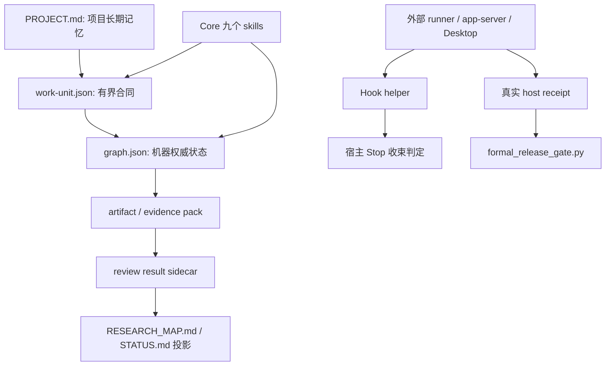
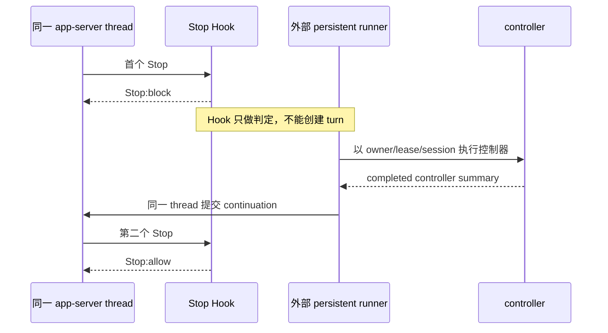
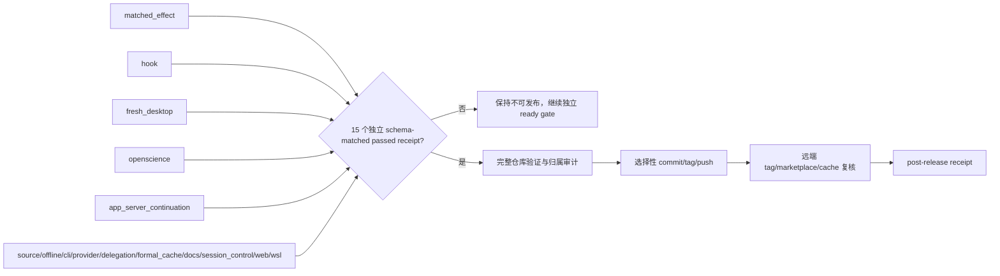
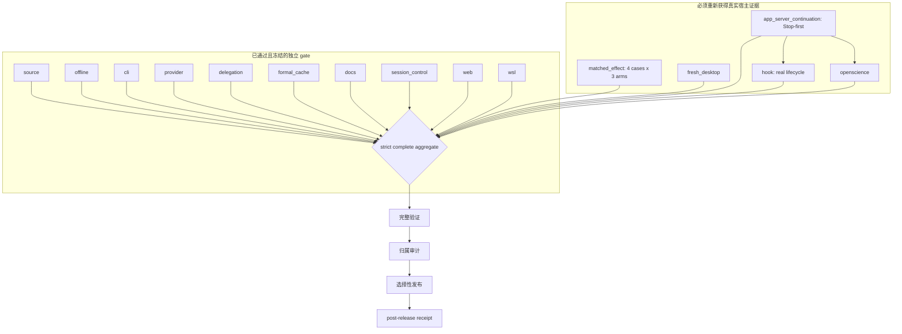

# 请接手：DS Lite 0.8.1 的持续执行、自动续跑与真实验收（2026-07-30）

## 先理解我在做什么

我正在做 DS Lite：一个面向小型科研项目的工作流插件。我不想把它做成只会生成研究文本、一次对话结束后就失去工作上下文的提示词集合；我希望它能把研究任务变成一个可靠过程。这个过程需要有任务边界、可恢复状态、可追溯证据、独立审查、明确失败、跨会话接管、用户可见进度，以及能经得起严格复核的发布结果。

我希望其中的自动化不是“模型又发了一条消息”。Hook 应该只判断在关键事件能否结束；持续运行的外部控制器应该负责持有任务所有权、会话连续性、退避、恢复和调度；不可覆盖的 receipt 应该保存真实证据；用户看到的状态应该告诉他现在完成了什么、卡在哪一层、系统接下来会自己做什么。这个分工的目的，是让任务在网络波动、宿主停止、对话切换或某个实验失败时仍能被下一次运行正确接管。

现实困难不是一个普通 bug。仓库中已经有 Hook、自动恢复、失败分类、持续 runner、严格聚合和多个验收 harness；但它们在真实宿主、真实网络和真实会话里没有被完整、稳定地观察到。多个实验会在真正完成前中断。更严重的是，过去的执行曾把“代码设计了 auto-resume”误说成“这轮真的自动续跑成功”，把一个可退避的外部错误变成整个目标停止，也没有稳定地继续推进其他没有依赖关系的工作。这使问题不仅是外部环境不稳定，也是控制面没有真正落实为持续运行的系统。

请把它当作一个“设计与真实运行是否一致”的问题来接手，而不是只寻找一个报错修补。先审计哪些能力只是存在于代码，哪些已经有真实证据；然后将退避、新身份、并行推进、状态持久化和用户可见进度做成一个可持续、可接管的控制器；严格区分 Hook 判定、同一会话恢复、同一宿主线程 continuation 和最终结束；最后只在每一项关键能力都有独立证据后才发布。不要为了得出“已经完成”的结论，把局部成功、缓存、相邻结果、一次连通性测试或推测升级成整体通过。

你需要完成的工作有四类。第一，读完本文后重建系统边界：什么是插件本体，什么是宿主能力，什么是验收 harness，什么是发布证据。第二，找出并修复持续执行控制面缺口，使一个外部失败只冻结该身份，并不停止其他独立任务。第三，在环境允许时用新的、隔离的真实运行取得缺失证据，绝不伪造、补写或复用冻结证据。第四，只有全部验收条件被真实满足后，才进入验证、归属审计和发布。本文后续章节提供这一判断所需的具体源码、receipt、失败时间线和恢复约束。

## 0. 文档合同、阅读方法与证据等级

本文交给下一位具备工程、agent runtime、宿主自动化与发布经验的维护者。它不是发布证明、不是重试许可，也不是将局部测试升级为真实宿主通过的依据。它把本仓库中已持久化的 receipt、状态文件、验收 handoff、`PROJECT.md`、源码和当前未提交工作树作为唯一事实来源。除这些来源外，不把口头描述、缓存发现、相邻 receipt、一次 HTTP 成功、CLI 输出或本地单测当作新事实。

本文刻意不保存凭据、环境变量值、会话标识、完整 prompt、原始模型输出、完整事件流、原始 provider 文本、绝对工作站路径或可用于重放访问的连接细节。涉及外部失败时，只写已持久化的分类、计数、哈希存在性和协议观测。引用路径均为仓库相对路径。

每一个实质判断都使用以下标签。**已证实**表示代码、schema 或 receipt 直接给出该事实；**强支持**表示多个独立脱敏 receipt 的同类字段一致，但不能反推出外部服务的根因；**待验证**表示需要新的、独立的真实宿主或 provider 证据，不能由现有材料补齐。标签描述的是证据强度，不是对维护者能力、用户授权或未来结果的判断。

接手前必须先读：`PROJECT.md`、`docs/maintainers/ds-lite-0.8.1-acceptance-handoff-20260730.zh.md`、本文件、`research/artifacts/handoff-20260728-continuation.json`、最新 `research/.validation-tmp/**/receipt.json` 或同类终态 receipt、以及 `git status --short`。handoff 的 `schema_version` 必须为 `ds-lite.handoff.v1`，`context_digest` 必须为 `9695819bc5a0b056b34cccc77fa9a3806a66c9cc8f3436c2e2f0647de1d8aa71`。这是恢复前的防漂移核验，不是可选提示。

## 1. 这项工作目前走到了哪里

### 1.1 现在为何不能发布

**已证实：不可发布。** `tools/validation/formal_release_gate.py` 将 `ds-lite-0.8.1-complete` 定义为一个 fail-closed 发布边界：15 个 gate 都必须各自有一个 schema 精确匹配、独立、`status == passed` 的 receipt。当前只有 10 个已通过；`matched_effect`、`hook`、`fresh_desktop`、`openscience`、`app_server_continuation` 没有可接受的独立 passed receipt。因此 complete aggregate 不能通过，`release_allowed` 不能为真。

**已证实：strict aggregate、post-release、commit、tag、push 均没有发生。** 旧聚合 `research/artifacts/formal-release-gate-20260729-04.json` 是 blocked 的历史证据，不能代表 complete profile。当前接受状态 `research/.validation-tmp/acceptance-state-20260730-32/state.json` 明确记录 `release_allowed: false`。工作树存在大量既有修改和未跟踪对象；在严格聚合与发布后 receipt 都 passed 前，不得进行选择性提交以外的发布动作，更不得以“文件已准备好”暗示发布完成。

**强支持：最近若干新 matched-effect canary 在进入线程后、HTTP 响应前失败。** `matched-effect-20260730-29/30/31-windows` 的脱敏 canary receipt 一致记录：观察到 `thread.started`，未观察到 `turn.completed`，使用量为零，工具计数为零，诊断类别为 `transport`，失败类为 `network`，响应头状态为 `not-received`。这足以冻结各自 identity，不足以断言某一外部服务、凭据或网络设备一定是根因。

### 1.2 Gate 总表

| Gate | 规定 schema | 当前状态 | 可接受的最新证据 | 不可用的替代物 |
|---|---|---|---|---|
| source | `ds-lite.upstream-audit.v1` | passed，冻结 | source acceptance receipt | 文档叙述 |
| offline | `ds-lite.offline-protocol-acceptance.v1` | passed，冻结 | offline acceptance receipt | 单元测试 |
| cli | `ds-lite.cli-acceptance.v1` | passed，冻结 | `research/.validation-tmp/cli-rust-20260729-06/receipt.json` | cache 安装 |
| provider | `ds-lite.academic-provider-acceptance.v1` | passed，冻结 | `research/.validation-tmp/provider-acceptance-20260729-06/receipt.json` | Responses 可用性推断 |
| hook | `ds-lite.trusted-hook-acceptance.v1` | 待验证 | 无 fresh passed receipt | hooks/list、源码、局部测试 |
| delegation | `ds-lite.real-delegation-acceptance.v1` | passed，冻结 | delegation acceptance receipt | 计划文件 |
| matched_effect | `ds-lite.matched-effect-acceptance.v1` | blocked，多个 identity 冻结 | 无 passed effect receipt | prepare/install/canary、评分草稿 |
| formal_cache | `ds-lite.formal-cache-acceptance.v1` | passed，冻结 | formal-cache acceptance receipt | Desktop discovery |
| fresh_desktop | `ds-lite.fresh-desktop-acceptance.v1` | 待验证 | 无 independent passed receipt | CLI、cache、app-server |
| docs | `ds-lite.docs-acceptance.v1` | passed，冻结 | docs acceptance receipt | 文档存在 |
| openscience | `ds-lite.openscience-acceptance.v1` | 待验证 | 无 fresh passed receipt | provider 或 web receipt |
| app_server_continuation | `ds-lite.app-server-continuation.v1` | blocked | app-server terminal/continuation receipt | UserPrompt-first |
| session_control | `ds-lite.app-server-conversation-control.v1` | passed，冻结 | conversation-control receipt | Stop-first |
| web | `ds-lite.web-benchmark-acceptance.v1` | passed，冻结 | web benchmark receipt | 浏览器可打开 |
| wsl | `ds-lite.wsl-tmux-acceptance.v1` | passed，冻结 | WSL/tmux receipt | Windows assertion |

**已证实：上表的 15 项顺序与 `COMPLETE_RELEASE_GATES_V2` 和 `COMPLETE_GATE_SCHEMAS` 一致。** 通过的十项为 source、offline、cli、provider、delegation、formal_cache、docs、session_control、web、wsl。其余五项不是“差一点通过”，而是缺少其专属的 schema-matched passed receipt。

### 1.3 下一位 AI 最不应重复的错误

1. **已证实：不得把实现存在当成真实执行发生。** `watch_job()`、Hook 配置、`codex exec resume` 分支存在，只说明设计被编码；本次没有真实观察到完整 Stop-first 自动续跑链。
2. **已证实：不得在一个可退避 transport 失败后把全目标标为 blocked。** 失败只冻结对应 identity；fresh Desktop 等无依赖 gate 理应独立推进。严格 aggregate 仍 blocked，但控制器不能因此停止 DAG 中其他 ready gate。
3. **已证实：不得以 `turn.completed` 替代 continuation。** Stop-first 是一条多事件链；`Stop:block + turn.completed` 而没有同线程 continuation 必须写 `blocked/hook-continuation-not-observed`。
4. **已证实：不得重跑、覆盖或“补写”冻结 receipt。** 每次可退避失败都只能以新的 identity 产生新的不可覆盖证据。
5. **待验证：不要相信任何单次 HTTP 200 可证明 Responses、app-server 或 stream 运行可用。** 这在本轮恰被相反的脱敏 probe 结果提醒。

## 2. 产品与插件完整设计

### 2.1 研究定位与插件边界

**已证实：DS Lite 是文件协议优先的轻量科研工作流插件。** `PROJECT.md` 将它定位为教学、快速启动和小型科研项目的可恢复、可审计、可教学闭环。它强调 work-unit、artifact、显式 graph、typed evidence、独立 review 与最小 iteration，而非将推理结果假装成实验结果。

**已证实：插件不是 daemon、Web/TUI、连接器集合或长期调度平台。** 这些宿主级或验收级能力可以由脚本、app-server、Desktop、外部 persistent runner、测试 harness 协作提供，但并不自动属于插件本体。插件应提供明确的协议、skill、模板、hook helper、状态工具和可验证接口；长期进程的持有、线程续跑、远端认证、桌面发现和实际网络可用性属于外部执行面。混淆这个边界，是本次“设计有 auto-resume”被误说成“本轮已自动续跑”的核心认识错误之一。

### 2.2 Core 的九个 skill

**已证实：`plugins/deepscientist-lite-core/skills/` 有九个入口：** `ds-lite`、`ds-lite-intake`、`ds-lite-scout`、`ds-lite-idea`、`ds-lite-experiment`、`ds-lite-review`、`ds-lite-analysis-write`、`ds-lite-iterate`、`ds-lite-coordinate`。它们不是九个互相隔离的 bot，而是同一文件化研究协议在不同阶段的受限入口。

| Skill | 协议职责 | 关键限制 |
|---|---|---|
| `ds-lite` | 统一入口和多 gate 前台协调 | 在已批准的多 gate 场景才应启动协调；规划或单步请求不应伪造控制器执行 |
| intake | 建立项目合同、目标、约束和工作单元 | intake 不是完成实验 |
| scout | 收集候选来源、缺口与证据 | 来源存在不等于结论可靠 |
| idea | 用 Factor Card 比较新颖性、可行性、风险和对齐 | 不用加权总分冒充真值 |
| experiment | 写 contract、执行计划和 evidence pack | 计划或 artifact 不等于真实运行 |
| review | 独立复核 claims、证据、反例和版本 | review 必须有 sidecar 结果 |
| analysis-write | 将已审查结果组织成分析/写作 | 不得把未证实推测升级为论断 |
| iterate | 一轮动作、验证、反思、终态收束 | 它不是 exactly-once transaction |
| coordinate | 有界分工、互斥路径、父 worker 整合 | 最多三个子任务，父 worker 对整合负责 |

### 2.3 状态、证据、学习与沟通层

**已证实：`PROJECT.md` 与项目工作区约定中的 work-unit、state graph 是不同层级的权威。** 根 `PROJECT.md` 是项目级长期记忆，记录研究背景、假设、目标、工作流、结构、运行与验收；项目工作区内的 `work-unit.json` 以 `ds-lite.work-unit.v1` 表示有界任务合同；项目工作区内的 `graph.json` 是机器权威状态，Markdown 映射是可重建的人类投影。后二者是插件为具体研究项目约定的路径，不是本仓库当前已有的验收 receipt。修改状态必须经锁、revision 和语义校验；不能由对话印象替代。

**已证实：artifact、receipt、graph 各自解决不同问题。** artifact 承载研究或执行产物；receipt 是一次验收或控制动作的不可覆盖结构化见证；graph 表示当前依赖与状态。artifact 不是进度，ready 不是完成，idea 不是实验。acceptance 收据的最低可信语义来自 schema、status、来源身份、输入输出引用和失败层，绝不能由相邻文件名或时间接近性补足。

**已证实：learning 层要求显式保留反例、不确定性和派生假设。** Factor Card 保存多个拆分维度而不合成“真值分数”；review 同时输出人读 Markdown 与 typed sidecar；`RESEARCH_MAP.md`、`STATUS.md` 是从 graph 和 iteration 投影而来。此设计意在让下一次工作继承可审计事实，而不是继承未证实的自然语言结论。

**已证实：communication 层有 start/progress/end 协议，但它不能替代 receipt。** 用户可见 progress 用于说明正在做什么、证据在哪、下一自动动作是什么；不可覆盖 receipt 用于机器可审计终态；handoff/end report 用于把事实、限制、恢复动作交给下一位维护者。三者不可互换：progress 不能证明通过，receipt 不能承担面向用户的恢复说明，最终报告也不能修改历史 receipt。

### 2.4 模板、状态图与边界图



**已证实：上图中实线不表示所有箭头都已经通过真实宿主验收。** 它表达设计关系。真正发布资格由最右侧的独立 receipt 和 formal gate 决定，不能倒推。

## 3. 自动续跑、Hook 与规范输出的原始设计

### 3.1 四类 Hook 事件及其权限

**已证实：`plugins/deepscientist-lite-core/hooks/hooks.json` 配置四类事件：`UserPromptSubmit`、`PreToolUse`、`PostToolUse`、`Stop`。** `ds_lite_hook.py` 的事件映射位于约第 25--28 行；它处理允许、阻塞待用户动作、以及阻塞并要求续跑等结果。Hook 是宿主在特定时机调用的判定器，不是一个可以主动向 Codex 创建 turn 的调度器。

**已证实：Hook 的合法职责是判定收束，不是创建 continuation。** Hook 可以根据状态返回 `allow`、`block-and-resume` 或 `block-awaiting-user-action`，写入有限的脱敏上下文和控制信号；它没有 session 生命期、owner 互斥、线程提交权限或宿主网络循环的所有权。若把“Hook 返回 block-and-resume”描述成“Hook 已重跑”，那是协议层错误。

### 3.2 persistent runner 的职责与数据模型

**已证实：`plugins/deepscientist-lite-core/scripts/ds_lite_autoresearch_runner.py` 是 runner 设计的中心。** 它在约第 34 行建立 owner lock，在约第 112 行声明 owner，在 `owner.json` 保存 `ds-lite.runner-owner.v1`、owner id、owner token 和 lease。它的目的不是保存秘密，而是防止两个控制器以同一 job 互相覆盖或并发 resume。

**已证实：runner 以 session 为连续性边界。** `build_codex_command()` 约第 211 行在已有 session 时构造 `codex exec resume`；`run_job()` 约第 277 行验证或保存 session、写 attempt 与 completion failure 证据、检测 session drift 和缺失 session，并结合 `retry_schedule()` 记录下一自动动作。一个恢复 job 失去 session id 时必须 fail closed；不得在相同 identity 下悄悄创建新 session 来冒充续跑。

**已证实：`watch_job()` 是 persistent-runner 模式，而不是 Hook 的隐藏能力。** 约第 406 行起，watch 模式在 `needs_resume` 时轮询并再次调用 bounded `run_job()`，目标是让同一 session 在有效 completion report 产生前获得连续调度。它有 max batch、lease、owner 和终态限制。**待验证：本轮 app-server Stop-first 是否曾让该机制成功跨一个真实 host turn 完成。现有证据不能证明。**

### 3.3 Stop-first 的唯一合格链路

**已证实：唯一合格链路如下，顺序不可交换：**



**已证实：少任何一段都不能 passed。** 如果观察到 `Stop:block` 后本线程产生 `turn.completed`，但没有 continuation，则 receipt 必须是 `blocked/hook-continuation-not-observed`。若 Stop 根本没有发生，必须写例如 `blocked/app-server-terminal` 的真实失败层，不能把它伪装成“continuation 缺失”。若 continuation 跑在 CLI 的另一 session，或只是调用 `codex exec resume` 而没有同一 app-server thread 的新 turn，也不能替代上图。

### 3.4 autonomy DAG 的原始承诺

**已证实：`ds_lite_autonomy.py` 有 `running_gates`、`frozen_gates` 及共享恢复分类；`ds_lite_recovery.py` 提供 `retry_schedule()`。** 设计语义是对 dependency-ready gate 并发推进，并将某个 identity 的失败局限在其所属 gate 或身份。临时 transport、408、429、5xx、timeout 可按退避创建新 identity；401/402/403、授权、支付、配额进入 `awaiting_user_action`；协议错误、session drift、缺失 session、owner conflict、Hook trust 则冻结。

**已证实：完整 release profile 是收束条件，不是调度停止条件。** aggregate 必须在所有 gate passed 时才可生成；但一个 gate frozen 不应阻断其他无依赖 gate。**已证实：本轮执行没有持续兑现这一语义。** 发生可恢复 transport 后，控制流过早把整体目标视为 blocked，未同步把 fresh Desktop 等无依赖门推进到终态。这是执行层事故，而非 strict aggregate 规则本身要求。

### 3.5 规范化输出的三层

| 层 | 内容 | 写入规则 | 不能代替 |
|---|---|---|---|
| 用户可见 progress | 已通过/运行/冻结 gate、证据路径、identity、下一动作、外部依赖 | 至少每 60 秒一次，基于现有 state | receipt 或发布许可 |
| 结构化 receipt | schema、status、failure layer、恢复分类、摘要 hash、引用 | write-once，不覆盖、不过度保留原文 | 解释性的 handoff |
| final handoff/end report | 当前终态、事实范围、恢复程序、残余风险 | 只能引用已有证据，不改写历史 | 新实验、aggregate 或发布 |

**已证实：本次未能维持稳定的 60 秒 controller state。** 当前 `acceptance-state-20260730-32/state.json` 是有价值的快照，含 passed/frozen gates、证据路径、failure layer、recovery class 与 next action；但它不是由贯穿本轮的前台 persistent controller 每 60 秒连续写出的接管日志。下一轮必须把此缺口当作执行协议问题，而不是仅以更长的对话回复弥补。

## 4. 验收 harness 的实际结构与设计断裂

### 4.1 matched-effect

**已证实：真实 pilot 入口是 `teaching/run_pilot.ps1`、`teaching/run_pilot.sh` 与 `teaching/pilot_runtime.py`。** 五个阶段固定为 `prepare -> install -> preflight -> canary -> run`。`prepare` 建隔离工作区，`install` 建隔离 skill home 与 manifest，`preflight` 检查执行条件，`canary` 做单次最小真实调用，`run` 才进入 4 cases x 3 arms 的 12 个主要单元及相应重复/对照安排。失败、超时或不明确状态不能在冻结 identity 上用 resume 混过。

**已证实：matched-effect 的通过证据不包括 Hook 或 auto-resume。** 它衡量的是隔离的工程 effect：4 个案例、3 个 arm、受控执行、独立评分和盲审隔离。Hook 是控制面，runner 是恢复工具；两者可以协助某次执行，但不能证明 effect 结果、盲审隔离或三 arm 比较完成。同理，能看到 cache、CLI 或 session 并不等于 canary 已通过。

**待验证：完成 4 x 3 后还需生成合格评分与盲审 package/execution，才能写 `ds-lite.matched-effect-acceptance.v1` 的 passed receipt。** 任何仅完成 prepare/install 或仅产生失败 canary 的 identity 都没有资格写 effect passed。

### 4.2 app-server Stop-first 与 trusted Hook

**已证实：Stop-first harness 的入口包括 `teaching/app_server_continuation_acceptance.py`、fixture、trusted-hook host 接受脚本和聚合脚本。** 它刻意在隔离 acceptance workspace 内放置 `ds-lite.stop-first-protocol.v1` 标记，使 UserPrompt Hook 不在第一个 Stop 前启动控制器；宿主必须先实际观察 `Stop:block`，再由外部控制器执行，随后在相同 app-server thread 发起 continuation。

**已证实：CLI `exec resume` 不能替代 app-server Stop-first。** CLI resume 只可证明 runner 在它拥有的 session 上采用了正确命令序列；Stop-first gate 要求宿主实际提交第二个 `turn/start` 并让第二次 Stop 收束。二者的 session、事件源和提交权限不相同。因此 CLI 测试、runner 单测、session-control receipt 都只能是局部证据。

**已证实：real Hook gate 也不能由 Hook 文件、trusted marker 或 `hooks/list` 取代。** 它需要新的真实 host receipt 覆盖 Hook 触发、信任状态、controller ownership、终态 summary 和收束。若模型在 Stop 前 terminal，结果只能是对应 blocked receipt；不能升级 Hook passed。

### 4.3 fresh Desktop 与 OpenScience

**已证实：fresh Desktop 是独立的宿主发现门。** 接受证据必须来自新的 Desktop task、隔离 project/workspace、fresh marketplace/cache discovery、一个无敏感数据的最小真实任务以及结构化终态 receipt。CLI、插件缓存、app-server 静态 Hook 数据、本地测试都不能替代它。`fresh-desktop-20260730-01` 是冻结身份，不得重用。

**已证实：OpenScience 也必须有自己的 fresh host receipt。** provider gate 只验证其公开学术 provider 范围，web gate 只验证其基准范围；它们不推导 OpenScience 的真实宿主任务。此前 OpenScience fresh task 在 Stop 前受 app-server terminal 阻断，因此仍待验证。

### 4.4 formal aggregate 与设计断裂

**已证实：`formal_release_gate.py` 拒绝缺失、重复、schema 不匹配和非 passed 的 evidence。** `COMPLETE_GATE_SCHEMAS` 在约第 36--52 行，`evaluate()` 在约第 75 行起逐一载入，不接受 adjacent-evidence inference。complete profile 全部满足后才会允许再走完整验证、归属审计、选择性 commit/tag/push、远端复核和 post-release receipt。

**已证实：当前验收 workflow 存在一个控制面设计断裂。** 代码提供了 retry classifier、identity 约束、runner 和 DAG；但没有把“退避后的新 identity 创建、并行 ready gate、60 秒持久化状态、同一前台控制器的恢复计划”封装为一个真正持续运行、可独立接管的 controller。实际推进仍依赖对话轮次、人工判断和临时命令组合。结果是某个外部失败经常中断全局动量，规范输出也变成事后补写。修复这一断裂应被视为后续工程工作；不能在这次未完成验收中把尚未验证的设计补丁宣称为通过。

## 5. 本次执行的完整时间线

本节只记录被持久化或由源码/receipt 可追溯的事件类别，不抄录敏感输入、原始异常、session id 或完整 event stream。时间顺序以 identity 后缀和 receipt 时间字段为准；个别 identity 的细节不足时明确标为待验证。

### 5.1 启动与状态核验

**已证实：本轮从 handoff schema/digest 和项目合同核验开始。** 目标是在用户授权范围内推进真实 0.8.1 验收，但权限从未允许删除、覆盖 receipt、重跑冻结 identity、reset/clean/revert 用户工作树。当前状态 receipt `acceptance-state-20260730-32/state.json` 标记为 `awaiting_external_recovery`，记录十个 passed gate、已冻结 matched-effect/app-server/fresh Desktop identity、canary 证据路径和 `release_allowed: false`。

### 5.2 matched-effect identity 清单

| Identity/组 | 持久化阶段或终态 | 可观察事实 | 是否可重试 | 正确处理 |
|---|---|---|---|---|
| `-12/-13/-14/-16/-17-windows` | 终态失败 | transport/network 类失败 | 原 identity 否 | 保留，退避后仅建新 identity |
| `-18/-19-windows` | 终态失败 | 4xx/认证类分类 | 原 identity 否 | 等待用户动作或授权恢复，不热循环 |
| `-20-windows` | 已完成 turn 被旧 harness 误判 timeout | Windows inherited pipe 影响完成判定 | 身份否 | 修正 harness 后用新 identity |
| `-21-windows` | prepare/install/preflight/canary 成功，后续失败 | 临时 resume 缺失 `workspace-write`，第二轮落入只读 | 身份否 | 修正命令环境后重新创建 identity |
| `-22/-23-windows` | WSL preflight 阻断 | 路径/宿主边界问题 | 身份否 | 修正解析/宿主调用后新建 identity |
| `-25/-28-windows` | WSL service access 相关阻断 | 包装器路径与宿主服务边界异常 | 身份否 | 以顶层直接断言重建，保留旧证据 |
| `-29/-30/-31-windows` | preflight 成功，canary failed | `thread.started`；零 token；无 completed；transport/network | 身份否 | 冻结，等待外部恢复后从全新 identity 五阶段开始 |
| `-33-windows` | 未完成 | 用户暂停时仅 prepare/install；没有 WSL receipt、preflight、canary、workload | 未授权继续 | 保持原样，不补写、不执行 |

**已证实：`-29/-31` 的 WSL preflight 证明了某些顶层直接 WSL Linux 断言可在当时通过。** 它只证明该阶段，不能外推成 WSL gate 的新 evidence 或 provider canary 成功。**强支持：Python/包装器路径在该环境曾触发 WSL service access 边界问题；** 因为多个 identity 以及随后采用不同宿主调用形态的结果相互支持，但本文件不把它归因到单一系统组件。

### 5.3 canary 和脱敏 app-server 分类诊断

**已证实：`research/.validation-tmp/matched-effect-20260730-29-windows/windows/results/canary.json` 的 schema 是 `ds-lite.matched-pilot-execution.v1`，status 为 failed。** 它的 acceptance 子结构仅实际观察到 `thread.started`，期望的 `turn.completed`、final feedback、工具观察均未满足；使用量为零，状态为 blocked。`-30`、`-31` 同类 canary receipt 提供一致的脱敏分类。

**强支持：provider Responses/stream 或其执行路径在 HTTP 响应前存在外部 transport 层失败。** 该判断来自三份独立新 identity 的同型字段，以及脱敏 Responses probe 在默认路由与 direct-egress 下记录相同类 `URLError` 摘要 hash。**待验证：具体根因。** 普通 HTTPS/TLS 探测返回 200 只说明基础连通性；它不证明可认证的 Responses 请求、流式传输、网关路由、模型服务或 app-server turn 生命周期可用。

### 5.4 app-server、fresh Desktop 与 acceptance state

**已证实：`appserver-stop-first-20260730-01` 与 `fresh-desktop-20260730-01` 被列在当前 state 的 frozen gates。** 这两个 identity 不得重跑或覆盖。先前 `appserver-continuation-20260729-11` 的有效结论是：信任 Hook 的准备/部分生命周期可见，但模型在 Stop 前进入 terminal，未观察 Stop；因此其 failure layer 是 app-server terminal，不是 continuation passed，也不应错误写成 hook-continuation-not-observed。

**已证实：本轮没有 fresh Desktop passed receipt，也没有 fresh OpenScience passed receipt。** 任何后来声称“Desktop 已发现”或“OpenScience 已完成”的描述，若不能指向这两种 schema 的新独立 passed receipt，都应拒绝。

### 5.5 本轮已存在但未发布的 harness 变更

**已证实：工作树中已有 `teaching/pilot_runtime.py`、`tests/test_pilot_runtime.py`、`teaching/run_pilot.ps1`、`teaching/wsl_host_probe.ps1` 等验收相关修改。** 其动机包括：temporary resume 显式传 `workspace-write` 和工作目录；避免 Windows 子孙进程继承 stdout/stderr handle 导致 completed turn 等待 pipe close 被误判 timeout；解析 WSL 输出中的 warning；使 WSL host probe receipt 可验证；以及在环境边界下采用顶层直接断言与一次性 receipt。

**已证实：聚焦的 `tests.test_pilot_runtime` 记录为 43 项通过，附有 ResourceWarning。** 这为 runner/harness 的局部正确性提供回归支持。**待验证：这些修改在真实 provider、app-server Stop-first、Hook、fresh Desktop 或 matched effect 端到端场景是否有效。** 单元回归不能升级任何五个未过 gate。

## 6. 失败分类与根因分析

### 6.1 已证实的本地 harness 缺陷

| 问题 | 触发条件 | 错误行为与违反规范 | 影响 | 已有修复 | 残余风险与正确动作 |
|---|---|---|---|---|---|
| resume 缺失写权限 | `-21` 的 temporary second call | 同一验收尝试在只读 sandbox 下继续，违反“真实环境一致性” | 后续 workload 不能代表合格运行 | 临时 `exec resume` 传 sandbox/workdir | 用全新 identity 复验；不得补旧 receipt |
| inherited pipe | Windows 子孙进程保留 stdout/stderr | 完成的 turn 因父进程等待 pipe close 被误判 timeout，违反“以宿主终态而非管道静默判定” | `-20` 被冻结但不是 provider 成功/失败证据 | 改善 descendant handle 处理 | 在真实 host 仍需观察 deadline、turn 与 process 三者一致 |
| WSL 输出/宿主边界 | warning 混入 Linux 输出或包装器经服务路径调用 | 解析/服务访问失败，违反“跨系统执行须显式验证边界” | preflight 不能代表 Linux 断言 | 解析改进、顶层直接断言、host probe receipt | 不将该 workaround 当 WSL gate 或端到端 provider 成功 |

这些问题说明 harness 曾给出错误的失败解释，但不允许倒转为“被误判的尝试应算通过”。验收遵循 evidence fail closed：任何不完整、不可解释或未记录完整输入条件的尝试都只能冻结。

### 6.2 已证实的外部执行失败与证据边界

**已证实：多个新 identity 的 canary 在 `thread.started` 之后、HTTP 响应前以零 token 结束。** receipt 中保存的是 `transport/network` 分类、nonzero exit、无响应头、哈希和脱敏统计。它们没有保存 raw provider error，因此不得将本文任何概括反向当作原始错误重现。

**强支持：外部执行层的失败可按瞬态 transport policy 处理。** 分类器把 DNS、连接中断、TLS/transport、408、429、500、502、503、504、timeout 归入退避的新 identity 策略；旧 identity 不可续跑。其“瞬态”只表示策略可允许一次退避，不表示外部一定会恢复，更不表示不断重试合理。

**待验证：服务端、网关、账号、路由、模型可用性及 WSL service 的具体归因。** 不能把 HTTPS 200 推导为 Responses 可用，也不能把零 token 推导为凭据一定错误。401/402/403、配额、支付、授权一旦由结构化分类明确观察到，应进入 `awaiting_user_action`，而不是继续试探。

### 6.3 不能下的结论

1. **已证实：CLI、cache、local test、session-control 或相邻 receipt 不能推断 fresh Desktop。**
2. **已证实：Hook 配置、源码分支、trusted marker 或 UserPrompt-first 不能推断 real Hook lifecycle 或 Stop-first。**
3. **已证实：provider、web、docs receipt 不能推断 OpenScience。**
4. **已证实：canary started 不能推断 canary passed；prepare/install 不能推断 4 x 3 completed。**
5. **待验证：任何尚未落盘为专属 passed receipt 的宿主能力。**

### 6.4 执行层错误与为何反复不生效

**已证实：错误一，把“可继续恢复”理解成“可以继续在同一冻结 identity 重跑”。** 规范实际要求是保存旧 receipt、退避、创建全新 identity；而 session continuity 只适用于同一 persistent runner 所有的、仍具有可验证 session id 的 job。matched-effect 被 freeze 后没有可合法 resume 的身份，Stop-first 又没有满足同线程 continuation 的前置条件。将两者混在一起，会制造无效实验或虚假的成功叙事。

**已证实：错误二，把 auto-resume 的设计和本轮的观察混淆。** runner 的 `watch_job()` 具有重复 `run_job()` 的实现，Hook 也会返回 block-and-resume；但本轮 app-server 没有达成完整 `Stop:block -> continuation -> summary -> Stop:allow`。没有第二个同 thread turn 时，auto-resume 没有被真实观察。此前用“具备能力”回答“是否已经用到”是不规范输出错误。

**已证实：错误三，把整体发布目标过早标为 blocked。** strict aggregate 的确 blocked，但 autonomy 的承诺是其他 ready gate 继续。fresh Desktop 结果不依赖 matched-effect，不能因为 provider transport 暂停。没有一个持续 controller 负责并行排程和 60 秒状态落盘，导致对话停止就等同控制流停止。

**已证实：错误四，状态反馈不够结构化、不能接管。** 面向用户的短结论没有始终同时给出事实、证据路径、正在运行的 identity、冻结 identity、failure layer、recovery class 和下一自动动作。即使技术上无可立即执行的实验，也应保留可被下一位执行者读取的持久状态。

**正确恢复动作：** 先核验 state 和冻结目录；对外部 layer 做一次受限分类；仅在分类为可退避时创建新 identity；并行安排无依赖 gate；每 60 秒写统一 controller state；让最终自然语言报告从 state 和 receipts 生成。不要靠更频繁的道歉、更多临时命令或更长的口头承诺模拟 persistent execution。

## 7. 当前真实状态与可交接恢复程序

### 7.1 固定不可违反规则

**已证实：所有新 identity 只能创建在 `research/.validation-tmp/<new-identity>/`。** 不得使用系统临时目录或仓库外路径。不得删除文件或目录，不得覆盖任何 receipt，不得重跑冻结 identity，不得 reset、clean 或 revert 用户工作树。现有临时目录、未跟踪文件和历史 receipt 均保留，哪怕它们看起来重复。

**已证实：当前 `-33-windows` 未完成，且用户已暂停其继续。** 不得补写 WSL receipt、preflight、canary 或 workload；也不得把不完整状态解释成失败通过或可发布。以后若用户明确恢复实验，也应先重新核验该 identity 是否被正式冻结；默认更安全的做法是创建新 identity。

### 7.2 provider 恢复后的 matched-effect 顺序

1. **已证实的前置核验：** 重读 handoff digest、`PROJECT.md`、最新 state、git status、目标 identity 目录不存在、冻结清单未变化。将所有输入、授权引用和工作树快照放入新 identity，而不是复用旧目录。
2. **已证实的分类动作：** 做一次最小、脱敏 app-server/Responses 分类诊断。只保留类别、HTTP status class（如有）、摘要 hash、next action；禁止保存 prompt、原始异常、环境或凭据。只有 transient 分类才创建新的 pilot。
3. **已证实的五阶段：** 严格完整运行 `prepare -> install -> preflight -> canary -> run`。任何阶段失败都写该 identity 的终态 receipt，绝不跳过 install，也不以预检替代 canary。
4. **待验证的完成段：** 通过 canary 后完成 4 cases x 3 arms；然后运行只读评分，构造盲审隔离 package，执行独立 blind review；全部结果与输入隔离、统计完整性和 schema 均满足后，才写新的 `matched_effect` passed receipt。
5. **已证实的恢复分类：** 408/429/5xx/transport/timeout 按退避创建另一个新 identity；401/402/403、配额/支付/授权写 awaiting user action；协议/session drift/missing session/owner conflict/Hook trust 直接冻结。任何一项都不得删除旧 evidence。

### 7.3 app-server 恢复后的 Stop-first、Hook 与 OpenScience 顺序

1. **已证实的第一步：** 做一次脱敏 app-server 分类诊断。若得到 transport/timeout/408/429/5xx，则依策略退避后新建 Stop-first identity；若是认证、配额、授权则等待用户动作；若是协议、session、owner 或 trust 问题则冻结并先修配置。
2. **待验证的第二步：** 在新 identity 的隔离 workspace、pinned runtime、trusted Hook 与同一 app-server thread 中观察首个 `Stop:block`。没有 Stop 就如实写 `blocked/app-server-terminal` 或实际 failure layer。
3. **待验证的第三步：** 外部 persistent runner 持有同一 session/owner/lease 执行 controller，产出 completed controller summary，并由 app-server 提交同 thread continuation。CLI 独立 resume 不合格。
4. **待验证的第四步：** 在第二个 Stop 观察 `Stop:allow`。若 block 后只有 completed turn 无 continuation，必须写 `blocked/hook-continuation-not-observed`。成功后分别形成 app-server continuation 和 trusted Hook 的独立 receipt，不将一个 schema 复用给另一个 gate。
5. **待验证的第五步：** app-server 可稳定运行到 Stop 后，以新 identity 执行最小的 OpenScience host 任务并写专属 receipt。其失败不能倒退已通过的 provider/web gate。

### 7.4 fresh Desktop 的独立恢复

**待验证：只要 Desktop 宿主可用，就应与 provider pilot 和 app-server 诊断并行。** 新建 Desktop task、隔离 project、fresh discovery、无敏感最小真实任务、宿主事件/终态和独立 receipt 缺一不可。必须明确记录它是 Desktop，而不是 CLI 或 app-server 的名字替换。Desktop 若失败，写自己的 failure layer，继续不依赖它的 matched-effect；它不能被 formal cache 或 session control 取代。

### 7.5 aggregate 与发布次序



**已证实：只有 A 为是才可重建 strict aggregate。** aggregate passed 后仍须完整验证、所有权审计和选择性发布；post-release receipt 也 passed 后才可声称发布完成。当前处在 A 为否，后续节点都不得提前启动。

## 8. 给下一位 AI 的操作协议

### 8.1 启动检查清单

1. 读取并严格核验 handoff schema/digest。
2. 读取根 `PROJECT.md` 与本文件，区分长期设计和本轮事故。
3. 列出最新 `research/.validation-tmp`，检查任何新 worker 是否已写新 receipt；不要假定目录静止。
4. 读取最新 acceptance state、全部阻断 gate 的最近终态 receipt，并以 `git status --short` 确认脏工作树归属未被误清理。
5. 从 `formal_release_gate.py` 重新取 required gate 常量和 schema，不从本文手工复制结果作为唯一来源。
6. 先确定每个 ready gate 的依赖、身份、授权、failure layer 与 recovery class，再执行任何命令。

### 8.2 60 秒状态落盘格式

**已证实：下列字段是最低可接管集合。** 实现可使用 JSON，但必须 schema 化、写入新或允许更新的 controller state（不得覆盖 receipt）：

```json
{
  "schema_version": "ds-lite.acceptance-progress.v1",
  "status": "running|awaiting_external_recovery|awaiting_user_action|completed",
  "passed_gates": [],
  "running_gates": [],
  "frozen_gates": {},
  "evidence_paths": {},
  "current_identity": "redacted-or-local-identity",
  "failure_layer": "normalized-category",
  "recovery_class": "retryable|awaiting-user-action|freeze",
  "next_automatic_action": "concrete next step",
  "release_allowed": false
}
```

每 60 秒刷新时，允许更新 progress state，但不能重写任何 attempt、canary、gate 或 aggregate receipt。若没有动作，也要写“无正在运行 gate、等待到何时/何种外部条件、下一自动检查是什么”，而不是沉默。对话系统若不能保持进程，必须将 controller 状态交给能够持久运行的外部 runner，而不是宣称已经持续。

### 8.3 创建、冻结、等待和并行的决策表

| 观察到的分类 | Identity 动作 | Gate 动作 | 用户沟通 | 并行策略 |
|---|---|---|---|---|
| 408/429/5xx/transport/timeout | 冻结旧身份；退避后新 identity | running/awaiting recovery | 说明类别、证据、退避和下一动作 | 继续所有无依赖 ready gate |
| 401/402/403/配额/支付/授权 | 终态 receipt 保留 | awaiting user action | 指明恢复类别和所需外部动作 | 继续不依赖 gate |
| 协议错误/session drift/无 session/owner conflict/Hook trust | 冻结 | blocked，先修控制面 | 说明配置或协议缺口 | 不阻断无依赖 gate |
| Stop:block 无 continuation | 冻结该 Stop-first identity | blocked/hook-continuation-not-observed | 说明缺失的是同线程第二个 turn | 可继续 Desktop、matched-effect 等 |
| Stop 前 terminal | 冻结 | blocked/app-server-terminal | 不声称 Hook 或 continuation 失败/通过 | 可继续其他 gate |
| 所有 15 gate passed | 不再创建验收 identity | 允许 aggregate | 说明将进入验证/审计 | 顺序进入发布前流程 |

### 8.4 面向用户的规范状态汇报模板

> **事实：** 本周期已通过 `[gates]`；正在运行 `[gate/identity]`；冻结 `[gate/identity]`。  
> **证据：** `[相对 receipt/state 路径]`，其 schema/status/failure layer 为 `[字段]`。  
> **当前自动动作：** `[退避检查/新 identity 五阶段/独立 Desktop/同线程 continuation]`。  
> **外部依赖：** `[仅类别，不含秘密]`；该依赖不阻断 `[其它 ready gates]`。  
> **发布状态：** strict aggregate=`[状态]`，post-release=`[状态]`，因此当前 `[不可发布/可进入下一步]`。

**已证实：禁止空泛道歉、只报 blocked、暗示发布或用“应该能恢复”替代下一动作。** 如果没有可自动动作，也必须清楚说明 failure layer、恢复类别、已有证据和触发下一检查的条件。

### 8.5 不得再犯清单

1. 不把 user 的广泛实验授权解释为允许删除、覆盖、重跑冻结身份或清理工作树。
2. 不把 persistent runner 的源码存在解释为此次 app-server 已实际 auto-resume。
3. 不把 Hook 控制信号解释为 Hook 具有创建 turn 权限。
4. 不把 `turn.completed`、summary 文件、CLI resume 解释为同 thread continuation。
5. 不把 200、缓存、单测、CLI、local test、相邻 receipt 推断为 Desktop、real Hook、OpenScience 或发布通过。
6. 不把 partial stage、零 token started、preflight 或 canary failure 升级为 matched effect 完成。
7. 不因一个 gate 外部失败停止无依赖 gate；不因 aggregate fail-closed 停止 DAG 排程。
8. 不只在对话结束时写状态；每 60 秒都要有可接管控制面状态。
9. 不把原始错误、prompt、凭据或绝对主机信息塞进 receipt 或 handoff。
10. 不为了“有结论”而将待验证的事实写成已证实。

## 9. 附录 A：架构、gate DAG 与 schema 索引

### A.1 发布 gate DAG



**已证实：图中的 `app -> hook` 和 `app -> open` 是当前推荐恢复顺序，不是 formal aggregate 中的 schema 依赖。** formal gate 只要求独立 receipt；工程上 app-server 能稳定到 Stop 才有实际条件补 real Hook/OpenScience。

### A.2 receipt schema 索引

| Gate | Schema | 权威脚本/入口 | 当前可引用证据类型 |
|---|---|---|---|
| source | `ds-lite.upstream-audit.v1` | upstream audit validator | frozen passed receipt |
| offline | `ds-lite.offline-protocol-acceptance.v1` | offline acceptance | frozen passed receipt |
| cli | `ds-lite.cli-acceptance.v1` | CLI/Rust acceptance | fresh passed receipt |
| provider | `ds-lite.academic-provider-acceptance.v1` | academic live provider acceptance | fresh passed receipt |
| hook | `ds-lite.trusted-hook-acceptance.v1` | trusted hook host/aggregate | 需新 host receipt |
| delegation | `ds-lite.real-delegation-acceptance.v1` | real delegation canary | frozen passed receipt |
| matched_effect | `ds-lite.matched-effect-acceptance.v1` | pilot runtime + score/review | 需完整新证据 |
| formal_cache | `ds-lite.formal-cache-acceptance.v1` | formal cache acceptance | frozen passed receipt |
| fresh_desktop | `ds-lite.fresh-desktop-acceptance.v1` | fresh host probe/Desktop | 需新 Desktop receipt |
| docs | `ds-lite.docs-acceptance.v1` | docs acceptance | frozen passed receipt |
| openscience | `ds-lite.openscience-acceptance.v1` | fresh OpenScience host | 需新 host receipt |
| app_server_continuation | `ds-lite.app-server-continuation.v1` | continuation acceptance | 需真实 Stop-first receipt |
| session_control | `ds-lite.app-server-conversation-control.v1` | conversation control | frozen passed receipt |
| web | `ds-lite.web-benchmark-acceptance.v1` | web benchmark acceptance | frozen passed receipt |
| wsl | `ds-lite.wsl-tmux-acceptance.v1` | WSL/tmux probe | frozen passed receipt |

历史 aggregate 还可使用 `ds-lite.formal-release-gate.v1` 的兼容 profile；**已证实：它不是本次 complete profile 的通过替代物。** 0.8.1 complete profile 应由当前 formal gate 的完整 schema 规则收束，旧 schema 的存在只用于兼容读取历史 evidence，不能绕过 15 个独立 gate。

### A.3 关键源码与文档证据索引

| 路径 | 关键位置 | 可证实内容 |
|---|---|---|
| `PROJECT.md` | 研究背景、工作流程、0.8.1 follow-up | 插件边界、状态权威、runner 设计、项目临时目录政策 |
| `docs/maintainers/ds-lite-0.8.1-acceptance-handoff-20260730.zh.md` | 全文 | 前一轮 gate 状态、Stop-first 规则、恢复边界 |
| `plugins/deepscientist-lite-core/hooks/hooks.json` | 约第 3、13、24、35 行 | 四个 Hook 事件 |
| `plugins/deepscientist-lite-core/scripts/ds_lite_hook.py` | 约第 25--28、401--405、845--1014 行 | 事件映射、block-and-resume、Stop-first 收束逻辑 |
| `plugins/deepscientist-lite-core/scripts/ds_lite_autoresearch_runner.py` | 约第 34、112--150、211、277--399、406--443 行 | owner/lease、resume、attempt、completion、watch 模式 |
| `plugins/deepscientist-lite-core/scripts/ds_lite_autonomy.py` | 状态与恢复调用 | running/frozen gate 的 DAG 控制语义 |
| `plugins/deepscientist-lite-core/scripts/ds_lite_recovery.py` | 约第 24、29 行 | 分类和 retry schedule |
| `tools/validation/formal_release_gate.py` | 约第 13--52、75--110 行 | 15 required gate、schema、fail-closed 聚合 |
| `teaching/pilot_runtime.py` | pilot runtime | 五阶段、隔离与脱敏 receipt |
| `teaching/app_server_continuation_acceptance.py` | continuation harness | 同 thread Stop-first acceptance |
| `research/.validation-tmp/acceptance-state-20260730-32/state.json` | 全文 | 当前十个 passed、冻结门、恢复分类、不可发布 |
| `research/.validation-tmp/matched-effect-20260730-29-windows/windows/results/canary.json` | 全文 | started/zero-token/transport 脱敏事实 |

### A.4 冻结 identity 与证据路径索引

**已证实：以下 identity 不得重跑。** 完整目录名而非绝对路径可用于定位：

| Gate | 冻结 identity/组 | 代表性证据 |
|---|---|---|
| matched_effect | `matched-effect-20260730-12/13/14/16/17-windows` | 各 identity terminal receipt |
| matched_effect | `matched-effect-20260730-18/19-windows` | 认证类终态 receipt |
| matched_effect | `matched-effect-20260730-20/21/22/23/25/28-windows` | harness/WSL 边界终态 evidence |
| matched_effect | `matched-effect-20260730-29/30/31-windows` | `windows/results/canary.json` |
| matched_effect | `matched-effect-20260730-33-windows` | prepare/install 后不完整状态 |
| app_server_continuation | `appserver-stop-first-20260730-01` | frozen state 引用 |
| fresh_desktop | `fresh-desktop-20260730-01` | frozen state 引用 |
| aggregate | `research/artifacts/formal-release-gate-20260729-04.json` | blocked 历史 aggregate |

上述表只作为恢复前检查索引。每次接手都必须枚举目录与最新 receipt，避免本文写成时之后又出现的新 identity 被遗漏。

## 10. 附录 B：受限字段、工作树归属与维护边界

### B.1 受限/脱敏字段说明

**已证实：receipt 设计应保存可审计摘要而非原文。** 可保存：schema、status、failure layer、分类、HTTP status 类、时间、非秘密输入摘要 hash、token/工具计数、过程状态、被引用文件的相对路径、下一动作。不得保存：密钥、cookie、Authorization 内容、完整 URL query、原始 provider 字符串、完整 prompt、完整模型输出、完整 event stream、绝对主机路径、session id、真实用户数据。

**已证实：本文件遵守该边界。** 文中以“transport/network”“认证类”“服务 access 边界”“摘要 hash 已存在”等描述代替原始文本；具体敏感字段只存在于受控运行时或已经脱敏的既有 receipt 范围内，不在这里复刻。

### B.2 当前未提交工作树的归属分类

**已证实：当前工作树很脏，且包含用户已有、验收 harness、插件拆包、文档和临时研究目录的混合修改。** 已观测的修改涉及根文档、插件 core/扩展包、`teaching/`、`tests/`、`tools/validation/`、`research/`、多个 `run_*.ps1/.sh`、临时目录与其他未跟踪对象。它们的精确归属尚未完成审计。

分类原则如下：

| 分类 | 处理 |
|---|---|
| 用户已有或不明归属 | 保留；不得 reset/clean/revert；发布审计时从候选中排除，除非明确证明属于 DS Lite 已验证变更 |
| 验收 harness 变更 | 保留；记录测试范围；真实 host 验收前不自动纳入发布 |
| DS Lite 运行时/包变更 | 需独立差异、测试和所有权审计；仅在 complete aggregate 后候选选择性提交 |
| 临时/研究目录 | 保留作证据；不删除、不批量清理；不默认进入发布 |
| 本交接文件 | 仅维护文档，未改变实验或 receipt 语义 |

**待验证：哪些未提交变更最终属于 0.8.1 发布内容。** 这必须在 strict aggregate passed 后，用 `git diff --name-status`、逐文件所有权、验证覆盖与用户确认范围进行选择性审计。不要把“为验证而修改”自动等同“可发布”。

### B.3 最终接管结语

本事故的关键不是“系统没有任何自动化设计”，而是设计边界、真实宿主证据和实际执行控制面被混为一谈。Hook 能判断收束，persistent runner 才能在仍可验证的同一 session 中续跑，app-server 才能创建同 thread continuation；任何一层缺失都必须被结构化记录，而不是被自然语言弥补。严格 aggregate 的价值正是阻止这种补全式推理进入发布。

下一位维护者应把本文件当作恢复协议：先核验，再按分类创建新 identity，保留所有历史，持续驱动独立 ready gate，每 60 秒落盘能接管的状态，只在 15 个独立 passed receipt、严格 aggregate、完整验证、归属审计、选择性发布、远端复核和 post-release receipt 全部完成后结束验收。除此之外，最诚实也最有用的终态是带有 failure layer、恢复类别、证据路径和下一自动动作的未发布状态。
