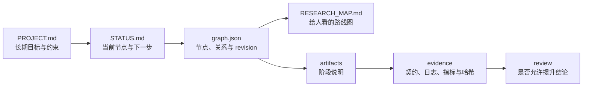

# DeepScientist Lite 用户指南

这篇指南解释插件为什么要生成这些文件，以及它们怎样配合。若你只想尽快试用，先回到[中文 README](../README.zh.md)完成五分钟上手。

## 1. 先建立一个简单的心智模型

DeepScientist Lite 不接管科研项目。它更像一本有格式的实验台账，由 Codex 帮你维护。

每次推进都围绕四个问题：

1. 项目长期要解决什么？
2. 当前正在做哪一步？
3. 这一步留下了什么可检查的记录？
4. 下一位接手者怎样重复或质疑它？



这些文件不是重复记录。它们的更新频率和职责不同：PROJECT 很少改，STATUS 经常改，Graph 管路线，artifact 讲清一步工作，Evidence Pack 保存实验事实，review 记录检查决定。

## 2. 六个技能分别在什么时候用

### Intake：先把问题和边界说清楚

`$ds-lite-intake` 用于新项目启动或旧项目接入。它会先读当前目录，再建立项目合同和初始状态。

你应当看到：`PROJECT.md`、`STATUS.md`、`research/state/graph.json` 和 `RESEARCH_MAP.md`。

它不能保证：自动理解旧项目中每个结论是否可信。旧项目接入仍需要核对 README、代码、结果和运行脚本。

### Scout：先找证据和风险，不急着拍方案

`$ds-lite-scout` 用于澄清数据、baseline、benchmark、指标、来源和可行性。

你应当看到：一个 scout artifact，写清发现、来源、缺口和下一步。

它不能保证：仅凭二手摘要验证论文主张。无法核验时应写 `needs-human` 或明确缺证据。

### Idea：把候选路线变成可证伪的问题

`$ds-lite-idea` 通常给出 2–3 条候选路线。真正值得以后回访的候选可以成为 Graph 分支。

你应当看到：候选假设、最小实验、预期信号、失败解释和选择理由。

它不能保证：分支越多越好。Lite 的目标是留下少量可检查路线，不是自动执行完整树搜索。

### Experiment：先写契约，再运行

`$ds-lite-experiment` 在运行前声明命令、输入、指标、阈值、seed、预算、预期输出和失败解释；运行后再封装日志和结果。

你应当看到：experiment artifact、`run_*.sh` 和 `research/evidence/<run-id>/`。

初始化生成的四个 `run_*.sh` 共用 `tools/ds_lite_runtime.sh`。脚本从自身位置找到项目根目录，通过 `PYTHON_BIN` 选择 Python，通过 `DS_LITE_STATE_CLI`、`DS_LITE_EVIDENCE_CLI` 或 `DS_LITE_PLUGIN_ROOT` 找到插件脚本。它们不会扫描 Codex 缓存，也不会把某台电脑的绝对路径写入项目。换机器时只需重新设置环境变量，不要改写 Graph 或把缓存目录提交到仓库。

它不能保证：进程退出码为 0 就说明结果有效。退出码只描述进程是否正常结束。

### Review：把“跑完了”和“能下结论”分开

`$ds-lite-review` 先运行确定性 Evidence Pack 校验，再检查四件事：

1. 文件是否齐全、哈希是否一致、步骤能否复现；
2. 实验是否遵守预先契约和指标口径；
3. 引用能否回到真实来源；
4. 方法说明是否与代码、日志和输出一致。

每一项只能是 `pass`、`fail`、`needs-human` 或 `not-applicable`。证据不足不是通过。

它不能保证：审查一定由另一模型执行，也不能替代领域专家或伦理审查。

### Analysis/Write：只写证据允许写的内容

`$ds-lite-analysis-write` 从通过的 review 进入分析，整理主张、证据、限制和下一步。

你应当看到：analysis 或 write artifact，其中的结论能追溯到 review 和 Evidence Pack。

它不能保证：把失败审查换一种措辞就能绕过去。未通过的路线只能写限制或补充实验计划。

## 3. Graph 到底保存什么

`research/state/graph.json` 保存公开的研究状态：节点、边、当前活跃节点和文件路径。它不保存隐藏思维链，也不保存每次 revision 的完整快照。

常用节点包括 intake、scout、idea、experiment、review、analysis 和 decision。常用关系包括：

| 关系 | 用途 |
| --- | --- |
| `next` | 正常推进到下一阶段 |
| `branch` | 保存以后可能回访的候选路线 |
| `supports` | 说明某份证据支持另一个节点 |
| `blocks` | 说明证据缺口或依赖阻止推进 |
| `supersedes` | 新证据替代旧路线，但旧节点保留 |
| `rollback` | 记录失败后返回哪个历史节点 |

Active Route 默认只沿 `next`、`branch` 和 `supersedes`。因此，`supports` 捷径和 `rollback` 回边不会把当前路线缩短成一条误导性的路径。

## 4. Revision 和事务写入解决什么问题

两个 Codex 会话可能同时读到 revision 7。会话 A 先提交后，Graph 变成 revision 8；会话 B 再携带 `--expected-revision 7` 写入时，CLI 会以退出码 4 拒绝。

正确处理方式是：

1. 停止当前写入；
2. 重新读取 Graph、STATUS 和相关 artifact；
3. 判断另一会话改了什么；
4. 协调自己的节点、状态或边；
5. 携带最新 revision 重试。

Graph 写入还会经过跨平台锁、完整语义校验、临时文件落盘和同盘原子替换。它能降低并发覆盖和半写文件风险，但不能让 Graph、STATUS、artifact 和 Markdown 地图在多个文件之间成为一个数据库事务。

如果 Graph 已提交而地图未更新，`status` 或 `validate` 会报告 stale；`render-map` 可以修复地图。

## 5. Artifact 与 Evidence Pack 有什么区别

Artifact 是给人读的阶段记录，例如为什么做这个实验、结果意味着什么、下一步怎么选。

Evidence Pack 是机器可复核的实验记录：

- `contract.json`：运行前承诺；
- `stdout.log`、`stderr.log`：运行输出；
- `metrics.json`：结构化指标；
- 环境说明：只允许安全字段，不转储完整环境变量；
- `manifest.json`：状态、路径、大小、SHA-256 和校验结果。

一个失败进程也可以有完整 Evidence Pack，因为“实验失败”与“证据损坏”不是同一回事。反过来，一个高分结果如果哈希变化、指标口径不符或使用了禁止输入，也不能进入通过状态。

## 6. 项目内路径和外部数据

Graph 只保存两类路径：

- 项目内 POSIX 相对路径，例如 `research/results/metrics.json`；
- 外部符号路径，例如 `external://dataset/train.csv`。

本机外部根目录由环境变量提供：

```text
DS_LITE_EXTERNAL_DATASET=D:\Data\my-dataset
```

另一台机器可以把同一别名映射到 `/data/my-dataset`。Graph 中不会出现两台机器不同的绝对根目录。

外部文件默认不计算哈希，只有明确使用 `--hash-external` 时才会读取和哈希。这样可以避免插件在不知情时扫描大型数据集或未授权资源。

## 7. 换一个会话后怎样恢复

新会话按这个顺序读取：

1. `PROJECT.md`：长期目标、限制和验收标准；
2. `STATUS.md`：当前节点、阻塞和下一步；
3. Graph 的 `active_node_id` 和 Active Route；
4. 活跃节点关联的 artifact；
5. 对应 Evidence Pack、review 和 `run_*.sh`。

恢复成功的最低标准不是“读过文件”，而是能够回答：

- 项目要解决什么？
- 当前证据是什么？
- 为什么走到这个节点？
- 哪些结论还不能说？
- 下一条可以执行的命令是什么？

## 8. 一条完整但不夸大的路线

```text
intake → scout → idea → experiment → review → analysis
```

这条路线表示：问题已经定义，资料和基线已检查，候选路线已选择，实验已经留下证据，审查允许提升结论，最后才进入分析。

它不表示每个研究项目都必须线性推进。你可以建立分支、保留失败、回滚到旧想法，也可以在证据不足时停在 blocked 状态。

## 9. 下一步练习

- [20分钟快速体验](../teaching/quickstart-20.zh.md)
- [45分钟证据审查](../teaching/evidence-lab-45.zh.md)
- [90分钟分支决策](../teaching/scored-branch-lab-90.zh.md)
- [30分钟路线语义](../teaching/route-lab-30.zh.md)
- [30分钟路径可移植](../teaching/path-lab-30.zh.md)
- [30分钟 revision 冲突](../teaching/revision-lab-30.zh.md)
