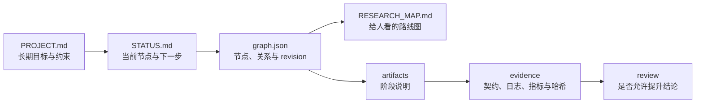

# DeepScientist Lite 用户指南

这篇指南解释插件为什么要生成这些文件，以及它们怎样配合。若你只想尽快试用，先回到[中文 README](../README.zh.md)完成五分钟上手。

## 1. 先建立一个简单的心智模型

遇到 provider、认证、Windows/WSL 路径、编码、命令行或配置格式冲突时，先查 Core 内的[环境兼容性排障手册](../plugins/deepscientist-lite-core/references/environment-compatibility-playbook.md)。它要求先分类故障、保留证据，再决定是否继续，不把环境故障写成科研结论。

DeepScientist Lite 不接管科研项目。它更像一本有格式的实验台账，由 Codex 帮你维护。

每次推进都围绕四个问题：

1. 项目长期要解决什么？
2. 当前正在做哪一步？
3. 这一步留下了什么可检查的记录？
4. 下一位接手者怎样重复或质疑它？



这些文件不是重复记录。它们的更新频率和职责不同：PROJECT 很少改，STATUS 经常改，Graph 管路线，`research/work-unit.json` 管当前有界任务，artifact 讲清一步工作，Evidence Pack 保存实验事实，review 记录检查决定，`research/iterations/*.json` 保存一次行动、验证、反思、汇报与停止理由；需要两到三个独立 worker 时，`delegation-*.json` 只记录授权、路径所有权、回传和父 worker 的整合责任。

`research/work-unit.json` 使用 `ds-lite.work-unit.v1`。新项目起初没有 claim requirement，所以证据状态是 planning；开始 claim-bearing experiment 前，才声明 profile、typed validator 和 canonical evidence refs。普通 Markdown、日志、PROJECT/STATUS 或任意非空路径都不是 typed evidence。schema 不认识的字段只能放进 `extensions`。

## 2. Core 与可选包分别在什么时候用

默认安装的九个 `ds-lite-*` Core skill 负责项目接手、证据、实验、审查和有界迭代。可选 Academic 包的十七个 `nature-*` skill 负责文献检索、引用、数据、图表、论文阅读与写作、统计、回复信和投稿辅助；Web 与 Knowledge 各提供一个实验入口。Nature skill 保留上游完整工作流，不是摘要说明；可选包首次使用时先检查 Core 版本、依赖和授权。

### DS Lite：不知道从哪里开始时的统一入口

`$ds-lite` 用于接手或恢复科研/工程项目、跨轮连续工作、实验比较、证据审查、假设管理、上下文重启和任务式指挥。它先判断当前目录是不是 DS Lite 工作区，读取 Mission Board，并说明为什么插件适用。对于已批准的多 gate 项目，默认使用前台 `ds-lite.autonomy-contract.v1` 连续推进所有独立 ready gate：瞬态、幂等的 provider 或网络失败可按合同做三到六次退避重试；命令结束后会静默轮询回执；会话中断后用 `--resume` 恢复但不重跑已完成或已冻结身份。非幂等操作、有重复风险的外部写入和未授权发布仍立即冻结。用户明确要求只做一步、只规划或禁止副作用时，才只选择一个动作 skill。

每个 gate 的终态必须写 `ds-lite.progress-report.v1`。它必须交代执行原因、实际动作、证据引用、失败层、已完成与冻结的门、下一自动动作和下次汇报时限。遇到单个 blocker 时，控制器冻结该 identity 并继续所有无依赖门；只有没有可运行门、预算耗尽，或所有门到达终态时才收束。它是可观察、可中断的前台过程，不是 daemon、队列或权限绕过。

你应当看到：开始反馈中明确本轮目标、选择的 skill、唯一动作、风险和检查点。

它不能保证：一次调用自动完成 intake 到 write 的完整流程。总入口不自行循环、不执行多个阶段，也不能绕过 evidence、review 或用户审批。

### Intake：先把问题和边界说清楚

`$ds-lite-intake` 用于新项目启动或旧项目接入。它会先读当前目录，再建立项目合同和初始状态。

你应当看到：`PROJECT.md`、`STATUS.md`、`research/state/graph.json` 和 `RESEARCH_MAP.md`。

它不能保证：自动理解旧项目中每个结论是否可信。旧项目接入仍需要核对 README、代码、结果和运行脚本。

### Scout：先找证据和风险，不急着拍方案

`$ds-lite-scout` 用于澄清数据、baseline、benchmark、指标、来源和可行性。

你应当看到：一个 scout artifact，写清发现、来源、缺口和下一步。

它不能保证：仅凭二手摘要验证论文主张。无法核验时应写 `needs-human` 或明确缺证据。

### Idea：把候选路线变成可证伪的问题

`$ds-lite-idea` 通常给出 2–3 条候选路线。真正值得以后回访的候选可以成为 Graph 分支。

你应当看到：候选假设、最小实验、预期信号、失败解释和选择理由。

它不能保证：分支越多越好。Lite 的目标是留下少量可检查路线，不是自动执行完整树搜索。

#### 用 Factor Card 评价 idea，而不是只问“新不新”

`ds-lite.factor-card.v1` 把一个候选 idea 分成六项。每项使用 `null` 或 0–4 分，另存 confidence、证据路径、简短依据和不确定性：

| 分项 | 要回答的问题 | 分数方向 |
| --- | --- | --- |
| `novelty` | 与最近的已知工作相比，机制、组合、目标或证据是否真的不同？ | 越高表示差异证据越强；没有来源时必须为未知 |
| `feasibility` | 最小实现或推导能否在当前数据、权限和预算内完成？ | 越高越可行 |
| `evidence_strength` | 现在已有多少可复核、typed 或可复现证据？ | 越高表示现有证据越强 |
| `cost` | 时间、算力、数据准备、外部调用和人工审查负担多大？ | 越高表示成本越高，不是越好 |
| `risk` | 技术、科学、重复执行、授权和误解风险多大？ | 越高表示风险越高，不是越好 |
| `alignment` | 它是否直接推进当前 work unit 和 active route？ | 越高越对齐 |

插件不做加权总分，也不会把最高分自动变成赢家。选择只能是 `explore`、`verify-first`、`park`、`reject` 或 `needs-human`，并且必须写一个能改变当前判断的最小测试。这样可以保留“新但贵”“可行但证据弱”“风险高但值得先做小验证”等真实取舍。

每个进入比较的候选保存为 `research/artifacts/factor-card-<slug>.json`，然后运行：

```bash
python <plugin>/scripts/ds_lite_protocol.py validate-factor-card \
  --path research/artifacts/factor-card-<slug>.json
```

Factor Card 只是路线选择 artifact，不是实验、引用核验或 Evidence Pack。即使六项都有高分，也不能把 Mission Board 从 planning/needs-evidence 升到 has-evidence；只有 work unit 声明的 typed validator 可以完成这种升级。

### Experiment：先写契约，再运行

`$ds-lite-experiment` 在运行前声明命令、输入、指标、阈值、seed、预算、预期输出和失败解释；运行后再封装日志和结果。

你应当看到：experiment artifact、`run_*.sh` 和 `research/evidence/<run-id>/`。

初始化生成的四个 `run_*.sh` 共用 `tools/ds_lite_runtime.sh`。脚本从自身位置找到项目根目录，通过 `PYTHON_BIN` 选择 Python，通过 `DS_LITE_STATE_CLI`、`DS_LITE_EVIDENCE_CLI` 或 `DS_LITE_PLUGIN_ROOT` 找到插件脚本。它们不会扫描 Codex 缓存，也不会把某台电脑的绝对路径写入项目。换机器时只需重新设置环境变量，不要改写 Graph 或把缓存目录提交到仓库。

准备交接当前路线时使用 `validate --strict --scope active-route`。它仍会全局检查图结构、路径完整性和 revision，只把其他分支上的证据警告列到 `off_route_warnings`，不让这些警告阻断当前路线。若要审计整个项目的每条分支，继续使用默认的 `validate --strict`。失败分支必须保留，不能为了得到退出码 0 而删除。

它不能保证：进程退出码为 0 就说明结果有效。退出码只描述进程是否正常结束。

### Review：把“跑完了”和“能下结论”分开

`$ds-lite-review` 先运行确定性 Evidence Pack 校验，再检查四件事：

1. 文件是否齐全、哈希是否一致、步骤能否复现；
2. 实验是否遵守预先契约和指标口径；
3. 引用能否回到真实来源；
4. 方法说明是否与代码、日志和输出一致。

每一项只能是 `pass`、`fail`、`needs-human` 或 `not-applicable`。证据不足不是通过。

Review 会同时写人类可读的 `review-<slug>.md` 和机器可读的 `ds-lite.review-result.v1` JSON。`verdict` 只表示审查门是 pass、fail 还是 needs-human；独立的 `claim_assessment` 才表示结论是 none、inconclusive、refuted 还是 supportable。只有 review node 已 done，且 work unit、profile、Evidence Pack refs 与 digest 全部匹配时，Mission 才会显示 reviewed。Markdown-only review 不会升级。

它不能保证：审查一定由另一模型执行，也不能替代领域专家或伦理审查。

### Analysis/Write：只写证据允许写的内容

`$ds-lite-analysis-write` 从通过的 review 进入分析，整理主张、证据、限制和下一步。

你应当看到：analysis 或 write artifact，其中的结论能追溯到 review 和 Evidence Pack。

它不能保证：把失败审查换一种措辞就能绕过去。未通过的路线只能写限制或补充实验计划。

### Iterate：只推进一轮，然后停在 checkpoint

`$ds-lite-iterate` 用于 OpenScience 或用户希望 worker 自主推进一个小步时。它先读取 Mission Board，在当前 revision 登记 running receipt，再从 `scout`、`idea`、`collect-evidence`、`execute`、`debug`、`review`、`analysis`、`write`、`branch`、`rollback`、`stop`、`ask-human`、`status-check` 中选择一个动作。旧 `exploit` 必须显式映射为 `execute`。

你应当看到：`ds-lite.iteration.v1` sidecar、动作产物、验证结果、reflection、user report、必要的 Graph 变化，以及由 `render-status` 更新的 `STATUS.md`。终态只能是 `completed`、`partial`、`blocked`、`failed` 或 `ambiguous`。

它不能保证：后台持续运行或 exactly-once transaction。一次调用只推进一轮；`completed` 只表示本轮闭合，不表示假设成立。GPU、长跑、依赖安装或外部数据访问仍需要用户或主管系统授权，transport 不明或有重复风险时必须停止。

### Coordinate：先划清任务和写入边界，再决定是否委派

`$ds-lite-coordinate` 只适合一个 work unit 中已经存在两到三个彼此独立的有界任务。它先创建 `ds-lite.delegation.v1` sidecar，逐项写明目标、必需输入、允许修改路径、预期结果、验证命令、资源预算和停止条件，并指定唯一的父级 integration owner。

计划生成后先运行：

```bash
python <plugin>/scripts/ds_lite_protocol.py validate-delegation \
  --path research/artifacts/delegation-<id>.json
```

此时仍不能启动子任务。只有用户或 OpenScience 主管明确批准，并留下简短、项目相对的 approval ref 后，才可以使用宿主已有的子智能体能力。最多三个任务；`nested_delegation=false`；parallel 模式要求所有写入和结果路径互不重叠。子任务只回传自己的 artifact/result ref，父 worker 负责检查 diff、核验证据、运行完整测试和最终整合。

若任务只需要一个 worker、彼此依赖、共享写入路径，或父 worker 无法独立验收，就不要委派，继续使用普通 skill 或 `$ds-lite-iterate`。partial、blocked、cancelled 和 transport 状态不明都要保留，不能自动重试或启动替代任务。

它不能保证：后台排队、长期调度、自动恢复或“子智能体说完成了就算完成”。委派协议只管理一次有界计划和回传；真实效果仍需要在具体宿主和新线程中单独验收。

## 3. Mission Board 是什么

`mission --format json|markdown` 会从 Graph、artifact、Evidence Pack 和验证结果派生出一个任务板。`render-status` 会把同样的信息写进 `STATUS.md`，让用户或上层系统不用读完整 JSON 图也能知道当前状态。

Mission Board 重点回答：

- 当前研究问题和 active node 是什么；
- 最近真正完成了什么；
- 下一步单个动作是什么；
- 哪些候选路线还在队列里；
- 哪些实验等待证据或 review；
- 失败时可以回到哪个 rollback target；
- 指标方向、early/final/aggregate/AUC 等指标面是否已经在契约中说清；
- 当前证据强度是 planning、needs-evidence、has-evidence 还是 reviewed；
- 当前 `claim_readiness` 是 none、blocked、inconclusive、refuted 还是 supportable，以及 `evidence_detail` 中的 validated/negative evidence、typed review 数量、最新 refs 和 blocking reasons；
- 最新一轮 `latest_iteration` 的状态、skill、revision、stop reason 和用户报告；
- 派生 `hypothesis_pool` 中哪些候选仍是 untested，哪些已 supported、weakened、refuted、inconclusive 或 parked；
- 是否需要用户或 OpenScience 主管决策。

`waiting_for_user` 只看当前 active route、当前路线的 blocker、typed needs-human review 或 blocked work unit。off-route blocked 节点和 `off_route_warnings` 仍会显示为保留债务，但不会因为存在就无条件卡住当前路线。

它还会显示几条硬规则：artifact 不是进度，ready 不是完成，idea 不是实验，metric 错误是协议失败，没有可见闭环就没有智能体体验。

### Hook 能做什么，不能做什么

Core 候选 `0.8.1-beta.1` 带有插件局部 `hooks/hooks.json` 和标准库 helper。它只尝试附加脱敏状态、阻断确定违规、运行轻量一致性检查，并在 iteration 未闭合时让 Stop 最多续跑一次；明确选择 active skill 时还会检查 learning receipt 和 quality plan；不会保存原 prompt、完整工具参数、输出、stderr 或 secret，也不会自创批准事实。拆包后的真实宿主 Hook 仍须重新验收。

### 活动自治合同如何控制会话

当项目根存在 `research/autonomy/contract.json`，且 `research/autonomy/run/summary.json` 缺失、不可读或不是 `completed` 时，自治合同拥有当前会话的收束权。Hook 不会把阶段性总结视为完成：

- `UserPromptSubmit` 注入当前 gate、进度回执和唯一续跑动作；
- `PostToolUse` 在每次工具调用后重新投影控制器状态；
- `Stop` 必须返回 `block`，并把下一自动动作固定为 `resume-autonomy-controller`；
- 唯一允许的继续入口是 `run_autonomy --resume --root . --contract research/autonomy/contract.json --output research/autonomy/run`；控制器必须继续所有独立 ready gate，不得因单个 gate 冻结而结束会话。

只有自治 summary 明确为 `completed`，且 iteration、质量、用户动作和 communication audit 等其他 Stop 门也全部闭合，Stop 才允许会话结束。这个机制控制的是宿主允许的会话收束与下一步指令，不创建后台 daemon，也不绕过宿主权限、预算、用户批准或 provider 策略。

当前 pinned `codex exec` 的验收已证明它会调用并记录 `Stop block`，但该非交互执行面仍可能同时产生 `turn.completed`，不能据此宣称续跑成功。验收器会将这种组合判为 `hook-continuation-not-observed`；只有 fresh Desktop 交互执行面实际观察到 `Stop block -> resume -> completed summary -> Stop allow`，才算会话控制门通过。

Codex stable `0.146.0` 已在隔离 host 中实际从 Core 的 `hooks/hooks.json` 自动发现 Hook helper，并观察到单一 CLI turn 内的 `Stop:block -> same-turn repair -> Stop:allow`。源码 manifest 保留明确 Hook 指针；确定性发布包投影仅移除当前官方 validator 不接受的冗余字段，Hook 目录和配置保持不变。目录自动发现只证明加载路径，完整运行时保护仍必须由对应真实 host receipt 证明，不能由配置文件或单个 Hook 事件替代。

### Nature skill 的首次配置

第一次使用需要 MCP、外部 API、浏览器、下载器、LaTeX、Node 或 Python 的 Nature skill 前，运行：

```text
python <academic-plugin>/scripts/ds_lite_pack_doctor.py --core-root <core-plugin>
python <academic-plugin>/scripts/ds_lite_nature_setup.py onboarding --workspace .
```

`doctor` 只报告环境变量是否存在和工具是否可见，不读取密钥；`apply` 只写当前工作区 `.ds-lite/nature/`，不会修改正式 `CODEX_HOME`、全局 MCP、credential 或 marketplace。缺少依赖时结果必须保留 `needs-config`、`missing-dependency` 或 `not-observed`，不能假装外部能力可用。

## 4. Graph 到底保存什么

`research/state/graph.json` 保存公开的研究状态：节点、边、当前活跃节点和文件路径。它不保存隐藏思维链，也不保存每次 revision 的完整快照。

常用节点包括 intake、scout、idea、experiment、review、analysis 和 decision。常用关系包括：

| 关系 | 用途 |
| --- | --- |
| `next` | 正常推进到下一阶段 |
| `branch` | 保存以后可能回访的候选路线 |
| `supports` | 说明某份证据支持另一个节点 |
| `blocks` | 说明证据缺口或依赖阻止推进 |
| `supersedes` | 新证据替代旧路线，但旧节点保留 |
| `rollback` | 记录失败后返回哪个历史节点 |

Active Route 默认只沿 `next`、`branch` 和 `supersedes`。因此，`supports` 捷径和 `rollback` 回边不会把当前路线缩短成一条误导性的路径。

## 5. Revision 和事务写入解决什么问题

两个 Codex 会话可能同时读到 revision 7。会话 A 先提交后，Graph 变成 revision 8；会话 B 再携带 `--expected-revision 7` 写入时，CLI 会以退出码 4 拒绝。

正确处理方式是：

1. 停止当前写入；
2. 重新读取 Graph、STATUS 和相关 artifact；
3. 判断另一会话改了什么；
4. 协调自己的节点、状态或边；
5. 携带最新 revision 重试。

Graph 写入还会经过跨平台锁、完整语义校验、临时文件落盘和同盘原子替换。它能降低并发覆盖和半写文件风险，但不能让 Graph、STATUS、artifact 和 Markdown 地图在多个文件之间成为一个数据库事务。

如果 Graph 已提交而地图未更新，`status` 或 `validate` 会报告 stale；`render-map` 可以修复地图。

## 6. Artifact 与 Evidence Pack 有什么区别

Artifact 是给人读的阶段记录，例如为什么做这个实验、结果意味着什么、下一步怎么选。

Evidence Pack 是机器可复核的实验记录：

- `contract.json`：运行前承诺；
- `stdout.log`、`stderr.log`：运行输出；
- `metrics.json`：结构化指标；
- 环境说明：只允许安全字段，不转储完整环境变量；
- `manifest.json`：状态、路径、大小、SHA-256 和校验结果。

一个失败进程也可以有完整 Evidence Pack，因为“实验失败”与“证据损坏”不是同一回事。反过来，一个高分结果如果哈希变化、指标口径不符或使用了禁止输入，也不能进入通过状态。

## 7. 项目内路径和外部数据

Graph 只保存两类路径：

- 项目内 POSIX 相对路径，例如 `research/results/metrics.json`；
- 外部符号路径，例如 `external://dataset/train.csv`。

本机外部根目录由环境变量提供：

```text
DS_LITE_EXTERNAL_DATASET=D:\Data\my-dataset
```

另一台机器可以把同一别名映射到 `/data/my-dataset`。Graph 中不会出现两台机器不同的绝对根目录。

外部文件默认不计算哈希，只有明确使用 `--hash-external` 时才会读取和哈希。这样可以避免插件在不知情时扫描大型数据集或未授权资源。

## 8. 换一个会话后怎样恢复

新会话按这个顺序读取：

1. `PROJECT.md`：长期目标、限制和验收标准；
2. `STATUS.md`：当前节点、阻塞和下一步；
3. Graph 的 `active_node_id` 和 Active Route；
4. 活跃节点关联的 artifact；
5. 对应 Evidence Pack、review 和 `run_*.sh`。

### 会话恢复不等于进程恢复

对话、Codex worker、tmux、实验进程和落盘工件各有独立生命周期。若存在 `research/artifacts/external-task-*.md`，恢复时固定按以下顺序核对：

1. 先读取关联的 external-tmux-plan，再读取 external-task artifact、attempt 和 Evidence Pack / run ID 索引；
2. 核对 runtime owner、host、user、node、容器/cgroup 和 tmux socket；
3. 查询 scheduler job、tmux server 和 PID，不能只看 pane；
4. 检查退出码、日志尾部、heartbeat、checkpoint、预算、产物和哈希；
5. 将任务分类为 `running`、`suspect`、`interrupted`、`completed` 或 `failed`；attempt 失败但仍可能恢复/重试时应保持 `interrupted` 或转为 `recovering`，只有明确不再重试才把任务关闭为 `failed`；
6. 修复前保留旧 attempt、对应 Evidence Pack、部分日志、配置和 checkpoint；
7. 遵循 `recover first, resubmit last`，仅在旧任务已证明不存在、恢复不可行且不会重复消耗预算时追加新 attempt；
8. 更新 external-task artifact、Graph/STATUS 和 Evidence Pack，然后停止本轮。

`nohup`、`disown`、`setsid` 或自动创建 tmux 都不能单独证明任务能够跨越临时 shell、cgroup、容器或计算节点继续运行。

恢复成功的最低标准不是“读过文件”，而是能够回答：

- 项目要解决什么？
- 当前证据是什么？
- 为什么走到这个节点？
- 哪些结论还不能说？
- 下一条可以执行的命令是什么？

### 用户手动创建 tmux

长任务需要 tmux 时，Codex 不能直接在自己的临时 shell 中创建。它先写 `research/artifacts/external-tmux-plan-<plan-id>.md`，计算需要的并发 workload pane 数量、固定 socket、session/window/pane 名称、任务映射、资源预算和安全余量，再给出一段精确的用户 bootstrap 命令及其 SHA-256。

用户从独立稳定 SSH shell 手动运行命令，创建 tmux server、anchor session 和计划内终端，然后 detach、断开并重新连接。Codex 下一轮只做身份核对和 persistence probe；只有 server 指纹、socket 和计划槽位保持一致，计划才是 `verified`。未经验证时，Codex 只能继续等待或重新出具计划，不能自己补建 session。

本协议不建立“tmux 子会话”对象。用户要求子会话时，Codex 只能将它解释为已分配 pane 中的 pane-scoped Codex CLI child worker。必须记录 CLI PID、精确 provider/model 版本、thread/task ID、查询命令和实际验证过的恢复命令。tmux 保留了 pane，并不自动保证 provider 对话、认证连接或实验进程仍然有效。

## 9. 一条完整但不夸大的路线

```text
intake → scout → idea → experiment → review → analysis
```

这条路线表示：问题已经定义，资料和基线已检查，候选路线已选择，实验已经留下证据，审查允许提升结论，最后才进入分析。

`coordinate` 不属于这条科研语义路线中的新阶段。它只是当某一步确实可以拆成二到三个独立任务时采用的执行协议，不能绕过 experiment、Evidence Pack 或 review。

它不表示每个研究项目都必须线性推进。你可以建立分支、保留失败、回滚到旧想法，也可以在证据不足时停在 blocked 状态。

失败审查有一个容易混淆的细节：review 节点应当是 `blocked`，但不能同时设为 active。active 应留在仍可操作的 experiment，或转到一个明确的补救节点；`STATUS.md` 再列出 blocked review 和最小补做动作。这样“不能提升结论”和“现在还能做什么”不会混成同一件事。

## 10. 下一步练习

- [20分钟快速体验](../teaching/quickstart-20.zh.md)
- [45分钟证据审查](../teaching/evidence-lab-45.zh.md)
- [90分钟分支决策](../teaching/scored-branch-lab-90.zh.md)
- [30分钟路线语义](../teaching/route-lab-30.zh.md)
- [30分钟路径可移植](../teaching/path-lab-30.zh.md)
- [30分钟 revision 冲突](../teaching/revision-lab-30.zh.md)
- [45分钟行动与反思](../teaching/action-reflection-student.zh.md)
- [四案例三组 matched-control pilot](../teaching/matched-control-pilot.zh.md)

matched pilot 比较普通 Codex、单个 `NOTES.md` 和 DS Lite workspace。runner 准备 12 个隔离 arm、分轮提示和空白评分面；`pilot_runtime.py` 在授权后按 `prepare → isolated install → preflight → one-shot canary → run → score` 推进。这里的 install 只建立隔离 skill home，不是插件 cache 安装。preflight 不调用模型；canary 只验证一次隐式、只读、ephemeral 入口，不能代替完整 trigger 或效果实验。2026-07-17 的首个真实运行在第一个调用后以 `process-failed` 停止，完成数为 `0/18`，因此没有效果结论。不要把 `prepared-not-run`、`incomplete`、preflight 通过或一次正确停止当成插件优越性证据。

2026-07-18 的第二次验收通过了 preflight，但唯一一次 canary 只建立 thread，随后以 `rate-limit` 类别和 `timeout` 结束：0 token、0 tool、没有 turn terminal event 或最终反馈，工作区未修改。因此本轮冻结且没有进入 trigger/18-call 阶段。参见[canary 失败案例](../teaching/canary-failure-case-20260718.zh.md)。这说明“九技能已注入 prompt”与“模型实际隐式选择了技能”是两个不同的证据门。

外部验收现在还会附加统一审计门。看到 `extensions.acceptance_gate.status=blocked|ambiguous|not-verified` 时，含义是“本门证据不足，下一门没有启动”，不是插件已经完成或已经失败。只有 receipt 中同时有预期/实际事件、非零 usage、相对证据引用、失败层和下一动作，才可以进入后续 Hook、cache、delegation 或 matched comparison 门。

## 11. 跨学科可选包

Academic 保持 17 个可发现的 `nature-*` skill，不增加近义入口。`nature-ref-verifier` 现在可以调用 `ds-lite.citation-check.v1`：Crossref、OpenAlex、Semantic Scholar 和 arXiv 的结构化结果必须形成精确标识符匹配，或至少两个独立的标题/作者/年份匹配；网络超时、429 和服务不可用只会得到 `pending`。投稿模式只有 `verified` 才能通过。`nature-polishing`、`nature-response` 使用 `ds-lite.revision-constraints.v1` 限制路径、新引用/数值/定理、删除和每轮操作数；`nature-reviewer` 的 adversarial 模式要求 fresh reviewer 与 fresh adjudicator 使用不同 context ID，否则记录 `not-observed`。

Empirical 和 Engineering 各只有一个路由 skill，并且要求 Core `0.8.1-beta.1`。它们按需加载，不自动安装 Python、StatsPAI、R、Stata、MATLAB 或 Octave：

- `$ds-lite-empirical` 先写 `ds-lite.empirical-spec.v1`，明确 estimand、样本、识别策略、假设、诊断和稳健性，再写引用 Core Evidence Pack 的 `ds-lite.empirical-result.v1`。失败的平行趋势、缺失数据、稳健性不一致和零/负结果必须保留。
- `$ds-lite-engineering` 写 `ds-lite.engineering-analysis.v1`，记录单位、采样率、预处理、窗函数、频率分辨率、缩放、随机种子、命令和产物。单位、维度、混叠、泄漏和图轴检查是强制项；缺物理参数时停止，不补猜。

相应入口是 `run_validate_empirical.*`、`run_validate_engineering.*`。Academic 的真实 provider 验收入口是 `run_accept_academic_providers.*`，必须显式传入 `--authorized-external-provider`；未授权时会写阻断收据且不发起网络请求。六包源码矩阵不等于 marketplace 安装或新 Desktop 任务证据，真实 Hook、delegation、matched effect、formal cache、fresh Desktop 和 release 仍需各自独立 receipt。
