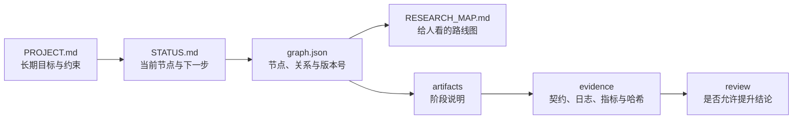

# DeepScientist Lite 用户指南

这篇指南解释插件为什么生成这些文件，以及它们如何配合。如果你只想尽快试用，先回到 [中文 README](../README.zh.md) 完成五分钟上手。

## 一、先建立一个简单的心智模型

DeepScientist Lite 不接管你的项目。它更像一本有格式的实验台账，由 Codex 帮你维护。

每次推进围绕四个问题：

1. 项目长期要解决什么？
2. 当前正在做哪一步？
3. 这一步留下了什么可检查的记录？
4. 下一位接手者怎样重复或质疑它？



这些文件不是重复记录。它们的更新频率和职责不同：

- `PROJECT.md`：项目目标和验收标准，很少改。
- `STATUS.md`：当前节点和下一步，经常改。
- `graph.json`：机器权威状态图，管路线和关系。
- `RESEARCH_MAP.md`：从 Graph 渲染给人看的路线图。
- `research/artifacts/`：记录每一步做了什么、依据是什么。
- `research/evidence/`：保存实验契约、日志、指标和文件哈希。
- `research/iterations/`：保存一次行动、验证、反思与停止理由。
- `research/work-unit.json`：当前有界任务描述。

## 二、快速上手

安装插件后，在项目目录中对 Codex 说：

```text
$ds-lite-intake 请从这个 questions 启动一个轻量研究项目：
"比较两个文本分类 baseline，在固定预算下判断哪个更值得继续。"
```

Codex 会创建 `PROJECT.md`、`STATUS.md` 和初始 Graph。之后用 `$ds-lite` 接手项目，它会读取 Mission Board 并告诉你下一步。

## 三、Core 与可选包分别在什么时候用

默认安装的九个 Core skill 负责项目接手、证据、实验、审查和有界迭代。

可选包：
- **Academic**（17 个 Nature 工作流）：文献检索、引用、数据、图表、论文阅读与写作、统计、回复信和投稿辅助。
- **Web**：公共网页采集和来源记录。
- **Knowledge**：从网页和论文证据生成审查门控的知识提案。
- **Empirical**：有界实证研究规范、诊断和结果交接。
- **Engineering**：有界工程数值分析、信号处理和图形审计。

可选包首次使用时先检查 Core 版本和授权。

## 四、Graph：研究状态图

Graph 是项目状态的唯一机器权威来源。它使用版本号（revision）机制防止多个会话同时写入产生冲突。

**Graph 能做什么：**
- 记录项目节点（目标、实验、审查结论等）和它们之间的关系。
- 通过 `supports` 表示哪个节点支持了另一个节点。
- 通过 `rollback` 标记可以回滚到的节点。
- 通过 `active_node_id` 指示当前活跃节点。

**版本号机制：** 每次写入需要带上期望版本号（`--expected-revision`）。如果 Graph 在你读取后被另一个会话修改，写入会被拒绝。解决方法：重新读取最新状态，协调改动，然后带新的版本号重试。

## 五、Mission Board：给人看的项目看板

`mission` 和 `render-status` 命令把 Graph 投影成 `STATUS.md` 和 `RESEARCH_MAP.md`。你不需要直接操作 Graph——Mission Board 就是给人看的项目界面。

`STATUS.md` 会显示：
- 当前活跃节点是什么
- 下一步该做什么
- 哪里可以回滚

`RESEARCH_MAP.md` 是从 Graph 渲染的研究地图。如果地图显示 stale，运行 `render-map` 重建。

## 六、Evidence Pack：证据包

实验阶段，插件会在 `research/evidence/<run-id>/` 下保存：

- **实验契约**：运行前写下的指标、阈值、seed、预算和失败条件。
- **日志**：运行过程的输出日志。
- **指标**：实际运行结果的指标值。
- **文件哈希**：输出文件的 SHA-256 哈希，用于完整性检查。
- **验证结果**：指标是否达标、文件是否完整。

**关键原则：高分不等于通过。** 文件完整、指标达标和结论可用是三个独立的判断。Evidence Pack 记录了前两个，结论可用性需要人工审查。

## 七、Review：审查

`$ds-lite-review` 在分析之前检查 Evidence Pack。它不是用另一个模型重新跑一遍，而是检查：
1. 实验契约是否完整
2. 输出文件是否匹配记录的哈希
3. 指标是否达到契约中设定的阈值
4. 实验过程是否有异常

审查结果写入 `research/artifacts/` 下的审查记录。

## 八、迭代：有界反思

`$ds-lite-iterate` 一次只推进一轮：执行一个有界动作，验证结果，反思，更新 STATUS，然后停在检查点。它不会变成无限循环。

每次迭代的记录保存在 `research/iterations/` 下，包含：
- 做了什么
- 验证结果
- 反思（假设是否成立、是否需要调整方向）
- 汇报
- 停止原因

## 九、委派：多任务协作

`$ds-lite-coordinate` 可以规划两到三个独立子任务，每个子任务有独立的路径所有权和预算。它不创建后台队列——没有用户明确批准时只生成计划并停止。

父 worker 负责收集所有子任务的结果并最终验证整合。

## 十、路径别名：安全的文件引用

Graph 不保存工作站的绝对根目录。如果实验需要引用项目外的数据，使用 `external://<alias>/<relative-path>` 格式，并通过环境变量 `DS_LITE_EXTERNAL_<ALIAS>` 提供本机根目录。

这样即使项目文件被分享或迁移，不会暴露你的本机路径。

## 十一、跨会话恢复

会话中断后，在新会话中：

1. 不要看聊天记录，只看文件。
2. 打开 `PROJECT.md` 确认项目目标。
3. 打开 `STATUS.md` 确认当前状态。
4. 打开 `RESEARCH_MAP.md` 确认研究路线。
5. 检查 `graph.json` 的 `active_node_id` 是否与 STATUS 一致。
6. 如果一致，从 STATUS 的"下一步"继续。
7. 如果不一致，以 Graph 为准重建 STATUS。

## 十二、遇到环境问题的排查步骤

遇到 provider、认证、Windows/WSL 路径、编码、命令行或配置格式冲突时，先查 Core 内的 [环境兼容性排障手册](../plugins/deepscientist-lite-core/references/environment-compatibility-playbook.md)。它要求先分类故障、保留证据，再决定是否继续，不把环境故障写成科研结论。

## 十三、从哪里继续学习

- 想了解 Graph 和协议设计细节：读 [实现说明](implementation.zh.md)。
- 想亲手做一遍：从 [AI 示教区域](../teaching/README.zh.md) 开始。
- 想比较普通 Codex 和 DS Lite：看 [四案例对比实验](../teaching/matched-control-pilot.zh.md)。
- 要升级旧 Graph v1 项目：看 [迁移指南](maintainers/graph-v2-migration.md)。