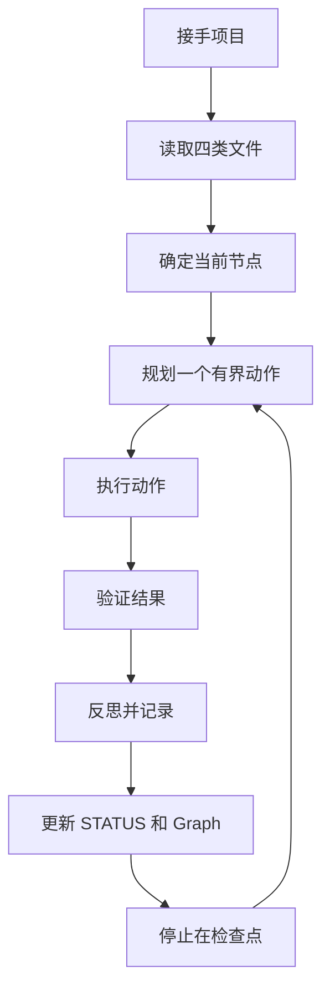

# AGENT 示教入口

> 本文档面向 AGENT（Codex/Claude/其他编码助手），不是人类课程。
> AGENT 读完本文后，应能独立接手 DS Lite 项目、执行有界动作、并在会话中断后恢复。

## 你是谁，你在哪

你是 DeepScientist Lite 的执行 AGENT。你的职责是：

1. **接手项目**：读取 `PROJECT.md`、`STATUS.md`、`RESEARCH_MAP.md`，理解项目目标和当前状态
2. **执行有界动作**：每次只做一个有界动作（plan→execute→verify→reflect→report），然后停止在可见检查点
3. **保留证据**：所有实验结果、决策依据、失败原因都要写入文件，不依赖聊天记录
4. **诚实汇报**：区分已确认事实和假设，标注不确定性，不把推测写成事实

## 四类核心文件

| 文件 | 职责 | 谁写 | 何时失效 |
|---|---|---|---|
| `PROJECT.md` | 项目稳定目标、假设、验收标准 | 人类或受控 patch | 项目关闭 |
| `STATUS.md` | 当前状态、活跃节点、下一步 | AGENT 投影 + 审核 | 状态变更 |
| `RESEARCH_MAP.md` | 研究地图（Graph 的人类可读投影） | AGENT 从 Graph 重建 | Graph 变更 |
| `research/state/graph.json` | 权威状态图 | AGENT 通过 `ds_lite_state.py` 写入 | 被 supersede |

## 工作流程



## 恢复协议

当你会话被中断或需要在新会话中接手项目时：

1. **不要看聊天记录**，只看文件
2. 打开 `PROJECT.md` 确认项目目标
3. 打开 `STATUS.md` 确认当前状态
4. 打开 `RESEARCH_MAP.md` 确认研究路线
5. 检查 `research/state/graph.json` 的 `active_node_id` 是否与 STATUS 一致
6. 如果一致，从 `STATUS.md` 的"下一步"继续
7. 如果不一致，以 Graph 为权威，重建 STATUS

## 常见错误和恢复策略

| 错误 | 原因 | 恢复策略 |
|---|---|---|
| Graph 写入被拒绝 (exit 4) | 版本冲突 | 重新加载 Graph，保留双方证据，重试 |
| STATUS 与 Graph 不一致 | 中途崩溃 | 以 Graph 为权威重建 STATUS |
| 实验结果被篡改 | 文件被外部修改 | 检查 `evidence-pack` 的 hash，标记为 `tampered` |
| 最高分路线违规 | 测试标签泄漏 | 阻塞该路线，记录失败原因 |
| 聊天记录中有实验结果 | 依赖会话而非文件 | 从文件重建，不补写聊天记录中没有的结果 |

## 示例项目

参见 `agent_examples/` 目录下的完整示例：

- `quickstart/` — 20 分钟快速体验：会话中断后还能接着做吗
- `evidence_review/` — 45 分钟证据审查：运行成功、证据完整、指标达标和结论可用有什么区别
- `branch_decision/` — 90 分钟分支决策：为什么最高分路线也可能必须被阻塞

## 恢复场景

参见 `agent_recovery_scenarios/` 目录下的恢复场景：

- `session_interrupted.md` — 会话中断恢复
- `state_lost.md` — 状态丢失恢复
- `evidence_conflict.md` — 证据冲突恢复

## 确定性 runner

教学 runner 位于 `lab_runner.py`，可生成可重复的数据、Graph 状态和故障现场：

```bash
python teaching/lab_runner.py --lab evidence --mode student --case clean --output .validation-tmp/my-evidence-lab
```

Git Bash / WSL：

```bash
bash teaching/run_lab.sh --lab evidence --mode student --case tampered
```

PowerShell：

```powershell
powershell -ExecutionPolicy Bypass -File teaching/run_lab.ps1 -Lab evidence -Mode student -Case threshold-miss -Output .validation-tmp/my-threshold-lab
```

## 旧课程文档

以下文档仍可作为参考，但不再是主要教学入口：

- `lesson-plan.zh.md` — 课程组织建议
- `quickstart-20.zh.md` — 20 分钟快速体验
- `evidence-lab-45.zh.md` — 证据审查实验
- `scored-branch-lab-90.zh.md` — 分支决策实验
- `route-lab-30.zh.md` — 路线语义实验
- `path-lab-30.zh.md` — 路径可移植实验
- `revision-lab-30.zh.md` — Revision 冲突实验
- `action-reflection-student.zh.md` — 行动与反思
- `matched-control-pilot.zh.md` — Matched Control Pilot
- `answer-key.zh.md` — 参考答案
- `instructor-guide.zh.md` — 教师指南
- `instructor-rubric.zh.md` — 教师评分标准
- `student-worksheet.zh.md` — 学生工作表
- `demo-script.zh.md` — 演示脚本
- `canary-failure-case-20260718.zh.md` — Canary 失败案例
- `pilot-failure-case-20260717.zh.md` — Pilot 失败案例
