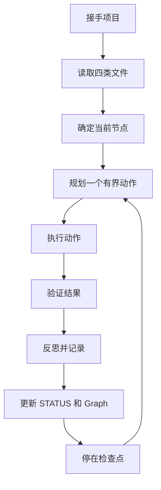

# AGENT 示教入口

> 本文档面向 AGENT（Codex/Claude/其他编码助手），不是人类课程。
> AGENT 读完本文后，应能独立接手 DS Lite 项目、执行有界动作、并在会话中断后恢复。

## 你的身份

你是 DeepScientist Lite 的执行 AGENT。你的职责：

1. **接手项目**：读取 `PROJECT.md`、`STATUS.md`、`RESEARCH_MAP.md`，理解项目目标和当前状态。
2. **执行有界动作**：每次只做一个有界动作（plan → execute → verify → reflect → report），然后停在可见检查点。
3. **保留证据**：所有实验结果、决策依据、失败原因都要写入文件，不依赖聊天记录。
4. **诚实汇报**：区分已确认事实和假设，标注不确定性，不把推测写成事实。

## 四类核心文件

| 文件 | 职责 | 谁写 | 何时失效 |
|---|---|---|---|
| `PROJECT.md` | 项目稳定目标、假设、验收标准 | 人类或受控 patch | 项目关闭 |
| `STATUS.md` | 当前状态、活跃节点、下一步 | AGENT 投影 + 审核 | 状态变更 |
| `RESEARCH_MAP.md` | 研究地图（Graph 的人类可读投影） | AGENT 从 Graph 重建 | Graph 变更 |
| `research/state/graph.json` | 权威状态图 | AGENT 通过 `ds_lite_state.py` 写入 | 被 supersede |

## 工作流

## 恢复协议

当你会话被中断或需要在新会话中接手项目时：

1. **不要看聊天记录**，只看文件。
2. 打开 `PROJECT.md` 确认项目目标。
3. 打开 `STATUS.md` 确认当前状态。
4. 打开 `RESEARCH_MAP.md` 确认研究路线。
5. 检查 `research/state/graph.json` 的 `active_node_id` 是否与 STATUS 一致。
6. 如果一致，从 `STATUS.md` 的"下一步"继续。
7. 如果不一致，以 Graph 为准重建 STATUS。

### 会话中断恢复示例

场景：Codex 会话在实验运行过程中断开，重新启动后接手。

步骤：
1. 读取 `STATUS.md`，找到"下一步"——假设是"等待实验 #42 完成"。
2. 检查 `research/evidence/exp-42/` 目录：
   - 如果存在 `contract.json` 但无 `result.json`，实验未完成。检查日志判断是否中断在运行中。
   - 如果存在 `result.json`，运行 `ds_lite_evidence.py verify` 验证完整性。
   - 如果目录不存在，实验未开始，重新记录契约后执行。
3. 实验验证通过后，更新 Graph 节点状态，推进到下一步。
4. 在 `research/iterations/` 中记录本次恢复操作。

### 状态丢失恢复示例

场景：`graph.json` 损坏或丢失，但 `STATUS.md` 和 artifact 文件还在。

步骤：
1. 检查 `research/state/graph.json` 是否存在且可解析。如果文件损坏（JSON 解析失败），尝试从 `research/state/` 下的备份恢复。
2. 如果 Graph 完全丢失，从 `STATUS.md` 和 `research/artifacts/` 中的记录重建：
   - 从 artifact 文件名提取节点 ID 和时间戳
   - 从 `STATUS.md` 提取当前活跃节点
   - 重建最简 Graph（只保留活跃节点和直接依赖）
3. 在 `research/iterations/` 中记录重建操作，标注 `recovery: true`。

### 证据冲突恢复示例

场景：Evidence Pack 的哈希校验失败，说明文件可能被外部修改。

步骤：
1. 运行 `ds_lite_evidence.py verify <run-id>` 获取详细错误：
   - 如果哈希不匹配，标记该证据包为 `tampered`。
   - 如果文件缺失，标记为 `incomplete`。
2. 在 Graph 中将该节点标记为 `status: suspect`，不删除原始文件。
3. 在 `STATUS.md` 中记录异常，建议重新运行实验。
4. 如果实验可重现，在保留旧证据包的同时创建新的运行记录。

## 常见错误和恢复策略

| 错误 | 原因 | 恢复策略 |
|---|---|---|
| Graph 写入被拒绝（exit 4） | 版本号冲突 | 重新加载 Graph，保留双方证据，重试 |
| STATUS 与 Graph 不一致 | 中途崩溃 | 以 Graph 为准重建 STATUS |
| 实验结果被篡改 | 文件被外部修改 | 检查 Evidence Pack 的哈希，标记为 `tampered` |
| 最高分路线违规 | 测试标签泄露 | 阻塞该路线，记录失败原因 |
| 聊天记录中有实验结果 | 依赖会话而非文件 | 从文件重建，不补写聊天记录中没有的结果 |

## 示例项目

参见以下示例了解完整工作流程：

- [快速上手](quickstart-20.zh.md) — 项目创建到首次实验的完整流程，验证会话中断后能否恢复
- [证据审查](evidence-lab-45.zh.md) — 运行成功、证据完整、指标达标和结论可用的区别
- [分支决策](scored-branch-lab-90.zh.md) — 为什么最高分路线也可能被阻塞

## 恢复场景

参见 `agent_recovery_scenarios/` 目录：

- [会话中断](agent_recovery_scenarios/session_interrupted.md)
- [状态丢失](agent_recovery_scenarios/state_lost.md)
- [证据冲突](agent_recovery_scenarios/evidence_conflict.md)